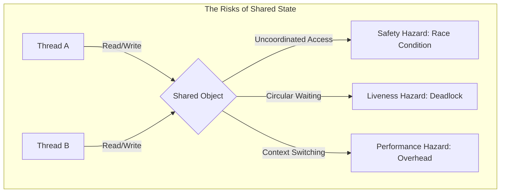

# Chapter 1: Introduction

## 1. The Mental Model (Prose)
At its core, concurrency is the art of **managing shared, mutable state**. While historically motivated by the need for better resource utilization (multitasking), in Java, threads are the fundamental unit of execution that allow us to turn idle CPU cycles into throughput. The "Why" behind threads isn't just speed; it's **decoupling**. By assigning distinct tasks to distinct threads, we simplify modeling—moving from a complex state machine that handles many events simultaneously to a set of sequential workflows that are easier to reason about.



## 2. Modern Java Context (Crucial)
JCIP was written in an era where threads were expensive, "heavyweight" operating system resources.

* **Virtual Threads (Java 21+):** The most significant shift since the book's publication. Project Loom introduces Virtual Threads, which are "cheap" and managed by the JVM rather than the OS. This effectively solves the "Performance Hazard" of thread creation costs, allowing millions of threads to exist simultaneously.
* **CompletableFuture (Java 8+):** Replaces the manual management of `Future` and `Callable` for asynchronous event handling with a functional, pipeline-based approach.
* **Parallel Streams:** Simplifies "Exploiting Multiple Processors" for data processing without requiring the developer to manually manage the lifecycle of worker threads.

## 3. Real-World Application
**Real-World Scenario:** A developer uses a standard `HashMap` to cache user sessions in a high-traffic Spring Boot application. Because Servlets are inherently multi-threaded, simultaneous requests from different users can trigger a race condition during a map resize, leading to an infinite loop (Liveness failure) or data corruption (Safety failure) that crashes the production environment.

## 4. The "Proof" (Code Strategy)

### The Breaking Code: Unsafe Sequence
The classic failure of atomicity. Even a simple `next++` is three distinct operations: fetch, add, and store.

```java
public class UnsafeSequence {
    private int value;

    /**
     * RISK: If two threads call this simultaneously, they may
     * read the same value and increment it to the same next value.
     */
    public int getNext() {
        return value++; // Non-atomic
    }
}
```

### The Fixed Version: Thread-Safe Sequence
Using core Java concurrency primitives to ensure that the increment operation is "atomic".

```java
import java.util.concurrent.atomic.AtomicInteger;

public class SafeSequence {
    private final AtomicInteger value = new AtomicInteger();

    /**
     * FIX: AtomicInteger uses CAS (Compare-And-Swap) 
     * to ensure thread safety without heavy locking.
     */
    public int getNext() {
        return value.getAndIncrement();
    }
}
```

## 5. Summary Checklist
* **The Golden Rule:** If multiple threads access the same mutable state variable without appropriate synchronization, your program is broken.
* **The Gotcha:** Threads are "everywhere" in Java. Even if you don't explicitly create a `new Thread()`, you are likely running in a concurrent environment if you use Servlets, RMI, or even simple Timers.