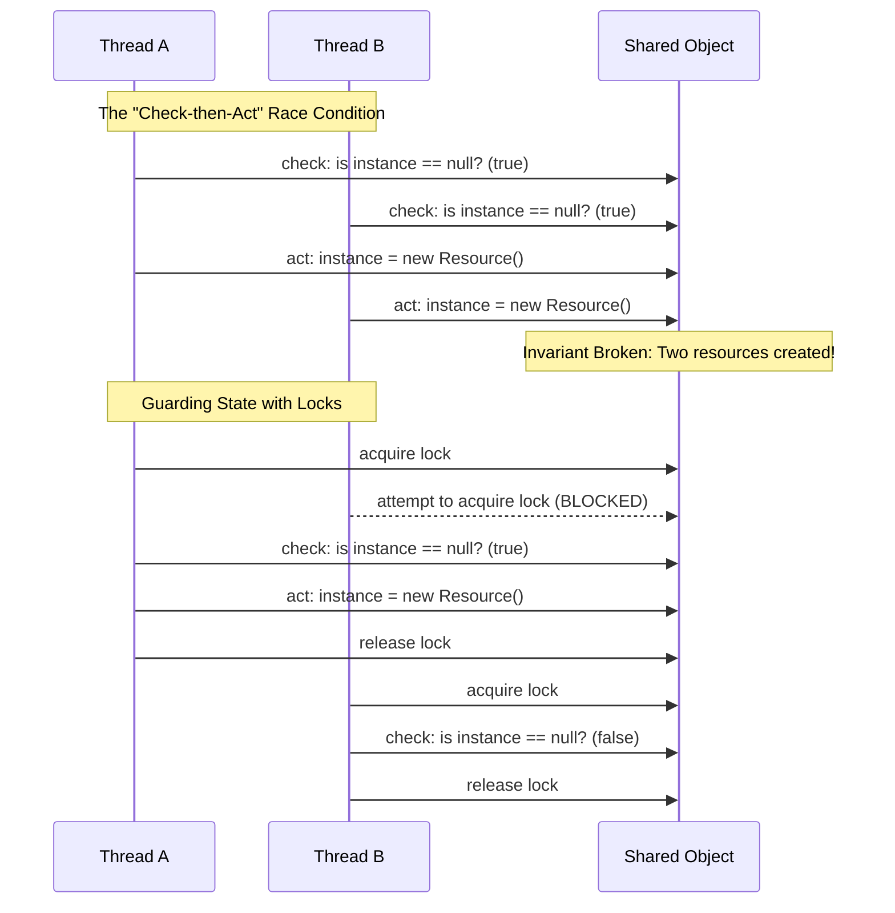

# Chapter 2: Thread Safety

## 1. The Mental Model
Thread safety isn't really about "threads"—it's about managing access to **shared, mutable state**. A class is thread-safe if it behaves correctly when accessed from multiple threads, regardless of the scheduling or interleaving of those threads by the runtime environment, and with no additional synchronization or other coordination on the part of the calling code.

The core enemy of thread safety is the **Race Condition**, which occurs when the correctness of a computation depends on the relative timing or interleaving of multiple threads. The most common type is the "Check-then-Act" scenario (like lazy initialization), where an observation is made, and based on that observation, an action is taken—but the observed state may have become invalid between the check and the action.

To protect state, we use **Atomicity** (ensuring operations are indivisible) and **Locking** (using intrinsic locks or `synchronized` blocks) to enforce exclusive access. Because intrinsic locks are *reentrant*, a thread can acquire a lock it already holds, preventing deadlocks when a subclass overrides a synchronized method and calls the superclass method.



## 2. Modern Java Context (Crucial)
While the core principles of JCIP remain the bedrock of Java concurrency, modern Java (8 through 21+) provides better tools so you don't have to rely entirely on explicit locking or synchronization:

* **Immutability First (Java 14+ Records):** JCIP strongly advocates for immutability. Java 14 introduced `record` types, giving us a native, boilerplate-free way to create deeply immutable data carriers. If an object is immutable, it is inherently thread-safe and requires no synchronization.
* **Virtual Threads (Java 21+):** With Project Loom, applications now spin up millions of lightweight Virtual Threads. While `synchronized` (intrinsic locking) works well, heavily contended `synchronized` blocks around I/O operations can currently "pin" the underlying OS carrier thread. In high-throughput virtual thread applications, modern engineers sometimes prefer `java.util.concurrent.locks.ReentrantLock` over intrinsic locks for specific I/O-heavy critical sections to avoid pinning.
* **Better Atomics (Java 8+):** The chapter discusses `AtomicLong` for atomic operations. Modern Java introduced `LongAdder` and `LongAccumulator`, which maintain an array of variables to distribute contention across threads, making them significantly faster than `AtomicLong` in highly concurrent scenarios.

## 3. Real-World Application
**Scenario:** A backend service uses an OAuth integration to fetch a temporary access token. The token generation is expensive and strictly rate-limited by the third-party provider.

**The Bug:** The token manager uses a naive lazy initialization pattern (`if (token == null || token.isExpired())`) to refresh the token. During a traffic spike, 50 virtual threads hit this logic simultaneously. Due to the "check-then-act" race condition, all 50 threads see an expired token and fire requests to the OAuth provider simultaneously. The provider flags this as a DDoS attempt, issues an HTTP 429 (Too Many Requests), and bans the service's IP, causing a total production outage.

## 4. The "Proof" (Code Strategy)

### The Breaking Code (Check-then-Act Race Condition)
```java
public class TokenManager {
    private Token currentToken; // Shared, mutable state

    // NOT THREAD-SAFE: "Check-then-act" compound action
    public Token getToken() {
        if (currentToken == null || currentToken.isExpired()) {
            currentToken = fetchNewTokenFromProvider(); // Expensive/rate-limited
        }
        return currentToken;
    }
}
```

### The Fixed Code (Using Intrinsic Locks & Guarding State)
```java
public class TokenManager {
    // State is guarded by the intrinsic lock of the 'this' object
    private Token currentToken; 

    // Synchronized ensures atomicity for the entire compound action
    public synchronized Token getToken() {
        if (currentToken == null || currentToken.isExpired()) {
            currentToken = fetchNewTokenFromProvider();
        }
        return currentToken;
    }
}
```
*Note: While `synchronized` works perfectly here to protect the invariant, if `fetchNewTokenFromProvider` takes a long time, it becomes a liveness/performance bottleneck. A more advanced modern fix would utilize `ConcurrentHashMap#computeIfAbsent` or explicit `ReentrantLock` with a double-checked locking idiom (using a `volatile` reference).*

## 5. Summary

* **The Golden Rule:** Stateless objects are always thread-safe. If you must have state, make it immutable. If it must be mutable and shared, you *must* guard every access to it with a lock.
* **The Gotcha:** Compound actions are sneaky. Operations like `check-then-act` (lazy initialization) or `read-modify-write` (incrementing a counter like `count++`) look like single operations in code but are actually sequences of multiple operations at the bytecode/CPU level. They are not atomic and require synchronization.