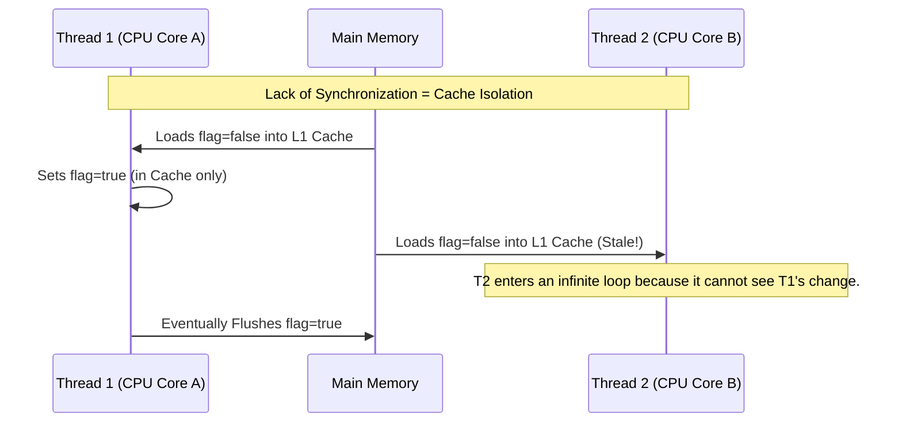
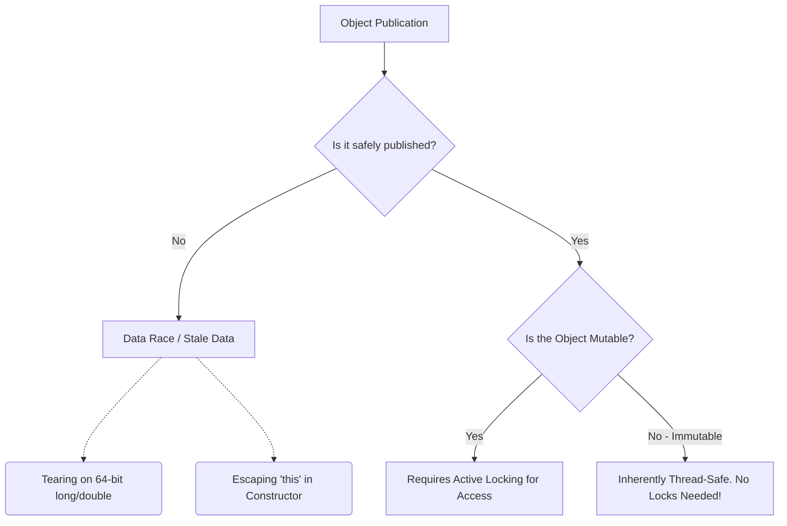

# Chapter 3: Sharing Objects

## 1. The Mental Model (Prose)

Most developers view concurrency as a *timeline* problem—ensuring two threads don't execute a block of code at the exact same time. Chapter 3 reveals that concurrency is fundamentally a *spatial* and *visibility* problem.

Because modern CPUs heavily utilize local L1/L2 caches to avoid expensive trips to Main Memory (RAM), a variable written by Thread A is inherently invisible to Thread B unless specific memory barriers are crossed. Furthermore, the JVM and CPU are allowed to aggressively reorder instructions to optimize performance, provided the single-threaded semantics remain intact. This means that without proper synchronization, a thread might not only see stale data, but it might see data in an impossible, half-constructed state (like an object reference being completely non-null, but its internal fields being zeroed out).

The core takeaway is that synchronization is not just about mutual exclusion (locking); it is equally about **memory visibility**.





## 2. Modern Java Context (Crucial)

JCIP was written during the Java 5/6 era. While the physics of memory visibility haven't changed, the modern Java ecosystem (Java 8 through 21+) provides drastically superior tools for sharing objects:

* **Records (Java 14+):** JCIP heavily emphasizes creating Immutable objects using `final` fields to guarantee initialization safety. Java 14 introduced `record`, which makes deep immutability a first-class language feature, eliminating the boilerplate of traditional class-based immutable data carriers.
* **Virtual Threads & Scoped Values (Java 21+):** JCIP discusses `ThreadLocal` for thread confinement. In the modern era of Project Loom (Virtual Threads), `ThreadLocal` is an antipattern. Because you can easily spin up millions of Virtual Threads, heavily using `ThreadLocal` causes catastrophic memory bloat. Java 21+ introduces `ScopedValue` as a modern, immutable, and highly efficient alternative to `ThreadLocal` for one-way data sharing.
* **VarHandles (Java 9+):** The concept of volatile variables is expanded. Instead of relying on `AtomicReferenceFieldUpdater` or internal `sun.misc.Unsafe` calls for atomic operations on standard fields, modern Java uses `VarHandle` for high-performance, fine-grained memory fencing and atomic operations.

## 3. Real-World Application

**The Bug:** A production service uses a background thread to refresh routing configurations from a database. To "optimize" performance, the developer removes the `synchronized` block on the `currentConfig` reference, assuming that object reference updates are atomic (which they are).

**The Catastrophe:** Because the reference was not marked `volatile` or safely published, the Java Memory Model allows instruction reordering. Traffic-routing threads suddenly see a non-null `currentConfig` object, but the fields *inside* that configuration object appear to be `null` or `0` (stale/uninitialized state). The service begins routing thousands of user requests to a `null` endpoint, resulting in a cascade of `NullPointerExceptions` and a massive outage.

## 4. The "Proof" (Code Strategy)

### The "Breaking Code" (Improper Publication & Escaping `this`)
A common trap is letting `this` escape during object construction. If another thread sees the object before the constructor finishes, it sees a broken object.

```java
public class EventListenerEscape {
    private final Map<String, String> routingTable;

    public EventListenerEscape(EventBus bus) {
        // DANGER: 'this' escapes before routingTable is initialized!
        // A background thread firing an event right now will see a null map.
        bus.register(this); 
        
        this.routingTable = new HashMap<>();
        this.routingTable.put("default", "node-1");
    }

    public void onEvent(Event e) {
        // Throws NullPointerException if called too early!
        System.out.println(routingTable.get("default")); 
    }
}
```

### The "Fixed" Version (Safe Publication via Factory)
To fix this, we ensure the object is fully constructed before any other thread can possibly obtain a reference to it.

```java
public class EventListenerSafe {
    private final Map<String, String> routingTable;

    // 1. Private constructor ensures no outside access during construction
    private EventListenerSafe() {
        this.routingTable = new HashMap<>();
        this.routingTable.put("default", "node-1");
    }

    // 2. Static factory method handles safe publication
    public static EventListenerSafe createAndRegister(EventBus bus) {
        EventListenerSafe instance = new EventListenerSafe();
        // Object is fully formed. Safe to share 'instance' now.
        bus.register(instance);
        return instance;
    }
}
```

## 5. Summary

* **The Golden Rule:** **Immutability is the ultimate cheat code for concurrency.** If an object's state cannot be modified after construction, you completely eliminate the need for synchronization across threads. Use `final` everywhere, or better yet, use modern Java `record` types.
* **The Gotcha:** **64-bit primitives are not intrinsically atomic.** Without `volatile`, reading or writing a `long` or `double` on a 32-bit architecture can result in "word tearing" (reading the first 32 bits of an old value and the second 32 bits of a new value), resulting in out-of-thin-air, impossible numbers. Always mark shared 64-bit primitives as `volatile` or use `AtomicLong`.