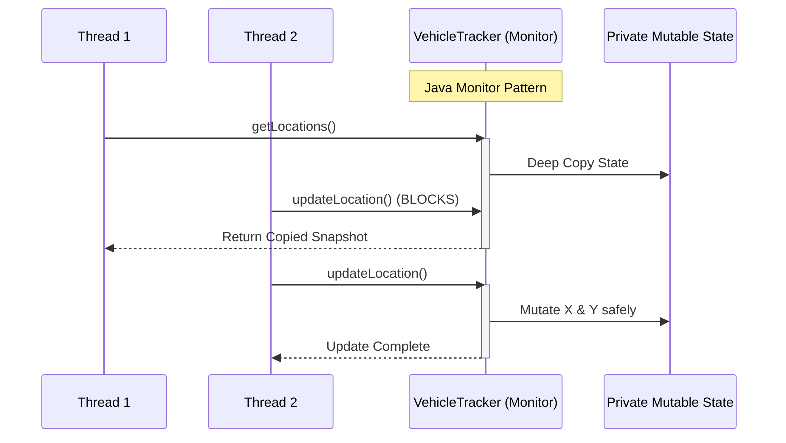

# Chapter 4: Composing Objects

### 1. The Mental Model (Prose)
The central theme of composing objects is that combining multiple thread-safe components does not automatically yield a thread-safe whole. You must actively design for thread safety by understanding state ownership and synchronization policies. This section focuses on the "why" and the underlying mechanics rather than just definitions.

* **Instance Confinement (The Java Monitor Pattern)**: Encapsulating mutable data deeply within an object so it can only be accessed through methods protected by a single, distinct lock. By hiding the state, you dictate exactly how and when it can be modified.
* **Delegation**: Transferring the responsibility of thread safety to underlying, already-proven thread-safe classes (like `ConcurrentHashMap` or `AtomicInteger`).
* **State Interdependence**: The core limitation of delegation. If two variables must remain consistent with each other (e.g., `min` and `max` limits), delegating to two independent thread-safe variables fails because they cannot be updated together atomically.



### 2. Modern Java Context (Crucial)
The following updates the JCIP concepts to the modern Java era (Java 8 through 21+). It is important to understand how newer features replace, enhance, or interact with the older Java 5/6 paradigms discussed in the book.

* **Records (Java 14+)**: JCIP heavily relies on immutable objects for safe delegation. Java Records provide zero-boilerplate, structurally immutable data carriers natively. A `record Point(int x, int y)` is inherently thread-safe and acts as the perfect vehicle for snapshotting state.
* **Concurrent Collection Enhancements (Java 8+)**: Methods like `ConcurrentHashMap.compute()`, `merge()`, and `computeIfAbsent()` allow for atomic compound actions directly on the map. This drastically reduces the need to implement complex client-side locking or custom monitors.
* **Virtual Threads (Java 21+)**: Heavy reliance on `synchronized` blocks (the classic Monitor Pattern favored in early Java) can pin Virtual Threads to underlying OS platform threads. Modern composition increasingly leans towards delegating to non-blocking concurrent collections or using `ReentrantLock` when composing interdependent state, as these play nicely with Project Loom.

### 3. Real-World Application
Here is a concrete, real-world backend scenario where getting this concept wrong causes a critical production bug.

Imagine a ride-hailing backend service tracking fleet vehicle locations for dispatch. If the service relies on a thread-safe map but stores a *mutable* `Point` object, delegation breaks. A writer thread updates the `latitude`, gets context-switched, and then a reader thread fetches the coordinates to dispatch a driver. The reader reads the new `latitude` but a stale `longitude`. The system calculates the vehicle's position as being in the middle of the ocean or routing through a building, triggering false alerts, invalid ETAs, and completely breaking the dispatch algorithm.

### 4. The "Proof" (Code Strategy)

**The Breaking Scenario**
Here is the "Breaking Code" scenario. Thread safety fails because the class relies on a thread-safe map, but the elements *inside* the map are mutable and updated non-atomically.

```java
public class UnsafeVehicleTracker {
    // The map is thread-safe, but the state inside is not safely published/mutated.
    private final Map<String, MutablePoint> locations = new ConcurrentHashMap<>();

    public void updateLocation(String id, int x, int y) {
        MutablePoint p = locations.get(id);
        // NON-ATOMIC COMPOUND ACTION: 
        // Thread 1 updates X. 
        // Thread 2 reads X and Y before Thread 1 updates Y!
        p.setX(x);
        p.setY(y);
    }
}
```

**The Fixed Scenario**
Here is the "Fixed" version using the appropriate concurrency primitives. We use a Java Record to ensure immutability and delegate the thread-safety entirely to the `ConcurrentHashMap`.

```java
// 1. Immutable State Carrier (Java Record)
public record Point(int x, int y) {}

// 2. Safe Delegation
public class DelegatingVehicleTracker {
    private final ConcurrentMap<String, Point> locations = new ConcurrentHashMap<>();
    private final Map<String, Point> unmodifiableView = Collections.unmodifiableMap(locations);

    public void updateLocation(String id, int x, int y) {
        // ATOMIC: We completely replace the immutable object. 
        // Readers always see a valid (x,y) pair.
        locations.put(id, new Point(x, y));
    }

    // Safe publication: changes to 'locations' reflect in 'unmodifiableView' safely
    public Map<String, Point> getLocations() {
        return unmodifiableView; 
    }
}
```

### 5. Summary
* **The Golden Rule**: This is one absolute best practice derived from the chapter. When composing objects, default to **delegating** thread safety to trusted concurrent collections (like `ConcurrentHashMap`) using **immutable state objects** (like Records) rather than building bespoke, synchronized Monitor objects.
* **The Gotcha**: This is one counter-intuitive edge case or common trap. **Client-side locking is usually a trap.** Trying to add functionality to an existing thread-safe class by locking on it from the outside only works if you acquire the *exact same lock* the collection uses internally. Because modern collections like `ConcurrentHashMap` use lock-striping or lock-free algorithms, you cannot easily sync on their internal intrinsic locks, making client-side locking virtually impossible to guarantee.