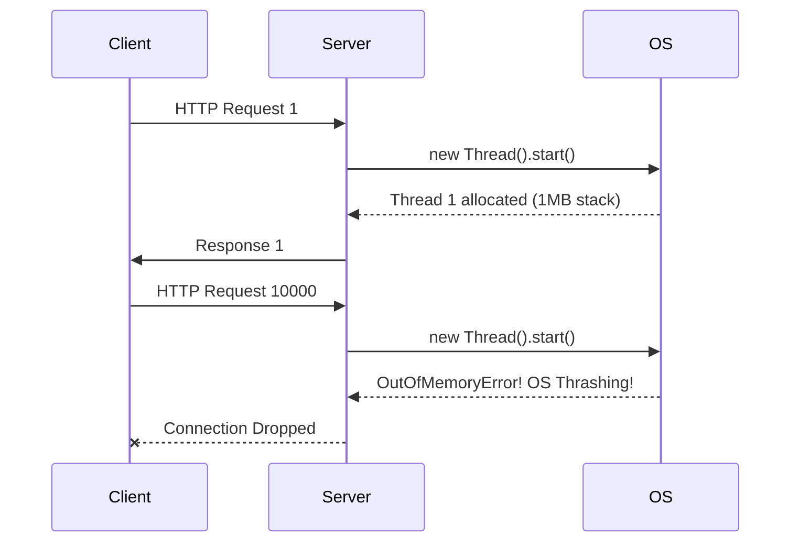
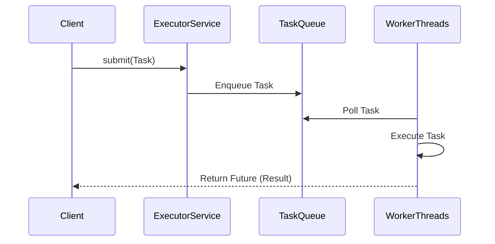
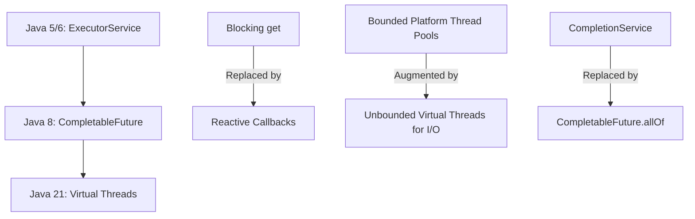

# Chapter 6: Task Execution

## 1. The Mental Model (Prose) 

The fundamental premise of Chapter 6 is the essential decoupling of **Task Submission** from **Task Execution**.

When building concurrent applications, the naive approach is to execute tasks sequentially (poor responsiveness and throughput) or to spawn a new thread for every incoming task (`new Thread(task).start()`). Unbounded thread creation inevitably leads to resource exhaustion, catastrophic `OutOfMemoryError`s, and CPU thrashing due to excessive context switching. 

The **Executor Framework** introduces a standard mechanism to manage execution policies. It abstracts away the complex thread lifecycle management, providing a unified interface to control *how*, *when*, and *by which thread* a task is executed. By using Thread Pools, we amortize the cost of thread creation across multiple tasks and place strict boundaries on memory and CPU consumption.

### The Naive "Thread-Per-Task" Anti-Pattern


### The Executor Framework Model


---

## 2. Modern Java Context (Crucial) 

The concepts in JCIP were written for Java 5/6. Here is how modern Java (8 through 21+) transforms these concepts:

* **`CompletableFuture` (Java 8+):** The book heavily relies on `Future` and `CompletionService` to retrieve results. However, raw `Future`s are blocking (`future.get()`). `CompletableFuture` replaces most use cases for `CompletionService` by allowing you to chain non-blocking, reactive callbacks (`thenApply`, `thenAccept`, `thenCombine`), transforming heterogeneous task execution into fluent, asynchronous pipelines.
* **Virtual Threads (Java 19/21+ Project Loom):** This fundamentally alters the "Disadvantages of unbounded thread creation" paradigm. Because traditional Platform Threads are expensive 1:1 wrappers around OS threads, bounding them in thread pools was mandatory. **Virtual Threads** are incredibly lightweight (managed by the JVM, not the OS). In modern Java, if tasks are heavily I/O bound, you *can* go back to a "thread-per-task" model using `Executors.newVirtualThreadPerTaskExecutor()`. However, for CPU-bound tasks, traditional bounded thread pools (`ForkJoinPool` or `ThreadPoolExecutor`) remain strictly necessary.

### Execution Policy Evolution


---

## 3. Real-World Application 

**Scenario:** A high-traffic travel reservation backend integrating with multiple third-party airline and hotel APIs.

**The Bug:** The team needs to fetch prices from 15 different APIs concurrently for a user's search. They implement an `ExecutorService` using the seemingly safe utility: `Executors.newFixedThreadPool(50)`.

During a holiday spike, downstream airline APIs experience high latency, taking 10 seconds to respond instead of 500ms. Because `newFixedThreadPool` uses an *unbounded* `LinkedBlockingQueue` under the hood, incoming user requests are queued infinitely as the 50 threads are blocked waiting for network I/O. The queue consumes all heap space, resulting in a silent `OutOfMemoryError` that takes down the entire microservice cluster, rather than gracefully rejecting requests.

---

## 4. The "Proof" (Code Strategy) 

### Breaking Code: The Hidden Unbounded Queue
```java
public class BreakingTravelService {
    // DANGER: newFixedThreadPool uses an unbounded LinkedBlockingQueue!
    // If tasks arrive faster than they execute, memory will exhaust.
    private final ExecutorService executor = Executors.newFixedThreadPool(50);

    public void serveRequest(SearchRequest req) {
        executor.submit(() -> callSlowAirlineApi(req)); 
    }
}
```

### Fixed Code: The Bounded, Managed Strategy
Instead of factory methods, manually construct the `ThreadPoolExecutor` to control the queue size and the rejection policy. For Java 21+, use Virtual Threads for this highly concurrent I/O workload.

**Java 8-17 Solution (Bounded Queue):**
```java
public class FixedTravelService {
    // Explicitly bounded queue (capacity 1000) with a CallerRuns rejection policy
    private final ExecutorService executor = new ThreadPoolExecutor(
        50, 50, // core and max pool size
        0L, TimeUnit.MILLISECONDS,
        new LinkedBlockingQueue<>(1000), // Strict memory boundary
        new ThreadPoolExecutor.CallerRunsPolicy() // Graceful degradation
    );

    public void serveRequest(SearchRequest req) {
        executor.submit(() -> callSlowAirlineApi(req));
    }
}
```

**Java 21+ Solution (Virtual Threads for I/O):**
```java
public class ModernTravelService {
    // Virtual threads cost almost zero memory. Perfect for blocking I/O calls.
    // Thread pools are an antipattern for Virtual Threads.
    private final ExecutorService executor = Executors.newVirtualThreadPerTaskExecutor();

    public void serveRequest(SearchRequest req) {
        executor.submit(() -> callSlowAirlineApi(req));
    }
}
```

---

## 5. Summary 

* **The Golden Rule:** Always decouple task *submission* from task *execution*. Never instantiate `new Thread(r).start()` directly in production code; consistently route concurrent logic through a configured `Executor`.
* **The Gotcha:** Beware of the `Executors` utility class factory methods (like `newFixedThreadPool` or `newCachedThreadPool`). They contain hidden unbounded parameters (either unbounded queues or unbounded thread limits) that will inevitably cause `OutOfMemoryError`s under high load or downstream latency. Always construct your `ThreadPoolExecutor` manually for production systems.