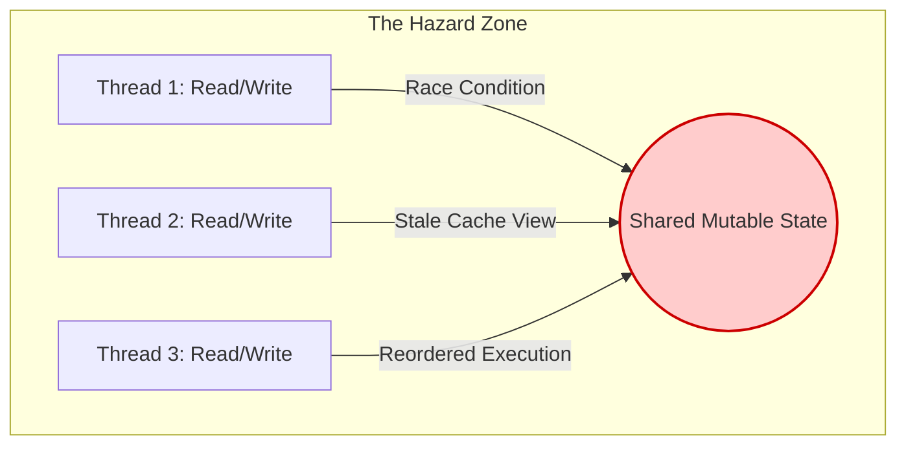
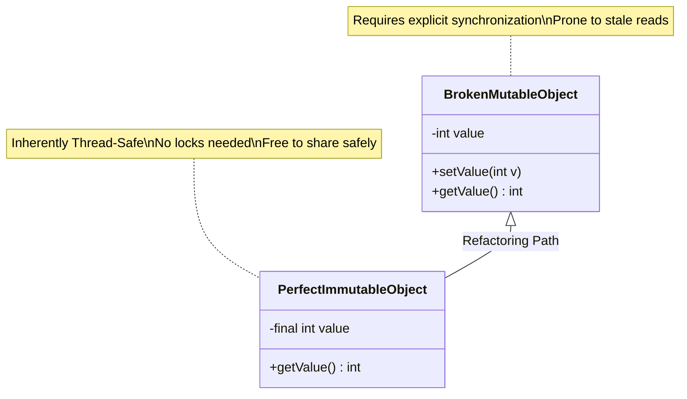
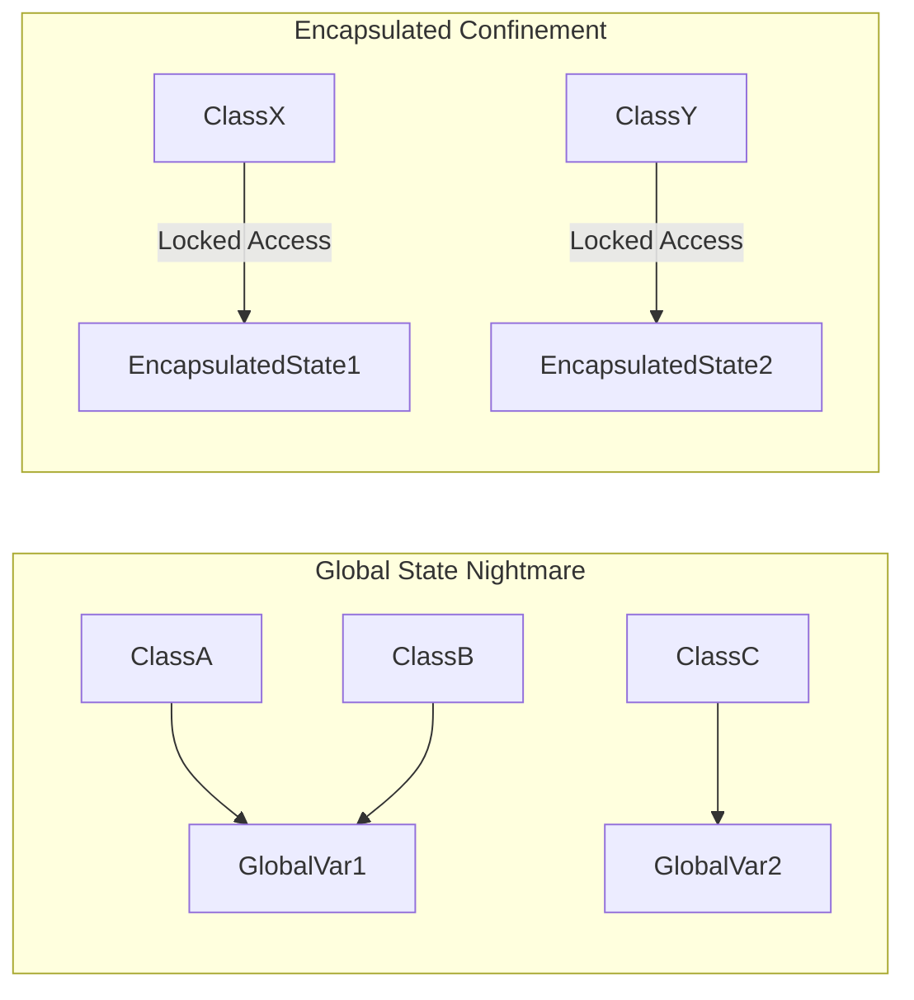
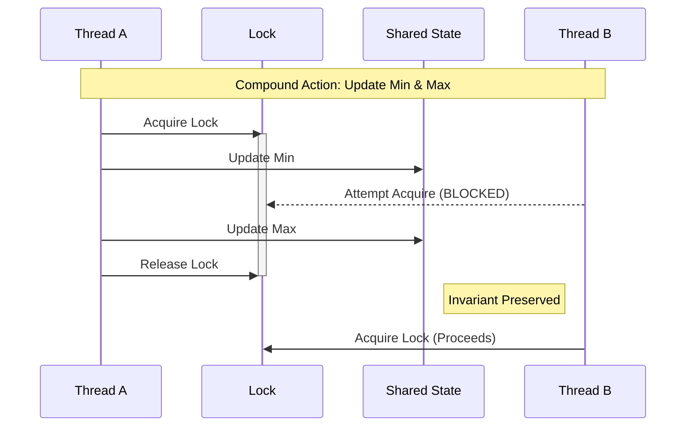
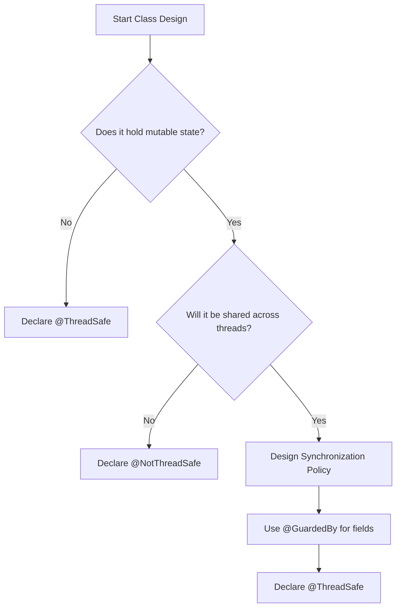

# Java Concurrency in Practice: Summary of Part I
## Fundamentals of Thread Safety

This documentation synthesizes the core principles from Part I of *Java Concurrency in Practice* (JCIP). It combines verbatim foundational rules with expanded architectural context, memory visibility mechanics, and modern Java considerations that are crucial for a complete mental model.

---

### 1. The Root Cause: Mutable State

> "It's the mutable state, stupid." All concurrency issues boil down to coordinating access to mutable state.

The primary battle in concurrent programming is not threads themselves, but the shared data they access. The less mutable state, the easier it is to ensure thread safety.

**The Complete Picture:** Concurrency hazards manifest in three distinct ways when mutable state is uncoordinated:
1.  **Atomicity Hazards (Race Conditions):** Thread A and Thread B interleave operations, corrupting the state.
2.  **Visibility Hazards:** Thread A updates a variable, but Thread B reads from a stale cache, never seeing the update.
3.  **Ordering Hazards:** The compiler or CPU reorders instructions to optimize execution, causing threads to see a state transition that defies chronological logic.

---

### 2. The Ultimate Defense: Immutability

> Make fields final unless they need to be mutable.  
> Immutable objects are automatically thread-safe. 

Immutable objects simplify concurrent programming tremendously. They are simpler and safer , and can be shared freely without locking or defensive copying.

**The Complete Picture:** Declaring fields `final` is not enough. For an object to be genuinely immutable (and thus inherently thread-safe), it must satisfy three strict conditions:
1.  Its state cannot be modified after construction.
2.  All its fields are `final`.
3.  It is **properly constructed** (the `this` reference does not escape during construction, such as registering a listener inside the constructor before the object is fully built).

*Note: In modern Java, Records (`record` keyword introduced in Java 14) provide a fantastic, boilerplate-free way to define immutable data carriers.*

---

### 3. Taming Complexity via Encapsulation

> Encapsulation makes it practical to manage the complexity. 

You could write a thread-safe program with all data stored in global variables, but why would you want to?. Encapsulating data within objects makes it easier to preserve their invariants ; encapsulating synchronization within objects makes it easier to comply with their synchronization policy.

**The Complete Picture:** This introduces the concept of **Instance Confinement**. By hiding data deeply inside an object, you constrain the scope of code that can touch it. If a piece of mutable state is strictly confined to a single class, you only need to analyze that specific class to verify thread safety, rather than auditing the entire codebase.

---

### 4. Locking Strategies and Invariants

> Guard each mutable variable with a lock.  
> Guard all variables in an invariant with the same lock.  
> Hold locks for the duration of compound actions.  
> A program that accesses a mutable variable from multiple threads without synchronization is a broken program.

**The Complete Picture:** A "compound action" is any operation that requires a sequence of steps that must be atomic. Common examples are "check-then-act" (e.g., lazy initialization: `if (x == null) x = new Object();`) or "read-modify-write" (e.g., `count++`). Even if you use a thread-safe `AtomicInteger`, if two variables share an invariant (e.g., `lowerBound` must always be less than `upperBound`), you cannot update them atomically without acquiring a single common lock across both updates.

---

### 5. Architectural Honesty and Design

> Don't rely on clever reasoning about why you don't need to synchronize.  
> Include thread safety in the design process - or explicitly document that your class is not thread-safe.  
> Document your synchronization policy.

**The Complete Picture:** "Clever reasoning" often falls apart under different JVM implementations or CPU architectures due to the Java Memory Model's allowance for instruction reordering. Concurrency should be designed upfront, not patched in via trial and error. To fulfill the documentation mandate, JCIP popularized standard annotations which should be used universally:
* `@ThreadSafe`
* `@NotThreadSafe`
* `@GuardedBy("lockName")`

