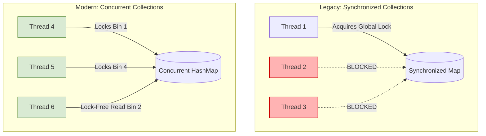

# Chapter 5: Building Blocks

## 1. The Mental Model 

The central theme of this chapter is **delegation**. Instead of building concurrent structures from scratch using volatile variables, intrinsic locks (`synchronized`), and wait/notify blocks, you should delegate thread safety to the battle-tested building blocks in `java.util.concurrent`.

The underlying mechanics shift from **mutual exclusion** (where only one thread can do *anything* at a time) to **fine-grained concurrency and non-blocking algorithms**. A classic synchronized collection treats the entire data structure as a single atomic unit. A concurrent collection like `ConcurrentHashMap` fragments the lock state, allowing multiple threads to read and write simultaneously without stepping on each other's toes.



Furthermore, synchronizers (Latches, Barriers, Semaphores) act as structural traffic cops. They control the flow of threads based on logical state (e.g., "wait until 5 services have started" or "only allow 10 concurrent database connections") rather than just memory protection.

## 2. Modern Java Context (Crucial) 

While the original text covers Java 5/6, modern Java (8 through 21+) dramatically transforms how we use these blocks:

* **ConcurrentHashMap Enhancements (Java 8):** The book discusses lock striping via `Segment` arrays. In Java 8, `ConcurrentHashMap` was completely rewritten. It dropped segments in favor of locking the first node of each bin (bucket) directly using `synchronized` and CAS (Compare-And-Swap) operations. It also introduced `computeIfAbsent()`, which safely handles atomic check-then-act caching.
* **Virtual Threads (Java 21+):** When using `BlockingQueue` for Producer-Consumer patterns, blocking operations (`take()`, `put()`) used to pin OS threads, limiting scalability. With Java 21's Virtual Threads, a blocked queue operation simply unmounts the virtual thread, freeing the carrier OS thread. This makes Producer-Consumer patterns orders of magnitude cheaper to scale.
* **CompletableFuture (Java 8+):** The book heavily references `FutureTask` for deferred results. `CompletableFuture` entirely supersedes raw `FutureTask` for asynchronous workflows, allowing non-blocking, functional chaining of tasks without ever explicitly calling `.get()` (which blocks).

## 3. Real-World Application 

**Scenario:** Building an expensive result cache (e.g., fetching a user's complex pricing tier from a legacy CRM).

If you use a `Collections.synchronizedMap`, every request to the cache serializes. If 1000 users hit the cache simultaneously, 999 are blocked just waiting to see if their result is cached.

If you upgrade to `ConcurrentHashMap<String, UserPricing>`, you fix the read bottleneck. However, if multiple threads request the *same* missing user ID at exactly the same time, they all experience a cache miss and trigger the expensive CRM call concurrently (the "Thundering Herd" problem). Getting this check-then-act sequence wrong causes your legacy CRM to crash under load.

## 4. The "Proof" (Code Strategy) 

### The Breaking Code 
Using a synchronized map creates a check-then-act race condition if not locked globally (defeating the purpose of concurrency), and causes redundant expensive computations.

```java
public class BreakingCache {
    // Thread-safe map, but NOT thread-safe compound operations!
    private final Map<String, Pricing> cache = Collections.synchronizedMap(new HashMap<>());

    public Pricing getPricing(String userId) {
        Pricing pricing = cache.get(userId);
        if (pricing == null) { // RACE CONDITION: Two threads can evaluate to true
            pricing = computeExpensivePricing(userId); 
            cache.put(userId, pricing);
        }
        return pricing;
    }
}
```

### The Fixed Version 
Using modern `ConcurrentHashMap` primitives combined with the `Future` pattern (the "Memoizer" concept from JCIP) ensures the expensive computation is only started *once*, and other threads wait for that specific computation to finish.

```java
public class ScalableMemoizer {
    // Maps the ID to the *computation process*, not just the result
    private final ConcurrentMap<String, Future<Pricing>> cache = new ConcurrentHashMap<>();

    public Pricing getPricing(String userId) throws Exception {
        while (true) {
            Future<Pricing> future = cache.get(userId);
            if (future == null) {
                Callable<Pricing> eval = () -> computeExpensivePricing(userId);
                FutureTask<Pricing> futureTask = new FutureTask<>(eval);
                
                // Atomically put if absent. If another thread beat us, we get their future
                future = cache.putIfAbsent(userId, futureTask);
                if (future == null) {
                    future = futureTask;
                    futureTask.run(); // Start computation on this thread
                }
            }
            try {
                // Wait for the computation to finish (either ours or the other thread's)
                return future.get(); 
            } catch (CancellationException e) {
                cache.remove(userId, future); // Clean up if computation was cancelled
            }
        }
    }
    
    /* 
     * Modern Java 8+ Alternative (Even cleaner):
     * cache.computeIfAbsent(userId, id -> computeExpensivePricing(id));
     */
}
```

## 5. Summary 

* **The Golden Rule:** Always prefer standard concurrent building blocks (`ConcurrentHashMap`, `CopyOnWriteArrayList`, `CountDownLatch`) over building custom mechanisms with `wait()`/`notify()` or `synchronized` collections. They handle the nuanced memory visibility and scalability issues for you.
* **The Gotcha:** Hidden Iterators. Even if you properly synchronize your collections, methods like `toString()`, `hashCode()`, `equals()`, or passing the collection to another constructor will implicitly iterate over it. If another thread modifies the collection during this hidden iteration, you will be hit with a seemingly random `ConcurrentModificationException` in production.