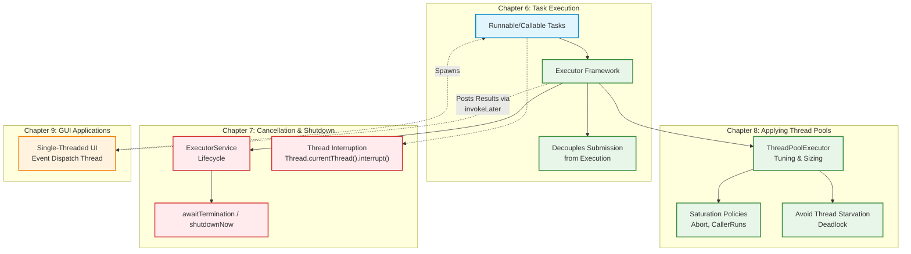
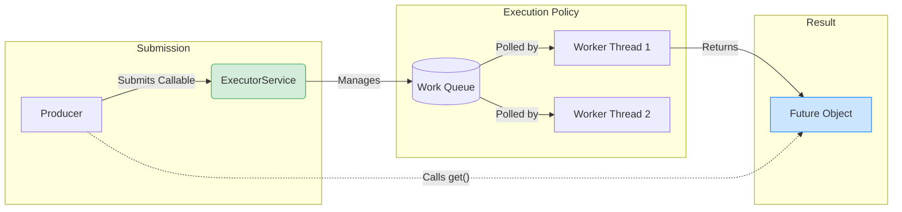
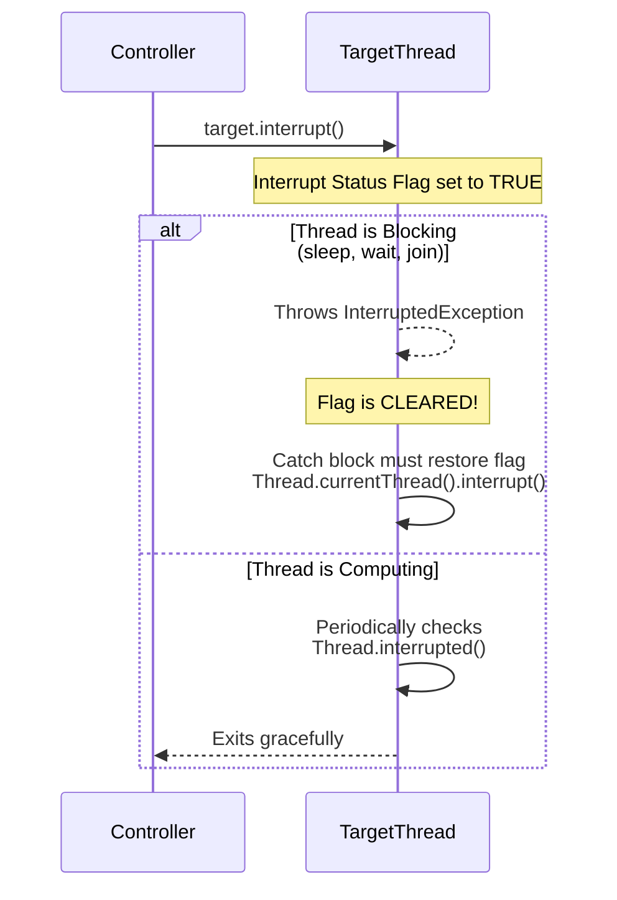
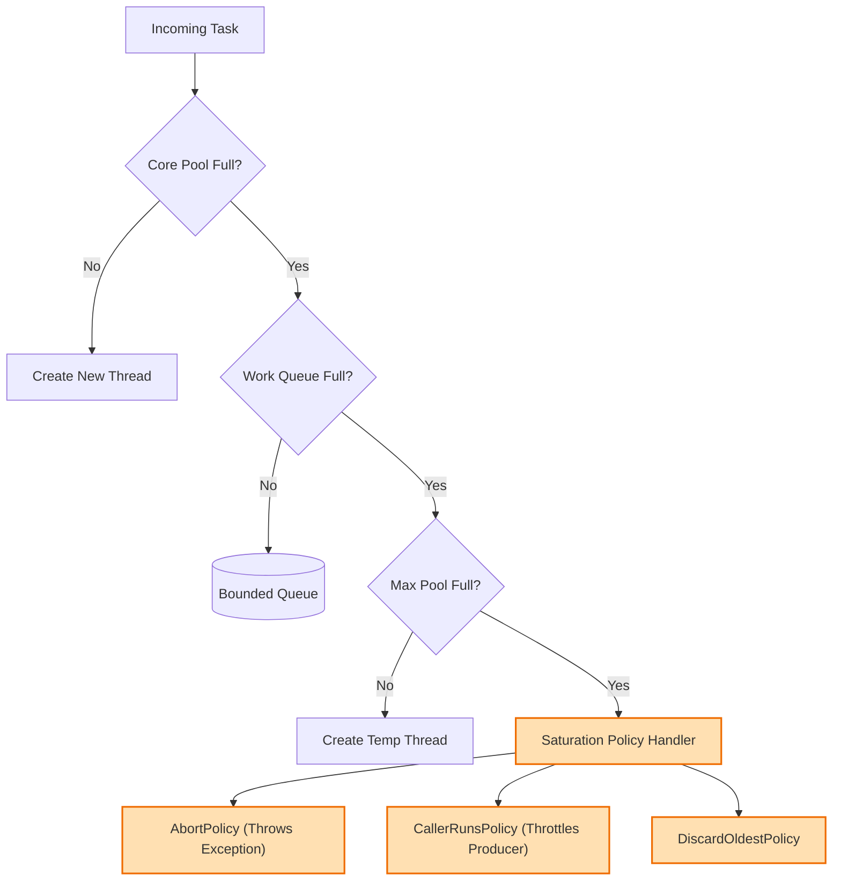
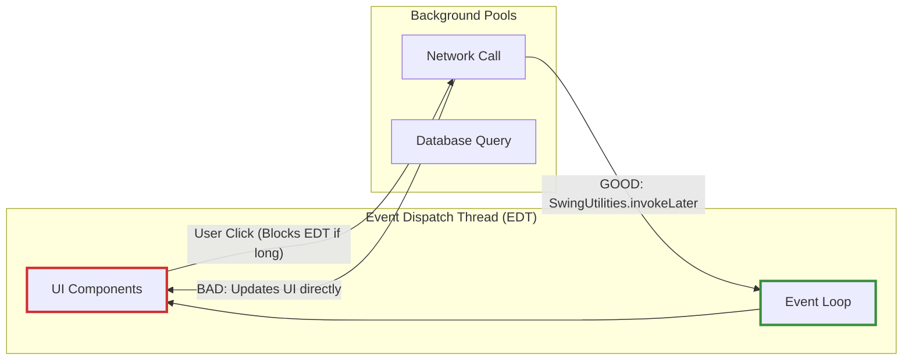

# Java Concurrency in Practice: Summary of Part II

## Structuring Concurrent Applications (Chapters 6-9)

Part II transitions from the low-level primitives of thread safety (Part I) to the architectural patterns needed to build robust, scalable concurrent applications. It focuses on task abstraction, lifecycle management, and execution policies.

## The Architectural Flow (Part II Ecosystem)

## Chapter 6: Task Execution Core Concepts

Chapter 6 teaches us to stop managing raw `Thread` objects (`new Thread(r).start()`) and instead think in terms of logical **Tasks** mapped to an **Execution Policy**.

* **Key Takeaway:** `Executor` separates *what* is done from *how* and *when* it is done.
* **Modern Equivalent:** Replaced/Enhanced by `CompletableFuture` for non-blocking asynchronous pipelines, and `Executors.newVirtualThreadPerTaskExecutor()` in Java 21.

## Chapter 7: Cancellation and Shutdown

There is no safe way to preemptively stop a thread in Java (`Thread.stop()` is deprecated). Chapter 7 focuses on **Cooperative Interruption**.

* **Key Takeaway:** Interruption is a request, not a command. Code must be written to actively check for and respond to interrupt requests. Swallowing `InterruptedException` without restoring the interrupt status is a critical antipattern.

## Chapter 8: Applying Thread Pools

A deep dive into `ThreadPoolExecutor`. It exposes the implicit coupling between tasks and pools.

* **Key Takeaway:** Never use unbounded queues in production. Always configure core/max threads, keep-alive times, bounded queues, and a sensible Saturation Policy to prevent `OutOfMemoryError`.
* **Danger:** **Thread Starvation Deadlock**. Submitting tasks to a bounded pool that then submit *sub-tasks* to the exact same pool and wait for them to finish.

## Chapter 9: GUI Applications

Deals with the constraint that GUI frameworks are single-threaded to prevent deadlocks and data races in the view components.

* **Key Takeaway:** Long-running tasks must be strictly confined to background threads, but UI mutations must be strictly confined to the Event Dispatch Thread. Use `Future`s or callbacks to bridge the gap.