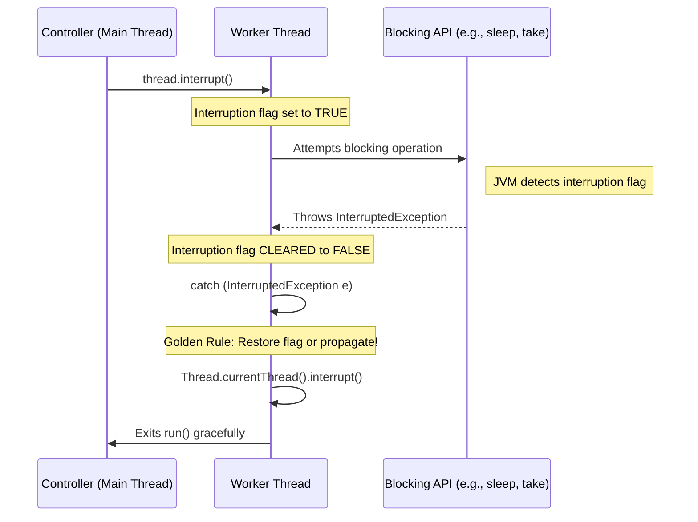

# Chapter 7: Cancellation and Shutdown

## 1. The Mental Model (Prose)

In Java, you cannot safely force a thread to stop. Older mechanisms like `Thread.stop()` were deprecated because they violently killed threads, leaving shared data structures in inconsistent states and silently dropping intrinsic locks. Instead, Java relies on **cooperative cancellation**.

The mental model here is a polite request rather than a forced termination. When you call `cancel()` or `interrupt()`, you are merely setting a boolean flag (the interruption status) on the target thread. It is entirely up to the target thread to periodically check this flag or respond to `InterruptedException` when blocked. If a developer writes a thread that ignores this flag, that thread is effectively un-cancelable, leading to resource leaks.

Shutdown is the macro version of this. When stopping a service (like an `ExecutorService`), you have to choose between a graceful shutdown (stop accepting new tasks, finish current ones) and an abrupt shutdown (interrupt everything currently running).



## 2. Modern Java Context (Crucial)

Chapter 7 of JCIP focuses heavily on `ExecutorService`, `Future`, and raw `Thread.interrupt()`. Modern Java (8 through 21+) has radically shifted this landscape:

* **Java 8 `CompletableFuture` Gotcha:** Calling `cancel(true)` on a `CompletableFuture` **does not** interrupt the underlying thread executing the task by default. It simply transitions the future to exceptionally completed. If you rely on `cf.cancel()` to stop a runaway thread, it will keep consuming CPU in the background.
* **Java 21 Virtual Threads (Project Loom):** Virtual threads are still `Thread` instances and respond to `interrupt()` exactly as OS threads do. However, because they are cheap to create and block, the penalty for *not* cancelling them gracefully is lower on OS resources (you won't exhaust OS threads), but you will still leak heap memory and application logic will drift.
* **Java 21+ Structured Concurrency (`StructuredTaskScope`):** This is the ultimate evolution of Chapter 7. Instead of manually managing `ExecutorService` shutdown and `Future` cancellation, structured concurrency binds the lifecycle of subtasks to a lexical scope (a `try-with-resources` block). If the parent scope fails or is cancelled, **all** running subtasks (virtual threads) receive an automated `interrupt()`. This virtually eliminates the orphaned thread problem JCIP spends pages trying to solve.

## 3. Real-World Application

**The Scenario:** A high-throughput API gateway acting as a facade for a legacy downstream billing system.  
**The Bug:** The gateway uses an `ExecutorService` to handle incoming HTTP requests, dispatching a worker thread to make a REST call to the legacy system. The downstream system experiences a brownout, and the HTTP requests start hanging. The client (e.g., a mobile app) times out and closes the connection.  
**The Catastrophe:** The client closed the connection, triggering a cancellation event on the gateway. The gateway calls `future.cancel(true)`. However, the developer used a standard `InputStream.read()` for the HTTP client, which **does not respond to `Thread.interrupt()`** (it's non-interruptible blocking). The legacy system hangs for hours. The gateway's threads are never freed, the thread pool exhausts, and the entire API gateway goes offline with an `OutOfMemoryError` or thread starvation, taking down the whole company's microservice ecosystem.  
**The Fix:** You must encapsulate non-standard cancellation. Overriding `newTaskFor` or explicitly closing the underlying `Socket` connection when the thread is interrupted is the only way to unblock threads stuck in standard socket I/O.

## 4. The "Proof" (Code Strategy)

### The Breaking Code (The Volatile Flag Trap)
Developers often try to invent their own cancellation policy using a `volatile boolean`. This works for CPU-bound loops, but fails catastrophically if the thread blocks.

```java
class BadWorker implements Runnable {
    private volatile boolean cancelled = false;
    private final BlockingQueue<Task> queue;

    public void cancel() { this.cancelled = true; }

    public void run() {
        // DANGER: If the queue is empty, the thread blocks at take().
        // It will NEVER wake up to check the 'cancelled' flag.
        while (!cancelled) {
            try {
                Task task = queue.take(); 
                process(task);
            } catch (InterruptedException e) {
                // The Sin: Swallowing the exception
            }
        }
    }
}
```

### The Fixed Code (Proper Interruption Policy)
We must use the JVM's native interruption mechanism. When `InterruptedException` is caught, the JVM clears the interrupt status. If we are in a `Runnable` (where we can't throw a checked exception), we **must** restore it.

```java
class GoodWorker implements Runnable {
    private final BlockingQueue<Task> queue;

    public void run() {
        // Use the native interruption flag as the source of truth
        while (!Thread.currentThread().isInterrupted()) {
            try {
                Task task = queue.take(); // Automatically responds to thread.interrupt()
                process(task);
            } catch (InterruptedException e) {
                // 1. We caught it, so the flag was cleared by the JVM.
                // 2. We restore the flag so the while-loop condition catches it on the next spin,
                // or so higher-level code knows this thread was interrupted.
                Thread.currentThread().interrupt(); 
                // Optionally log or clean up resources here
            }
        }
    }
}
```

## 5. Summary

* **The Golden Rule:** **Never swallow `InterruptedException`.** If you catch it, you must either rethrow it (if your method signature allows) or call `Thread.currentThread().interrupt()` to restore the interruption status so code higher up the call stack knows the thread was asked to stop.
* **The Gotcha:** `Thread.interrupt()` does not magically stop all blocking operations. It works seamlessly for `Object.wait()`, `Thread.sleep()`, and `BlockingQueue` methods. It **does not work** for synchronized block lock acquisition, `java.io` Socket reads, or intrinsic locks. For those, you must deal with non-interruptible blocking (e.g., closing the underlying socket stream).