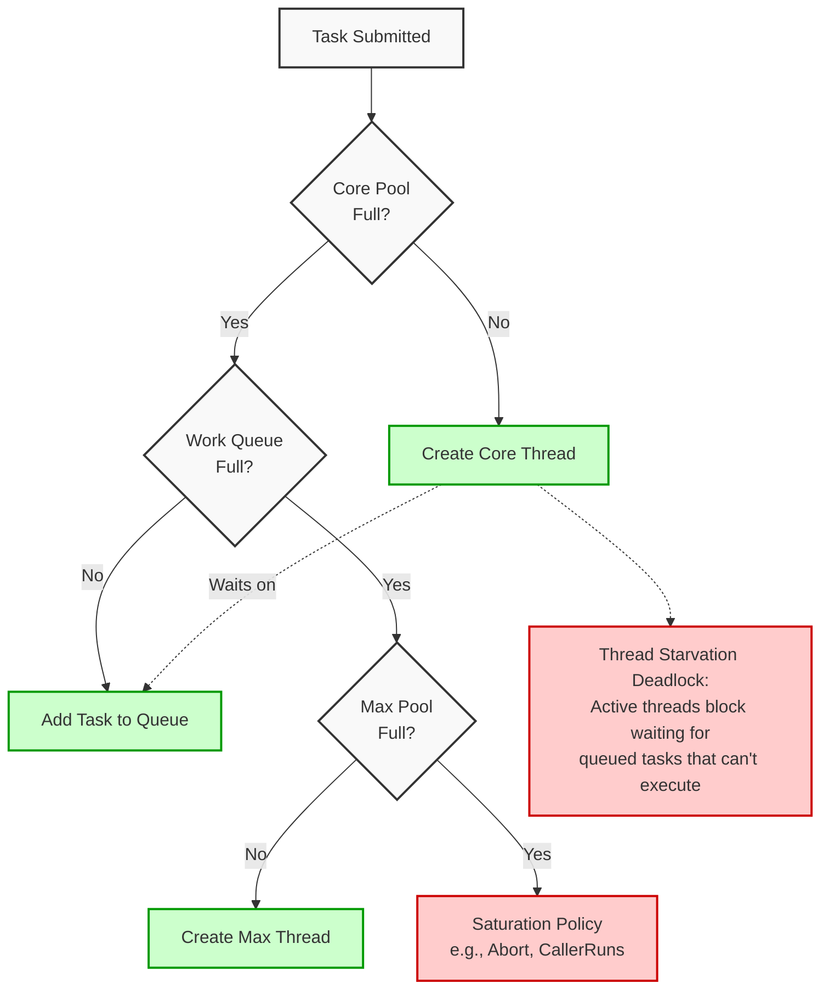

# Chapter 8: Applying Thread Pools

## 1. The Mental Model
The core premise of Chapter 8 is that **thread pools and the tasks they execute are not strictly independent**. While the `Executor` framework promises to decouple task submission from execution, certain types of tasks introduce *implicit coupling* with the execution policy. If tasks are dependent on one another, time-sensitive, or use `ThreadLocal`, the execution policy must be carefully tailored to prevent catastrophic failures like Thread Starvation Deadlock.

A `ThreadPoolExecutor` is a delicate balancing act between memory management (the work queue) and CPU allocation (the thread pool).



### Sizing the Pool Mathematically
To correctly size a thread pool, you must understand the ratio of wait time ($W$) to compute time ($C$). The optimal pool size ($N_{threads}$) for a system with $N_{cpu}$ cores and a target CPU utilization of $U_{cpu}$ (between 0.0 and 1.0) is:

$N_{threads} = N_{cpu} \times U_{cpu} \times \left(1 + \frac{W}{C}\right)$

## 2. Modern Java Context (Crucial)
The landscape of Java concurrency has shifted dramatically since JCIP was written.

* **Java 8 (`ForkJoinPool` & `CompletableFuture`):** For parallelizing recursive algorithms (like the puzzle framework mentioned in the chapter), `ForkJoinPool` uses a "work-stealing" algorithm where idle threads steal tasks from the queues of busy threads. `CompletableFuture` allows you to chain dependent tasks asynchronously without blocking a thread waiting for the result, largely mitigating Thread Starvation Deadlock.
* **Java 21+ (Project Loom & Virtual Threads):** This is the ultimate game-changer for IO-bound tasks. JCIP's complex guidance on sizing thread pools based on IO-wait-time is obsolete for virtual threads. **You do not pool Virtual Threads.** Because they are lightweight and cheap to block, you simply use `Executors.newVirtualThreadPerTaskExecutor()`. Thread Starvation Deadlock is almost impossible with virtual threads because blocking a virtual thread does not block the underlying OS carrier thread.

## 3. Real-World Application
**Scenario:** An e-commerce backend relies on an aggregator service to fetch pricing and inventory.  
**The Bug:** The developers configure a bounded `ThreadPoolExecutor` of 50 threads to handle incoming requests. Each request task spawns two sub-tasks (fetch price, fetch inventory) to the *same* thread pool and blocks waiting for their `Future.get()`.  
During a traffic spike, 50 requests arrive simultaneously. All 50 threads in the pool are consumed by the parent tasks. They all submit their sub-tasks to the queue and block. The sub-tasks can never execute because all threads are blocked. The system suffers a **Thread Starvation Deadlock** and completely freezes, requiring a hard restart.

## 4. The "Proof" (Code Strategy)

### The Breaking Code (Java 5/6 Era)
```java
// Antipattern: Submitting dependent tasks to the same bounded pool
ExecutorService pool = Executors.newFixedThreadPool(2);

Callable<String> dependentTask = () -> {
    return "Data";
};

Callable<String> parentTask = () -> {
    // DEADLOCK RISK: Parent submits to the same pool it is running on
    Future<String> future = pool.submit(dependentTask);
    // If the pool is saturated with parent tasks, this blocks forever
    return "Processed: " + future.get(); 
};

// Submitting 2 parent tasks saturates the pool. 
// Their dependent tasks are queued, but no threads are available to run them.
pool.submit(parentTask);
pool.submit(parentTask);
```

### The Fixed Version (Modern Java 21+)
Instead of using a bounded pool for dependent blocking IO tasks, we utilize Virtual Threads, which are practically infinite and unblock the carrier thread when waiting.

```java
// Fixed pattern: Use Virtual Threads for blocking dependent tasks
// No fixed pool sizing, no starvation deadlock
try (var executor = Executors.newVirtualThreadPerTaskExecutor()) {
    
    Callable<String> dependentTask = () -> {
        // Simulating IO delay
        Thread.sleep(100); 
        return "Data";
    };

    Callable<String> parentTask = () -> {
        // Spawns a new virtual thread, carrier thread is freed while waiting!
        Future<String> future = executor.submit(dependentTask); 
        return "Processed: " + future.get(); 
    };

    // Safely submit thousands of these without deadlocking
    executor.submit(parentTask);
    executor.submit(parentTask);
}
```
*Note: If restricted to older Java versions, the fix is to use two separate, isolated `ThreadPoolExecutor` instances (one for parents, one for sub-tasks) or rewrite using `CompletableFuture.thenCompose()`.*

## 5. Summary

* **The Golden Rule:** Never use an unbounded queue (e.g., `newCachedThreadPool` or `newFixedThreadPool` with a default `LinkedBlockingQueue`) in production without understanding your load. Always configure bounded queues with explicit Saturation Policies (`AbortPolicy`, `CallerRunsPolicy`) to fail fast and protect system memory.
* **The Gotcha:** *Implicit Coupling*. If your tasks are not completely independent (e.g., they wait on other tasks, rely on `ThreadLocal` state, or require a specific sequential execution order), they require a highly customized execution policy and are prime candidates for Thread Starvation Deadlock.