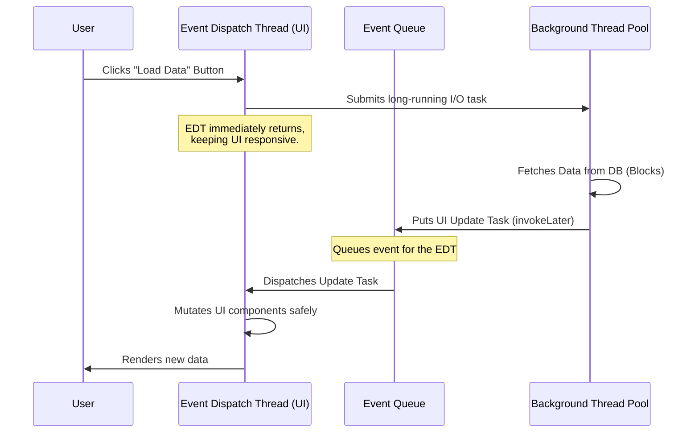

# Chapter 9: GUI Applications

## 1. The Mental Model
The core theoretical concept of Chapter 9 is **Thread Confinement**. Almost all modern GUI frameworks (Swing, JavaFX, Android UI) are designed as **single-threaded subsystems**. The designers explicitly traded the performance of multithreaded UI updates for the safety and simplicity of a single Event Dispatch Thread (EDT).

Because GUI components are highly interconnected (e.g., a scrollbar updates a viewport, which triggers a repaint, which queries a data model), making every component thread-safe via locks is prone to deadlocks and massive overhead. Instead, the "mental model" mandates that **all** UI events, repaints, and component mutations happen sequentially on one thread. If a background thread needs to update the UI, it must package that update as a task and inject it into the EDT's queue.



## 2. Modern Java Context (Crucial)
* **Java 5/6 (`SwingWorker`):** JCIP relies heavily on `SwingWorker` for separating background computation from UI updates. It provided `doInBackground()` for the heavy lifting and `done()`/`process()` which safely executed on the EDT.
* **Java 8+ (`CompletableFuture` & JavaFX):** `SwingWorker` is largely obsolete in modern reactive programming. Today, you chain asynchronous tasks using `CompletableFuture`. You perform the heavy lifting in `supplyAsync()`, and then use `.thenAcceptAsync(result, Platform::runLater)` (in JavaFX) or `.thenAcceptAsync(result, SwingUtilities::invokeLater)` to seamlessly shift the result back to the single-threaded UI subsystem.
* **Java 21+ (Virtual Threads):** Virtual threads make background workers exceptionally cheap. You don't need a dedicated background thread pool for GUI I/O tasks anymore. You simply spin up a virtual thread per user action (like a button click fetching from a network), block the virtual thread (which is cheap), and push the result back to the EDT when unblocked.

## 3. Real-World Application
**Scenario:** A desktop trading application has a "Refresh Portfolio" button that makes an HTTP call to a pricing API.  
**The Bug:** The developer maps the button click directly to a method that performs the synchronous HTTP call on the UI thread.  
**The Impact:** When the API experiences latency and takes 5 seconds to respond, the EDT is blocked. The entire application completely freezes. The window cannot be moved, resized, or minimized. Tooltips stop working. The OS may gray out the window and show a "Not Responding" prompt. Users panic and force-kill the app, assuming it crashed, potentially losing unsaved data.

## 4. The "Proof" (Code Strategy)

### The Breaking Code (Blocking the EDT)
```java
// Antipattern: Long-running task on the EDT
button.addActionListener(e -> {
    try {
        // DEADLOCK/FREEZE RISK: This executes on the EDT!
        String data = fetchReportFromNetwork(); // Blocks for 5 seconds
        label.setText(data); 
    } catch (Exception ex) {
        ex.printStackTrace();
    }
});
```

### The Fixed Version (Modern Java 8+ CompletableFuture)
```java
// Fixed pattern: Offload to background, update on EDT
button.addActionListener(e -> {
    // 1. Show immediate visual feedback on EDT
    label.setText("Loading...");
    button.setEnabled(false);
    
    // 2. Offload work to a background thread (Common ForkJoinPool)
    CompletableFuture.supplyAsync(() -> fetchReportFromNetwork())
        // 3. Shift execution back to the EDT for the UI update
        .thenAcceptAsync(data -> {
            label.setText(data);
            button.setEnabled(true);
        }, SwingUtilities::invokeLater) // Crucial: Thread Confinement
        
        // Handle background errors safely on the EDT
        .exceptionallyAsync(ex -> {
            label.setText("Error loading data.");
            button.setEnabled(true);
            return null;
        }, SwingUtilities::invokeLater); 
});
```

## 5. Summary
* **The Golden Rule:** Never perform blocking I/O or long-running computations on the Event Dispatch Thread, and conversely, never mutate a UI component or its underlying data model from any thread *other* than the Event Dispatch Thread.
* **The Gotcha:** *Shared Data Models*. Even if you update the UI correctly using `invokeLater`, if your background thread and your UI both hold a reference to the *same* underlying data model (like a `TableModel`), mutations from the background thread can cause `ConcurrentModificationException`s during UI repaints. Use a "Split Data Model" (presentation model vs. thread-safe shared model) to prevent this.