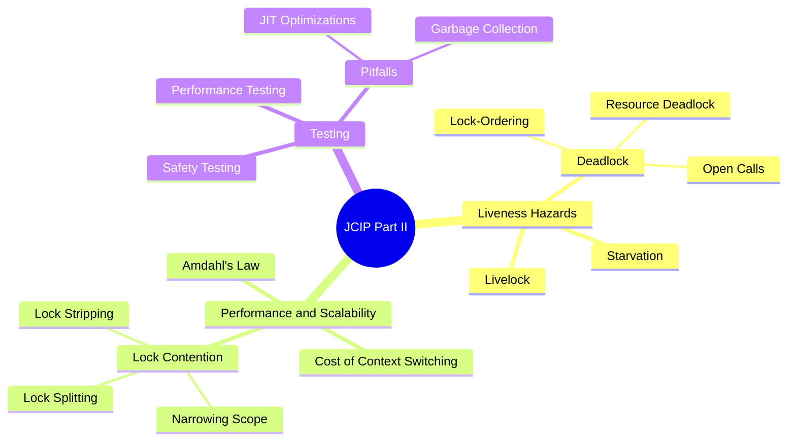
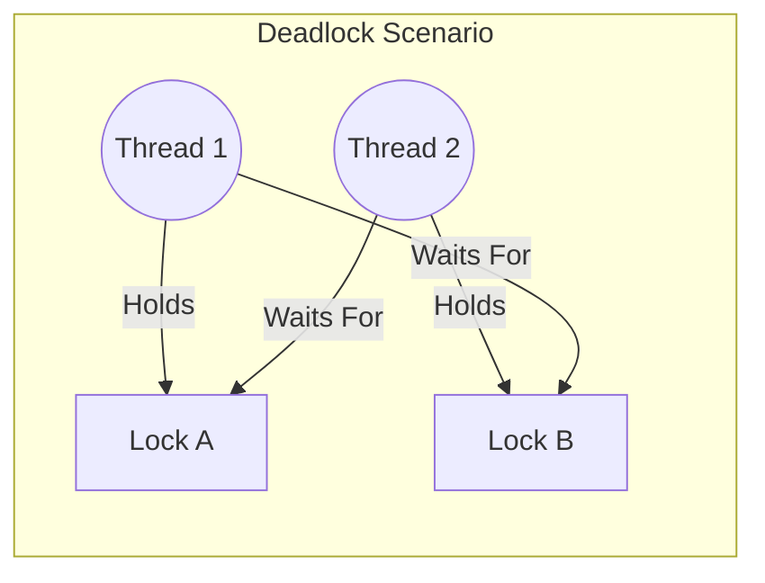
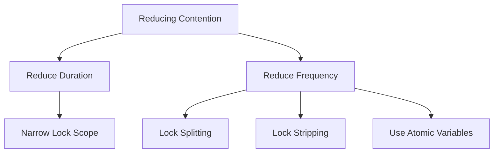

# Java Concurrency in Practice: Summary of Part III

## Liveness, Performance, and Testing

This summary covers the core concepts of **Part II** from *Java Concurrency in Practice* (JCIP), focusing on how to avoid hazards while ensuring that concurrent applications remain efficient and verifiable.

## Overview Mindmap

---

## Chapter 10: Avoiding Liveness Hazards

Liveness refers to a concurrent application's ability to execute in a timely manner. The most common threat is **Deadlock**.

### Key Concepts:
*   **Deadlock (The Deadly Embrace):** Occurs when thread A holds Lock L and tries to acquire Lock M, while thread B holds Lock M and tries to acquire Lock L.
*   **Lock-Ordering Deadlocks:** If all threads acquire locks in the same global order, deadlock is impossible.
*   **Open Calls:** Calling a method without holding a lock. This is the primary defense against deadlock.
*   **Resource Deadlock:** Occurs when threads wait for resources (like database connections) that are held by other waiting threads.

---

## Chapter 11: Performance and Scalability

Performance is about "how fast," but **scalability** is about "how much more" work can be done when more resources (CPUs) are added.

### Amdahl's Law
Scalability is limited by the fraction of the application that must be executed serially.
*   **Formula:** $Speedup \le \frac{1}{F + \frac{(1-F)}{N}}$ (where $F$ is the serial fraction and $N$ is processors).

### Reducing Lock Contention
1.  **Narrowing Scope:** Hold locks for the shortest possible time.
2.  **Lock Splitting:** Breaking one lock that guards multiple independent variables into two locks.
3.  **Lock Stripping:** Partitioning a single lock into a collection of locks (e.g., `ConcurrentHashMap` using 16 buckets).

---

## Chapter 12: Testing Concurrent Programs

Testing concurrent programs is notoriously difficult because bugs are often non-deterministic (Heisenbugs).

### Categories of Testing:
*   **Safety Testing:** Ensuring that the code does not enter an invalid state (e.g., checking for data races). Use "put/take" tests with checksums to verify that what goes into a queue comes out correctly.
*   **Performance Testing:** Measuring throughput and responsiveness.
*   **Pitfalls to Avoid:**
    *   **The JIT Compiler:** Code might be optimized differently under test than in production.
    *   **Garbage Collection:** Ensure GC cycles don't skew timing results.
    *   **Unrealistic Contention:** Tests with only one thread won't reveal concurrency bottlenecks.

### Testing Tools & Techniques:
*   **CyclicBarrier:** Use this to start all worker threads at the exact same moment to maximize contention.
*   **Thread Pools:** Test with different pool sizes to find the "sweet spot" for throughput.