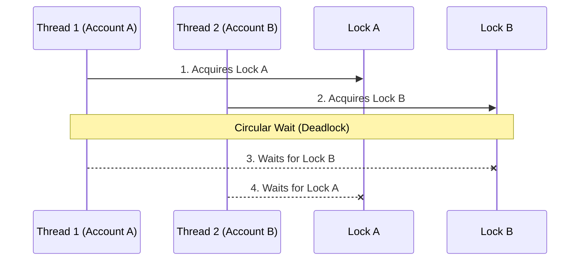
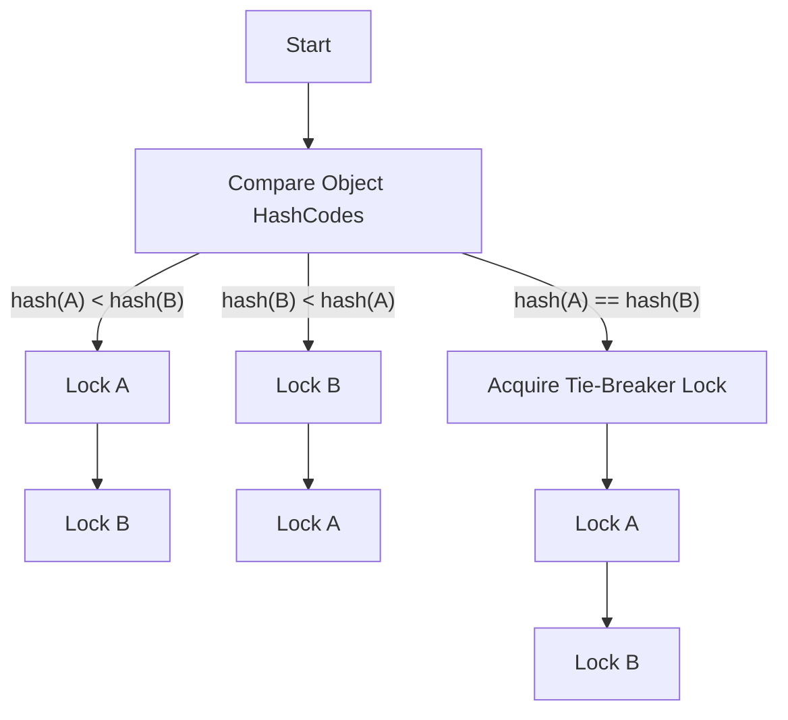

# Chapter 10: Avoiding Liveness Hazards

## 1. The Mental Model (Prose)
Liveness implies that "something good will eventually happen." When liveness is compromised, your application doesn't necessarily crash—it simply stops making progress, freezing indefinitely. The most notorious liveness hazard is a **Deadlock**, which occurs when two or more threads hold locks that the others need, resulting in an unbreakable cyclical wait.

The mechanics of deadlocks often stem from **Lock-Ordering**. If Thread A acquires Lock L1 then L2, while Thread B acquires Lock L2 then L1, a deadlock is mathematically possible if their executions interleave. **Dynamic lock ordering** masks this issue because the order of lock acquisition is determined by runtime arguments (e.g., transferring funds between two objects), hiding the static code structure's flaws. Similarly, **Deadlocks between cooperating objects** occur when a thread holds a lock while calling an "alien" method (an **Open Call** violation), inadvertently causing nested lock acquisition.



Other hazards include **Starvation** (where a thread is perpetually denied access to a resource, often due to thread priorities or greedy synchronization) and **Livelock** (where threads keep changing their state in response to each other without making actual progress, like two people constantly stepping into each other's way in a hallway).

## 2. Modern Java Context (Crucial)
While JCIP focuses heavily on explicit synchronization and `wait/notify`, modern Java (Java 8 through 21+) offers tools to mitigate these hazards fundamentally:

* **Virtual Threads (Java 21):** Virtual threads eliminate the cost of traditional thread starvation by multiplexing millions of lightweight threads onto a small pool of carrier threads. **However**, virtual threads do *not* prevent deadlocks. In fact, if a virtual thread blocks on an intrinsic `synchronized` lock, it "pins" the carrier thread, potentially causing a new form of starvation. Modern code should favor `ReentrantLock` over `synchronized` to avoid this pinning effect.
* **CompletableFuture (Java 8):** Asynchronous pipelines naturally avoid cooperating-object deadlocks by chaining callbacks instead of holding locks across method boundaries.
* **Timed Lock Attempts:** `ReentrantLock.tryLock(timeout, unit)` provides a robust escape hatch. If a thread cannot acquire a lock within a specific timeframe, it can back off, release its current locks, and retry, effectively curing both deadlocks and livelocks through randomized back-off delays.

## 3. Real-World Application
Imagine a high-throughput financial backend handling concurrent wallet transfers. If two users trigger transfers to each other at the exact same millisecond, and the application locks the wallets based on the parameters passed to the `transfer(fromWallet, toWallet)` method, a **Dynamic Lock-Ordering Deadlock** occurs.

The production servers won't throw an exception; instead, the threads handling those specific transfers will hang forever. Over time, as more users transact with those deadlocked accounts, more threads pile up waiting for the locks. Eventually, the entire thread pool is exhausted, leading to a complete system outage requiring a hard restart.

## 4. The "Proof" (Code Strategy)

### The Breaking Code
This naive implementation locks the parameters in the order they are passed. If Thread 1 calls `transfer(a, b)` and Thread 2 calls `transfer(b, a)`, they can deadlock.

```java
public void transferFunds(Account fromAccount, Account toAccount, double amount) {
    synchronized (fromAccount) { // Lock 1
        synchronized (toAccount) { // Lock 2
            fromAccount.debit(amount);
            toAccount.credit(amount);
        }
    }
}
```

### The Fixed Version
To fix this, we enforce a strict, global lock order using `System.identityHashCode`. If the hashes collide (a rare but possible event), we use a fallback tie-breaker lock.



```java
private static final Object tieLock = new Object();

public void transferFundsSafe(Account fromAccount, Account toAccount, double amount) {
    int fromHash = System.identityHashCode(fromAccount);
    int toHash = System.identityHashCode(toAccount);

    if (fromHash < toHash) {
        synchronized (fromAccount) { synchronized (toAccount) { executeTransfer(); } }
    } else if (fromHash > toHash) {
        synchronized (toAccount) { synchronized (fromAccount) { executeTransfer(); } }
    } else {
        // Hash collision fallback
        synchronized (tieLock) {
            synchronized (fromAccount) { synchronized (toAccount) { executeTransfer(); } }
        }
    }
}
```

## 5. Summary

* **The Golden Rule:** Always enforce a strict, globally consistent locking order when acquiring multiple locks, and prefer **Open Calls** (invoking methods on other objects without holding a lock) to prevent deadlocks between cooperating objects.
* **The Gotcha:** Relying on Thread Dumps to diagnose deadlocks is reactive, not proactive. Furthermore, in Java 21+, using intrinsic `synchronized` blocks can lead to "Carrier Thread Pinning" with Virtual Threads, causing unexpected liveness/starvation issues that don't look like traditional deadlocks. Migrate to `ReentrantLock` for heavily contended resources.