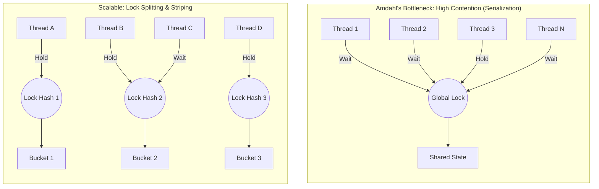

# Chapter 11: Performance and Scalability

## 1. The Mental Model (Prose) 
**Performance** is about *how fast* a single task completes (latency), whereas **Scalability** is about *how much* work the system can handle when provided with more resources (throughput). In concurrent applications, scalability is governed by **Amdahl's Law**, which states that the maximum speedup of a program is strictly limited by the fraction of the code that must be executed serially. Every time threads synchronize, block, or contend for a shared lock, they are forced into serial execution.

Threading introduces hidden costs: context switching (saving/restoring thread state), memory synchronization (flushing/invalidating caches across CPUs), and blocking (OS intervention). To maximize scalability, we must relentlessly attack the serial portion of our code by reducing lock contention. The primary strategies are:
1.  **Narrowing Lock Scope ("Get in, get out"):** Hold locks only for the shortest possible duration.
2.  **Reducing Lock Granularity:** Splitting one lock into multiple independent locks.
3.  **Lock Striping:** Partitioning locks across an array of resources (e.g., `ConcurrentHashMap` in older Java versions).
4.  **Avoiding Hot Fields:** Eliminating single shared variables (like a global `size` counter) that every operation must update.



## 2. Modern Java Context (Crucial) 
Modern Java (8 through 21+) has radically shifted the mechanics of scalability discussed in older JCIP paradigms:

* **The Evolution of `ConcurrentHashMap`:** In Java 5/6, `ConcurrentHashMap` used explicit **lock striping** (an array of 16 `Segment` locks). Java 8+ abandoned this for extreme fine-grained locking. It now uses a combination of CAS (Compare-And-Swap) operations and synchronizes only on the *first node* of a hash bin, dramatically increasing scalability.
* **Defeating Hot Fields with `LongAdder`:** Java 8 introduced `LongAdder` and `DoubleAdder`. While `AtomicLong` relies on CAS, under high contention, CPUs waste immense cycles spinning on CAS failures due to L1 cache line bouncing. `LongAdder` dynamically provisions an array of cells; threads hash to different cells to increment independently, and the total is only summed upon a read.
* **Virtual Threads (Project Loom - Java 21):** Virtual threads make context switching and thread creation virtually free compared to OS threads. However, they do *not* magically solve Amdahl's law. In fact, they expose a new scalability killer: **Pinning**. If a virtual thread blocks inside a `synchronized` block, it "pins" the underlying OS carrier thread, halting other virtual threads. Modern scalability heavily favors `java.util.concurrent.locks.ReentrantLock` over `synchronized` to avoid pinning.
* **Object Pooling is Dead:** Modern Garbage Collectors (ZGC, Shenandoah, G1) allocate and reclaim short-lived objects so efficiently that the synchronization overhead required to safely manage an object pool is now far more expensive than simply creating new objects.

## 3. Real-World Application 
**Scenario:** A high-throughput API Gateway implementing an application-wide Rate Limiter.

The engineering team implements a fast, thread-safe request counter using a single `AtomicLong`. Under normal load, latency is sub-millisecond. However, during a Black Friday traffic spike, CPU utilization hits 100%, yet application throughput plummets, and requests start timing out.

**The Bug:** The single `AtomicLong` became a **hot field**. Thousands of concurrent threads constantly invalidate each other's CPU caches trying to update the exact same memory address. The CAS operations continuously fail and retry in tight loops (spinning), burning CPU cycles on hardware-level memory bus contention rather than serving HTTP requests.

## 4. The "Proof" (Code Strategy) 

**The Breaking Code (High Contention Hot Field):** 
```java
public class RateLimiter {
    // A single hot field. Under massive concurrency, CAS loops will thrash the CPU cache.
    private final AtomicLong requestCount = new AtomicLong(0);

    public void recordRequest() {
        requestCount.incrementAndGet(); // Thread contends with ALL other threads here
    }
    
    public long getTotal() {
        return requestCount.get();
    }
}
```

**The Fixed Version (Dynamic Striping):** 
```java
public class ScalableRateLimiter {
    // LongAdder stripes the counter across multiple internal variables.
    // Threads increment their local "stripe", avoiding cache line contention.
    private final LongAdder requestCount = new LongAdder();

    public void recordRequest() {
        requestCount.increment(); // Threads rarely contend; highly scalable.
    }
    
    public long getTotal() {
        // Only incurs cost on read, aggregating the stripes.
        return requestCount.sum(); 
    }
}
```

## 5. Summary 

* **The Golden Rule:** Optimize for throughput by ruthlessly minimizing the time spent holding locks ("Get in, get out"). A program's ultimate scalability is bottlenecked by its serial fractions.
* **The Gotcha:** Object Pooling. Attempting to improve performance by pooling lightweight objects (like Strings, database connections, or small DTOs) usually degrades scalability. The synchronization required to safely borrow and return to the pool is vastly more expensive than letting modern GCs handle short-lived allocations.