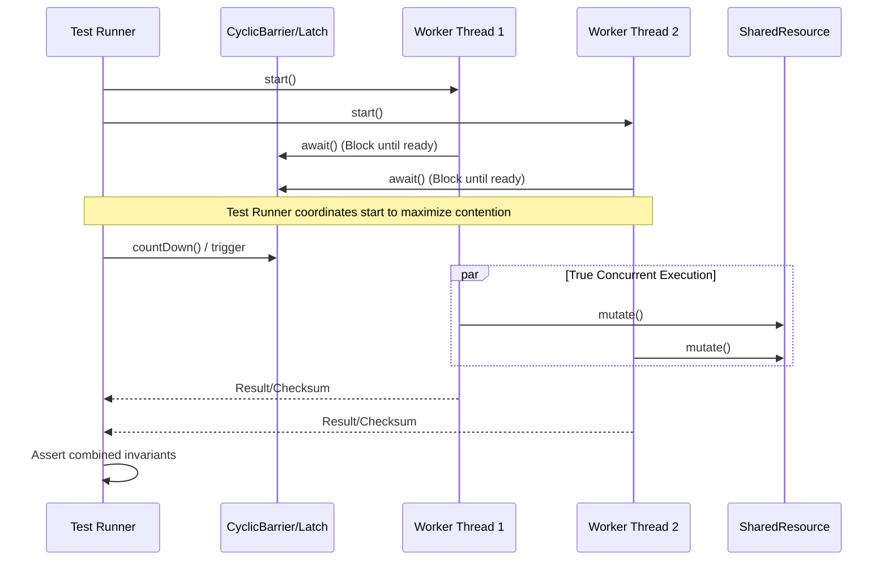

# Chapter 12: Testing Concurrent Programs

## 1. The Mental Model (Prose)
Testing concurrent programs requires a fundamental paradigm shift from traditional sequential testing. In a sequential world, if the initial state is $A$ and the inputs are $B$, the output will always deterministically be $C$. In a concurrent environment, non-determinism rules.

Because the OS scheduler controls thread interleavings, a concurrent program has a massive, multidimensional state space. A passing test run does not prove correctness; it only proves that the *specific interleaving executed during that run* did not fail. To effectively test concurrency, we must construct tests that artificially maximize thread contention, force edge-case interleavings, and rigorously verify both **safety** (nothing bad happens, invariants hold) and **performance** (liveness, throughput, responsiveness) while sidestepping deceptive JVM optimizations like dead code elimination and garbage collection pauses.



## 2. Modern Java Context (Crucial)
The original text relies heavily on manual test structures, custom `PutTakeTest` implementations, and raw timer math to measure performance. In the modern Java ecosystem (Java 8 through 21+), these older paradigms have been largely superseded by specialized frameworks:

* **JMH (Java Microbenchmark Harness):** JCIP warns heavily about the pitfalls of performance testing: JIT warmup, Dead Code Elimination (DCE), and unrealistic compilation. JMH is now the JDK-recommended gold standard for performance testing. It automatically handles JVM warmup iterations, provides `Blackhole` objects to consume outputs (preventing DCE), and manages thread state beautifully.
* **jcstress (Java Concurrency Stress tests):** Developed by the OpenJDK team, `jcstress` is an experimental harness specifically designed to test JVM, library, or hardware memory models. It exhaustively runs tests across different interleavings to detect stale reads and reordering bugs that are nearly impossible to write manual unit tests for.
* **Awaitility:** Testing asynchronous state changes often led developers to write flaky tests using `Thread.sleep(1000)`. Modern testing uses the Awaitility library (`await().until(() -> myCondition.isTrue());`), which polls a condition with a backoff, ensuring tests run as fast as possible but wait as long as necessary.
* **Project Loom (Java 21+):** Virtual Threads fundamentally change how we can test blocking operations. Instead of writing complex `Interrupt` handling tests with a pool of 10 OS threads, you can spin up 100,000 virtual threads in a test to effortlessly saturate and test the bounds of concurrent data structures or simulated I/O bottlenecks.

## 3. Real-World Application
Imagine a high-traffic e-commerce backend utilizing a custom concurrent cache to hold product inventory states.

A standard unit test spins up three threads, reads/writes to the cache, and asserts the inventory is correct. It passes locally and in CI/CD. However, in production during a "Black Friday" flash sale, 5,000 requests hit the cache at the exact same millisecond. Because the unit test didn't utilize a `CyclicBarrier` to align thread execution, the test threads ran mostly sequentially due to the fast execution time of the cache logic. In production, the true concurrent contention exposes a race condition in the cache eviction policy, leading to a lost update (inventory reads > 0 when it is actually 0), resulting in overselling products you don't have.

## 4. The "Proof" (Code Strategy)

### The "Breaking Code" Scenario
A naive concurrency test that fails to generate true interleavings and falls victim to timing bugs and DCE.

```java
// ANTI-PATTERN: Naive concurrent test
@Test
public void testCacheNaively() throws InterruptedException {
    long start = System.currentTimeMillis();
    for (int i = 0; i < 10; i++) {
        new Thread(() -> {
            cache.put(UUID.randomUUID(), "value");
        }).start();
    }
    
    // BAD: Hoping 1 second is enough for threads to finish
    Thread.sleep(1000); 
    
    // BAD: Ignored JVM warmup, DCE, and OS scheduling latency
    long duration = System.currentTimeMillis() - start; 
    assertEquals(10, cache.size());
}
```

### The "Fixed" Version
Using `CountDownLatch` to align threads for maximum contention, and `ExecutorService` for deterministic completion. (For true performance metrics, this logic would be moved entirely into a `@Benchmark` JMH class).

```java
// PROPER SAFETY TEST: Forcing contention and ensuring visibility
@Test
public void testCacheWithHighContention() throws InterruptedException {
    int threadCount = 100;
    ExecutorService executor = Executors.newFixedThreadPool(threadCount);
    CountDownLatch readyLatch = new CountDownLatch(threadCount);
    CountDownLatch startLatch = new CountDownLatch(1);
    CountDownLatch doneLatch = new CountDownLatch(threadCount);

    for (int i = 0; i < threadCount; i++) {
        executor.submit(() -> {
            readyLatch.countDown(); // I am ready
            try {
                startLatch.await(); // Wait for the green light
                cache.put(UUID.randomUUID(), "value");
            } catch (InterruptedException e) {
                Thread.currentThread().interrupt();
            } finally {
                doneLatch.countDown(); // I am finished
            }
        });
    }

    readyLatch.await(); // Wait until all threads are created and ready
    startLatch.countDown(); // FIRE! All 100 threads hit the cache simultaneously
    
    doneLatch.await(5, TimeUnit.SECONDS); // Deterministic wait for completion
    
    assertEquals(threadCount, cache.size());
    executor.shutdown();
}
```

## 5. Summary

* **The Golden Rule:** Never use `Thread.sleep()` to coordinate or wait for state changes in concurrent tests; always use synchronization barriers (`CountDownLatch`, `CyclicBarrier`) to force contention, and polling libraries (like Awaitility) or `Future.get()` to wait for asynchronous results.
* **The Gotcha:** Dead Code Elimination (DCE). If you write a concurrent performance test that calculates a result but never reads/prints/asserts that result, the JVM's Just-In-Time (JIT) compiler is smart enough to realize the code does nothing and will strip it out entirely. Your test will report impossibly fast execution times because it literally executed nothing. Use JMH and its `Blackhole` feature to prevent this.