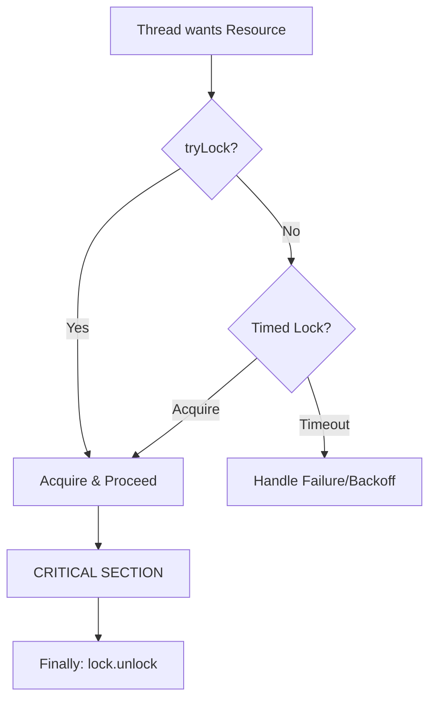
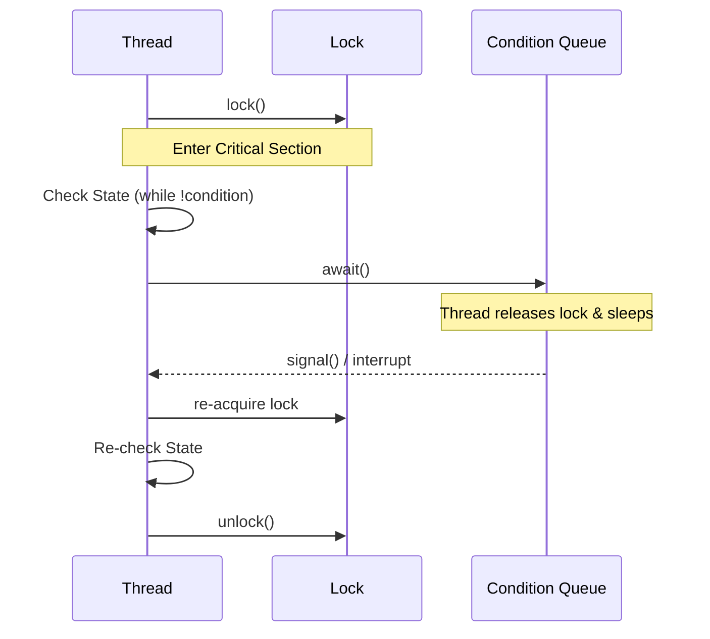
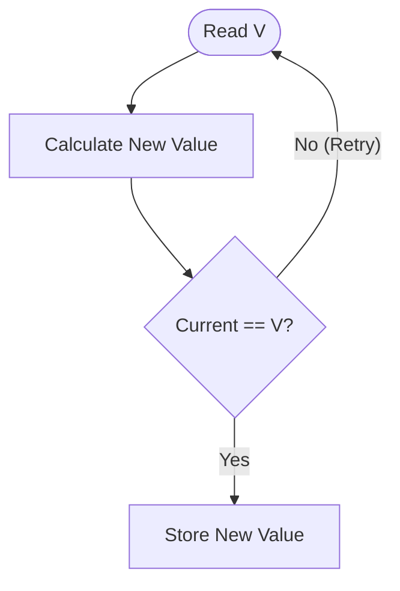
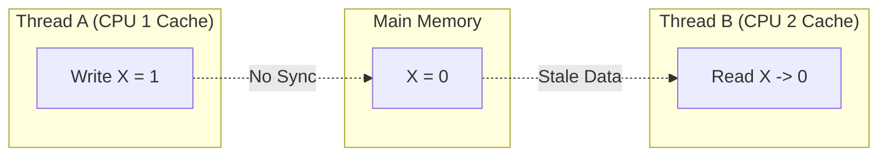

# Java Concurrency in Practice: Summary of Part IV

## Advanced Topics (JCIP Chapters 13-16)

This summary covers the transition from basic synchronization to high-performance, low-level concurrency primitives and the underlying memory model that governs them.

---

## Chapter 13: Explicit Locks
Explicit `Lock` implementations provide advanced features that intrinsic locking (`synchronized`) lacks, such as timed, polled, and interruptible lock acquisition.

### Lock Acquisition Flow

* **Key Advantage:** Ability to break out of deadlocks via `tryLock()`.
* **Modern Context:** `StampedLock` (Java 8+) provides optimistic read modes that are even faster than `ReadWriteLock` for read-heavy workloads.

---

## Chapter 14: Building Custom Synchronizers
Focuses on "State-Dependence"—managing actions that can only proceed when a specific condition is met (e.g., "Take" from an empty queue).

### The Condition Queue Lifecycle

* **The Golden Rule:** Always use `while` loops for condition tests, never `if`, to protect against spurious wakeups.

---

## Chapter 15: Atomic Variables & Nonblocking Synchronization
Nonblocking algorithms use low-level hardware primitives like **Compare-and-Swap (CAS)** instead of locks to ensure integrity.

### The CAS Mechanism (Optimistic Concurrency)

* **Performance:** In high-contention scenarios, Atomics outperform locking by avoiding thread suspension and context-switch overhead.
* **Modern Context:** `LongAdder` (Java 8+) and `VarHandle` (Java 9+) further reduce contention by stripping or providing direct memory fence control.

---

## Chapter 16: The Java Memory Model (JMM)
The JMM defines the "Happens-Before" relationship, which is the guarantee that one thread's write is visible to another thread's read.

### The Visibility Gap (Without Happens-Before)

* **Publication:** Improper publication (like unsafe Double-Checked Locking) can allow a thread to see a partially constructed object.
* **Safe Idiom:** The "Initialize-on-demand Holder" is the most efficient way to perform lazy thread-safe initialization in modern Java.

---

## Summary Checklist 

| Concept     | The Golden Rule                                | The Gotcha                                                                        |
|:------------|:-----------------------------------------------|:----------------------------------------------------------------------------------|
| **Locks**   | Always unlock in a `finally` block.            | `ReentrantLock` is not a drop-in for `synchronized`; use only when needed.        |
| **Atomics** | Use for fine-grained counters and flags.       | Beware of the **ABA Problem** in complex non-blocking structures.                 |
| **JMM**     | Use `final` fields to ensure safe publication. | `volatile` only guarantees visibility, NOT atomicity (e.g., `count++` is unsafe). |