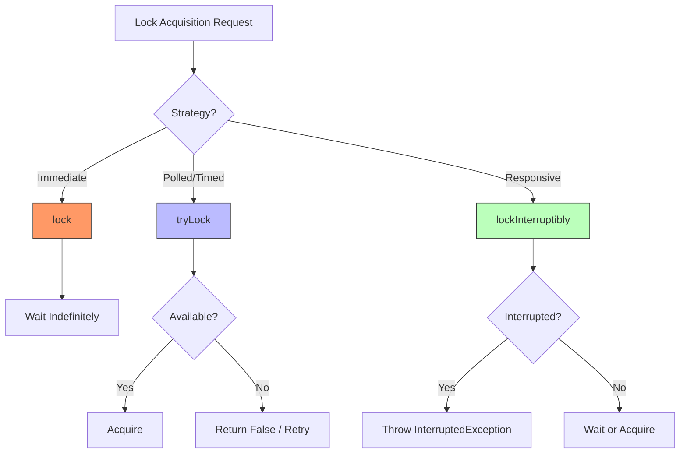

# Chapter 13: Explicit Locks

## 1. The Mental Model
The core "Why" behind Chapter 13 is **Flexibility and Control**. While `synchronized` is convenient because the JVM automatically handles lock release, it is a "blunt instrument" that lacks the ability to back out of an acquisition attempt or handle non-lexical (interleaved) locking patterns.

Explicit locks, primarily `ReentrantLock`, move lock management from the **language syntax** into **object-oriented code**. This shift allows for "Polled" and "Timed" acquisition, which are the primary defenses against deadlocks in complex systems. It also enables "Interruptible" locks, allowing a thread to give up if the wait becomes too long or the system is shutting down.



---

## 2. Modern Java Context
While JCIP was written during the Java 5/6 era, the landscape has shifted significantly:

* **StampedLock (Java 8):** For many high-concurrency read-heavy scenarios, `StampedLock` has replaced `ReentrantReadWriteLock`. It offers "optimistic reads" which do not require a memory barrier, significantly outperforming traditional Read-Write locks.
* **Virtual Threads (Java 21):** This is the most critical update. Using `synchronized` blocks can cause "Thread Pinning," where a Virtual Thread stays stuck to its carrier thread during I/O or blocking. **`ReentrantLock` is the recommended replacement** because it does not currently cause pinning in the same way, making it essential for Loom-based applications.
* **Try-with-resources:** Note that `Lock` does **not** implement `AutoCloseable`. You must still use the `try-finally` block manually to ensure `unlock()` is called.

---

## 3. Real-World Application
**The Scenario:** A "Transfer Service" in a high-traffic banking application.  
**The Bug:** Using `synchronized` to lock two accounts (Source and Destination). If User A transfers to User B while User B transfers to User A simultaneously, a **Deadlock** occurs. Because `synchronized` is uninterruptible and has no timeout, those threads are lost forever, eventually leading to a thread pool exhaustion and a complete service outage.

---

## 4. The "Proof" (Code Strategy)

### The Breaking Code
```java
// DANGER: Subject to Deadlock
public void transferMoney(Account from, Account to, Amount amount) {
    synchronized (from) {
        synchronized (to) {
            from.debit(amount);
            to.credit(amount);
        }
    }
}
```

### The Fixed Version
Using `tryLock()` with a timeout to allow the thread to "back out" of a potential deadlock and retry later.

```java
public boolean transferMoney(Account from, Account to, Amount amount, long timeout, TimeUnit unit) 
    throws InterruptedException {
    
    long stopTime = System.nanoTime() + unit.toNanos(timeout);

    while (true) {
        if (from.lock.tryLock()) {
            try {
                if (to.lock.tryLock()) {
                    try {
                        from.debit(amount);
                        to.credit(amount);
                        return true;
                    } finally {
                        to.lock.unlock(); // Always unlock in finally 
                    }
                }
            } finally {
                from.lock.unlock();
            }
        }
        
        if (System.nanoTime() > stopTime) return false;
        TimeUnit.MILLISECONDS.sleep(10); // Back-off to avoid livelock
    }
}
```

---

## 5. Summary
* **The Golden Rule:** Always wrap `lock.lock()` calls immediately with a `try { ... } finally { lock.unlock(); }` block to prevent "orphaned locks" that freeze the entire application.
* **The Gotcha:** **Fairness is a Performance Killer.** While `new ReentrantLock(true)` ensures threads are served in order, it often results in significantly lower throughput due to the overhead of suspending and resuming threads to maintain the queue. Only use fairness if starvation is a proven, critical issue.