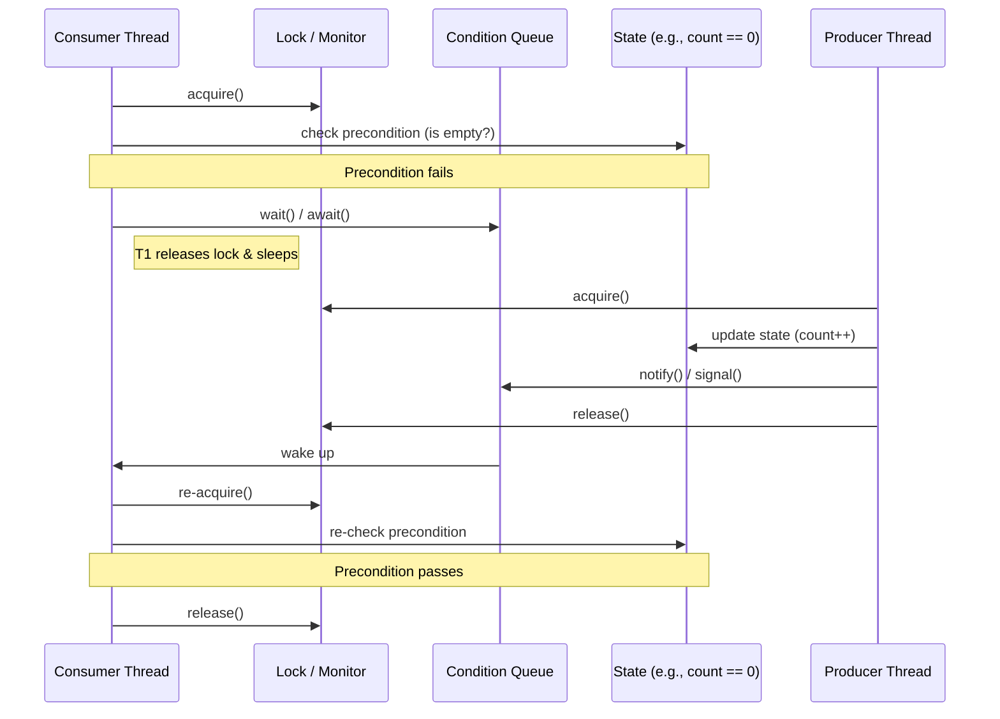

# Chapter 14: Building Custom Synchronizers

## 1. The Mental Model

Building a custom synchronizer is effectively about managing **state dependence**. In simpler classes, a method might fail if a precondition isn't met (e.g., `NoSuchElementException`). In concurrent components, however, a precondition failure (like trying to dequeue from an empty buffer) is often temporary. The "Why" behind this chapter is the transition from **failing** to **waiting until the state changes**. 

At its core, a synchronizer manages a state integer and a set of threads waiting for 그 state to reach a specific "sweet spot." Instead of crude polling—which wastes CPU cycles—we use **Condition Queues**. These allow a thread to suspend its execution and relinquish its lock until another thread signals that the state has likely changed. 



---

## 2. Modern Java Context (Crucial)

While JCIP focuses on `intrinsic condition queues` (`wait`/`notify`) and `Explicit Condition` objects, Modern Java (8 through 21+) has evolved the landscape: 

* **StampedLock (Java 8):** Provides an optimistic read mode that can significantly outperform `ReentrantReadWriteLock` for state-dependent checks that are mostly reads. 
* **Virtual Threads (Java 21):** This is the biggest shift. In the Java 5 era, blocking a thread was expensive (OS kernel involvement). With Project Loom, "blocking" a Virtual Thread on a `ReentrantLock` or `Condition` is incredibly cheap. The "crude polling and sleeping" mentioned in the book is even more of a "code smell" now because Virtual Threads make elegant blocking the gold standard. 
* **VarHandles (Java 9):** Provides a more fine-grained way to implement the "compare-and-swap" (CAS) operations that power AQS without needing to subclass `AbstractQueuedSynchronizer` for every tiny state change. 

---

## 3. Real-World Application

**Scenario:** A custom **Multi-Tenant Rate Limiter**.
Imagine a backend service where each "Tenant" has a permit quota. If a tenant hits their limit, the thread must wait until a "Refiller" task adds permits back.

**The Bug:** Using a simple `notify()` instead of `notifyAll()` in a complex state-dependent system. If two different types of threads (Refillers and Consumers) are waiting on the same condition queue, a `notify()` might wake a Refiller when it should have woken a Consumer, leading to a **Signal Hijacking** bug. The system essentially hangs (deadlocks) even though permits are available, because the threads that need them are still sleeping. 

---

## 4. The "Proof" (Code Strategy)

### The Breaking Code: Crude Polling
This approach consumes 100% CPU on one core while waiting, or introduces latency via `sleep()`. 

```java
// DON'T DO THIS
public synchronized String take() throws InterruptedException {
    while (items.isEmpty()) {
        Thread.sleep(100); // Crude: slow and still wastes resources
    }
    return items.remove(0);
}
```

### The Fixed Version: AbstractQueuedSynchronizer (AQS)
The "Gold Standard" for custom synchronizers is leveraging `AbstractQueuedSynchronizer`. It handles the queueing of threads and the atomicity of the state integer. 

```java
// A simple "Gate" using AQS
private class Sync extends AbstractQueuedSynchronizer {
    // State 0 = closed, State 1 = open
    protected int tryAcquireShared(int ignored) {
        return (getState() == 1) ? 1 : -1;
    }

    protected boolean tryReleaseShared(int ignored) {
        setState(1);
        return true;
    }
}

public class OneShotGate {
    private final Sync sync = new Sync();
    
    public void await() throws InterruptedException {
        sync.acquireSharedInterruptibly(1);
    }
    
    public void open() {
        sync.releaseShared(1);
    }
}
```

---

## 5. Summary

* **The Golden Rule:** Always use a **`while` loop** to check your condition predicate around a `wait()` or `await()` call. Never assume that waking up means the condition is met (Spurious Wakeups). 
* **The Gotcha:** **Signal Hijacking.** If you use `notify()` when multiple predicates are being waited on in the same queue, you risk waking the wrong thread, which then goes back to sleep, effectively "swallowing" the signal. When in doubt, use `notifyAll()`. 