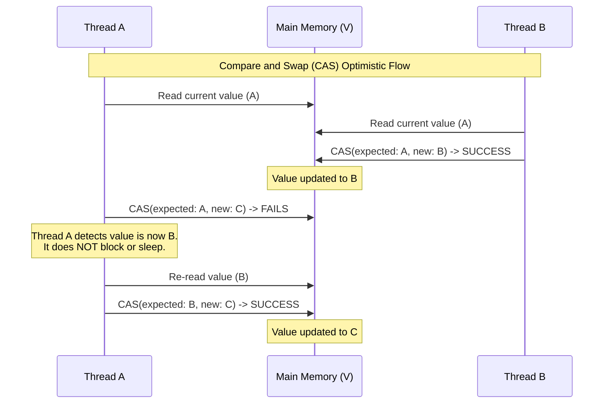

# Chapter 15: Atomic Variables and Nonblocking Synchronization

## 1. The Mental Model (Prose)

At its core, traditional locking (`synchronized`, `ReentrantLock`) is a **pessimistic** concurrency mechanism. It assumes the worst—that threads will constantly collide—so it forcibly serializes access by suspending (parking) competing threads. This suspension requires the OS to perform an expensive context switch, moving the thread off the CPU, storing its state, and waking it up later.

Non-blocking synchronization flips this paradigm to an **optimistic** approach using hardware-supported atomic instructions, primarily **Compare-And-Swap (CAS)**. CAS asks the hardware: *"Update this variable to the new value, but ONLY if the current value matches the expected value I just read."* If another thread intervened and changed the value, the CAS instruction fails. The crucial difference is that **the thread is never suspended**. Instead, it recognizes the failure, re-reads the new value, recalculates, and tries again (a CAS spin-loop). This eliminates deadlocks and massive context-switching overhead, creating a system where at least one thread is always guaranteed to make progress.



## 2. Modern Java Context (Crucial)

While JCIP focuses on Java 5/6 atomic variables (`AtomicInteger`, `AtomicReference`), modern Java has drastically evolved the landscape of non-blocking synchronization:

* **Java 8 `LongAdder` / `DoubleAdder` vs. `AtomicLong`:** In the older era, `AtomicLong` was the standard for counters. However, under extreme contention, the CAS spin-loop causes high CPU burn as dozens of threads fail and retry simultaneously. Java 8 introduced `LongAdder`, which dynamically allocates an array of underlying variables (striping) to divide the contention. Threads update different "cells" concurrently without blocking each other, and the total is summed only when requested. `LongAdder` entirely replaces `AtomicLong` for high-contingency counting.
* **Java 9 `VarHandle` vs. `Atomic*FieldUpdater`:** The book heavily features `AtomicReferenceFieldUpdater` to save memory in large linked data structures (so you don't need a heavy `AtomicReference` object per node). Java 9 introduced `java.lang.invoke.VarHandle`, which completely replaces `FieldUpdaters` and `sun.misc.Unsafe`. `VarHandle` provides strongly-typed, highly optimized, intrinsic memory access that compiles down to the exact hardware-level barriers and CAS instructions needed, acting as the ultimate modern tool for concurrent library authors.
* **Java 21 Virtual Threads (Project Loom):** Virtual Threads make blocking exceptionally cheap, as `synchronized` or `ReentrantLock` no longer park the heavy OS thread. While this reduces the *penalty* of locking, CAS and `java.util.concurrent.atomic` still remain fundamentally faster for fine-grained, highly-contended shared state mutations because they happen entirely at the CPU-cache level without JVM scheduling overhead.

## 3. Real-World Application

**The Scenario:** You are building a high-throughput API Gateway that serves thousands of requests per second. You need a Global Rate Limiter to count incoming requests over a sliding window.

**The Bug:** If you implement the total request counter using `synchronized (this) { count++; }`, every single concurrent network thread will hit a bottleneck. The lock queue will grow exponentially, OS threads will be parked and unparked, and latency will spike from milliseconds to seconds, eventually causing cascading timeouts across your microservices—all because of a simple integer increment.

**The Fix:** Using `LongAdder` or a non-blocking algorithm allows the network threads to increment the counter via hardware-level atomics, maintaining sub-millisecond latency regardless of request volume.

## 4. The "Proof" (Code Strategy)

### The Breaking Code (Pessimistic Locking)
```java
public class RateLimiter {
    private long totalRequests = 0;

    // Every thread entering this method forces a lock acquisition.
    // Under load, context-switching overhead destroys throughput.
    public synchronized void recordRequest() {
        totalRequests++;
    }
}
```

### The Fixed Code (Modern Non-Blocking Approach)
```java
import java.util.concurrent.atomic.LongAdder;

public class RateLimiter {
    // LongAdder uses thread-striping to avoid CAS contention
    private final LongAdder totalRequests = new LongAdder();

    public void recordRequest() {
        // Purely non-blocking, lock-free, highly scalable increment
        totalRequests.increment();
    }
    
    public long getCount() {
        return totalRequests.sum();
    }
}
```

### Implementing a Non-Blocking Stack (CAS Spin-Loop)
```java
import java.util.concurrent.atomic.AtomicReference;

public class ConcurrentStack<T> {
    private final AtomicReference<Node<T>> top = new AtomicReference<>();

    public void push(T item) {
        Node<T> newHead = new Node<>(item);
        Node<T> oldHead;
        
        // The quintessential CAS Spin-Loop
        do {
            oldHead = top.get();
            newHead.next = oldHead;
        } while (!top.compareAndSet(oldHead, newHead)); // Retry if another thread pushed
    }
    
    private static class Node<T> {
        public final T item;
        public Node<T> next;
        public Node(T item) { this.item = item; }
    }
}
```

## 5. Summary

* **The Golden Rule:** For counters or statistics under concurrent load, always default to `LongAdder` (or `AtomicInteger` for low-contention). Avoid using `synchronized` blocks purely for managing small, isolated pieces of state.
* **The Gotcha (The ABA Problem):** When building non-blocking linked structures (like a Queue or Stack), a naive CAS can fail you. If Thread 1 reads node A, pauses, and Thread 2 replaces A with B, then puts A back, Thread 1's CAS will succeed (because it still sees A), completely unaware that the underlying chain (`A.next`) was corrupted. You must use `AtomicStampedReference` (which pairs a reference with an integer version/stamp) to detect if the object was changed and changed back.