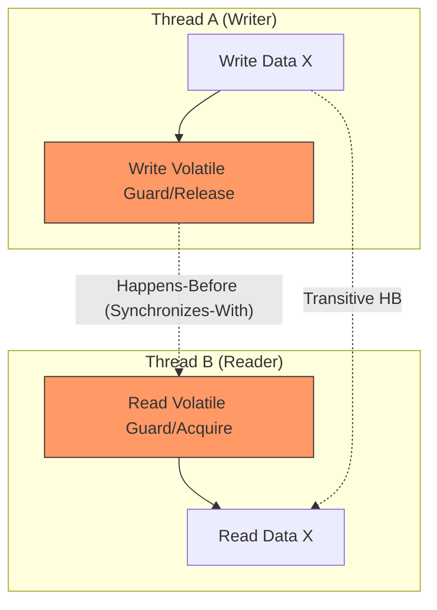

# Chapter 16: The Java Memory Model

## 1. The Mental Model (Prose)
The Java Memory Model (JMM) is not a description of how the JVM is implemented, but a **specification of guarantees** regarding when the effects of one thread's actions become visible to another. At its core, the JMM exists to balance the needs of the developer (predictability) with the needs of the hardware and compiler (performance through reordering and caching).

The fundamental concept is the **Happens-Before** relationship. Without a Happens-Before link between a write-in Thread A and a read-in Thread B, the JVM is legally allowed to reorder instructions or keep values in local CPU caches indefinitely. This results in "stale data" or, more dangerously, the observation of partially constructed objects.



## 2. Modern Java Context (Crucial)
While the JMM was significantly overhauled in Java 5 to fix `volatile` and `final` semantics, modern Java (9 through 21+) provides finer-grained tools for memory coordination:

* **VarHandle (Java 9+):** Replaces much of the internal use of `Unsafe`. It allows developers to invoke specific memory fence types (e.g., `getAcquire`, `setRelease`) which are cheaper than a full `volatile` read/write because they only provide one-way reordering constraints.
* **Records (Java 14+):** By enforcing shallow immutability, Records leverage the JMM's "Final Field Guarantee," ensuring that once a record is constructed, its fields are visible to all threads without explicit synchronization.
* **Virtual Threads (Project Loom):** While the JMM remains the same, the sheer scale of threading makes "piggybacking" and hidden race conditions more likely to manifest as performance bottlenecks if synchronization is too heavy-handed.

## 3. Real-World Application
In a high-frequency trading platform, a "MarketData" object is updated by a background ingestion thread and read by multiple strategy threads. If the ingestion thread uses **Unsafe Publication** (e.g., updating a non-volatile reference), a strategy thread might see a non-null `MarketData` reference but read `0.0` for prices because the object's internal fields haven't "flown" from the writer's CPU cache to the reader's. This leads to incorrect trades based on zeroed data.

## 4. The "Proof" (Code Strategy)

### The Breaking Code: Unsafe Double-Checked Locking
In older Java versions (or without `volatile`), DCL is broken because the write to the `instance` field can be reordered before the constructor call finishes.

```java
// BREAKING: Thread A might set 'instance' before constructor finishes.
// Thread B sees 'instance' != null but calls methods on a half-baked object.
public class UnsafeLazyFactory {
    private static Resource instance; 

    public static Resource getInstance() {
        if (instance == null) { // (1) Check
            synchronized (UnsafeLazyFactory.class) {
                if (instance == null) {
                    instance = new Resource(); // (2) Reordering can happen here
                }
            }
        }
        return instance;
    }
}
```

### The Fixed Version: Initialization-on-demand Holder
The cleanest modern way to achieve lazy, thread-safe initialization without explicit synchronization overhead is the "Holder Idiom". It leverages the JVM's guarantee that class initialization is atomic and visible to all threads.

```java
public class SafeLazyFactory {
    // The JVM guarantees this class is not loaded until needed,
    // and initialization is inherently thread-safe.
    private static class Holder {
        private static final Resource INSTANCE = new Resource();
    }

    public static Resource getInstance() {
        return Holder.INSTANCE;
    }
}
```

## 5. Summary
* **The Golden Rule:** Always use a formal synchronization primitive (`volatile`, `synchronized`, `final`, or `Atomic`) to publish an object; never assume a reference will be visible just because it was written.
* **The Gotcha:** Piggybacking on a `volatile` write or a lock release only works if the "piggybacked" action happens **before** the synchronization action in the code. Reordering the statements can silently break this fragile relationship.