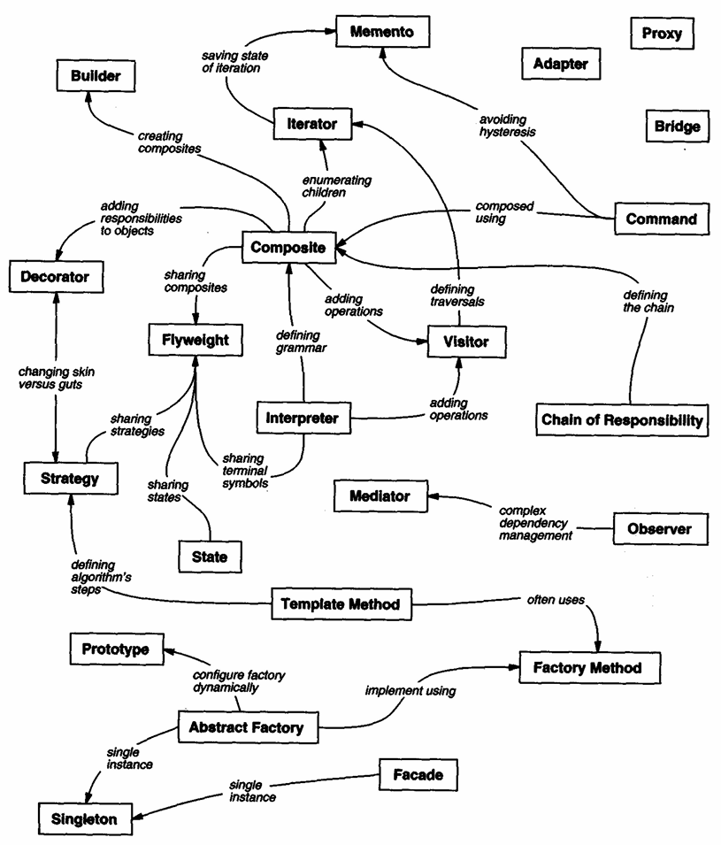

# Design Pattern Relationships: Map & Reference

***[Back to the Pattern Catalog](../README.md)***

This document serves as a reference map for the 23 Gang of Four (GoF) design patterns, detailing how they interact, compose, and contrast with one another.

---

### Author's Rights Reference
*Source: Gamma, E., Helm, R., Johnson, R., & Vlissides, J. (1994). Design Patterns: Elements of Reusable Object-Oriented Software. Addison-Wesley Professional.*

---

## 1. Creational Relationships

### **Abstract Factory $\rightarrow$ Factory Method** (`Implemented using`)
* **Role:** An Abstract Factory defines an interface for creating families of products. It frequently uses Factory Methods to actually instantiate the specific products within those families.
* **Java Insight:** Abstract Factories are often implemented using Java `Supplier<T>` interfaces or default methods in interfaces, replacing heavy class hierarchies with functional instantiation.

### **Abstract Factory $\rightarrow$ Prototype** (`Configure factory dynamically`)
* **Role:** Alternatively, an Abstract Factory can store a set of Prototypes and clone them to generate new product instances instead of relying on subclassing via Factory Methods.
* **Java Insight:** With Java 14+ `record` types, true cloning is often bypassed in favor of "wither" methods or copy constructors, as records are immutable. The Abstract Factory simply returns customized copies of these immutable prototypes.

### **Abstract Factory $\rightarrow$ Singleton** (`Single instance`)
* **Role:** Typically, an application only needs one instance of a concrete Abstract Factory to manage product creation across the system.
* **Java Insight:** Manual Singleton implementations (like double-checked locking) are largely obsolete. In modern Java enterprise environments (e.g., Spring Boot, Quarkus), the Abstract Factory is simply annotated as a singleton bean (`@Component` or `@ApplicationScoped`).

### **Builder $\rightarrow$ Composite** (`Creates`)
* **Role:** Builders are inherently designed to construct complex objects step-by-step. The final product returned by a Builder is very frequently a Composite tree (e.g., a DOM tree or an Abstract Syntax Tree).
* **Java Insight:** Modern Java builders often utilize a fluent API design. When constructing Composites, the Builder can leverage Java 21's enhanced `switch` and sealed classes to ensure only valid child nodes are attached to specific parent nodes during the build process.

---

## 2. Structural & Creational Overlap

### **Prototype $\rightarrow$ Composite** (`Often used with`)
* **Role:** Composites can be deeply nested. Prototypes are highly effective at cloning entire Composite structures (deep copies) to be used as starting templates.
* **Java Insight:** Deep cloning complex object graphs in Java is notoriously error-prone via `Cloneable`. Modern applications prefer serialization libraries (like Jackson) or deep-copy constructors to instantiate new Composite trees from a Prototype.

### **Facade $\rightarrow$ Singleton** (`Often implemented as`)
* **Role:** A Facade provides a unified, high-level interface to a complex subsystem. Since the subsystem is shared, the Facade object routing the requests is usually a Singleton.
* **Java Insight:** Similar to Abstract Factory, Facades in modern Java are almost exclusively managed by DI containers as stateless singleton services.

---

## 3. Structural Relationships

### **Adapter $\leftrightarrow$ Bridge** (`Similar structure, different intent`)
* **Role:** Both use object composition to hide implementation details. However, an **Adapter** retrofits an *existing* incompatible interface to make things work together after the fact. A **Bridge** is designed up-front to let the abstraction and implementation vary independently.
* **Java Insight:** Bridges often map well to standard Java interface-to-implementation separation. Adapters are frequently implemented dynamically using Java functional interfaces to map one method signature to another on the fly.

### **Composite $\leftrightarrow$ Decorator** (`Often used together`)
* **Role:** Both rely on recursive composition. A Decorator can be viewed as a degenerate Composite with only one child. Decorators are often used to add responsibilities (like logging or visual borders) to specific components *within* a Composite tree.
* **Java Insight:** When combining these, you can use Java's `java.lang.reflect.Proxy` to dynamically decorate Composite nodes at runtime without cluttering the node classes with decorator logic.

### **Decorator $\leftrightarrow$ Proxy** (`Similar structure, different intent`)
* **Role:** Both wrap an object and forward requests to it. A **Decorator** adds dynamic responsibilities (behavior) to the object. A **Proxy** controls *access* to the object (e.g., lazy loading, security, remote access).
* **Java Insight:** Proxies are deeply embedded in modern Java via frameworks (Spring AOP, Hibernate lazy loading). You rarely write Proxies manually now, whereas Decorators are still manually coded using interface delegation or functional composition (`Function.andThen()`).

### **Flyweight $\rightarrow$ Composite** (`Shares leaves`)
* **Role:** In a massive Composite tree, many leaf nodes might contain identical state. Flyweight allows these leaves to be shared across the tree to save memory.
* **Java Insight:** Java 21's Valhalla project (Value Objects/Inline Classes), once fully integrated, will naturally handle the memory efficiency Flyweight targets. Until then, immutable `record` types are excellent candidates for Flyweight shared leaves.

---

## 4. Behavioral & Structural Overlap

### **Composite $\rightarrow$ Iterator** (`Enumerates children`)
* **Role:** An Iterator provides the standard mechanism to traverse the inherently complex, recursive structure of a Composite tree without exposing its internal representation.
* **Java Insight:** `java.util.Iterator` is still used, but modern Java strongly favors wrapping Composite traversal logic into `java.util.stream.Stream<T>`. This allows clients to traverse, filter, and map the Composite tree using functional pipelines.

### **Composite $\rightarrow$ Visitor** (`Adds operations to`)
* **Role:** When a Composite structure is stable but operations on its nodes change frequently, a Visitor encapsulates those operations, extracting the logic out of the Composite classes.
* **Java Insight:** This is the most radically changed relationship in Java 21+. If the Composite nodes are modeled as `sealed` interfaces/classes, the Visitor pattern can be completely replaced by **Pattern Matching for Switch**. You can define operations externally using a `switch` expression that exhaustively checks every permitted node type, eliminating the need for `accept()` and `visit()` double-dispatch boilerplate.

### **Chain of Responsibility $\rightarrow$ Composite** (`Often applied to`)
* **Role:** A Chain of Responsibility is naturally mapped onto a Composite tree structure. A child node handles a request if it can; otherwise, it passes the request up to its parent node in the Composite tree.
* **Java Insight:** This parent-pointer delegation is standard in UI frameworks (event bubbling) and logger hierarchies (like Logback/SLF4J).

### **Interpreter $\rightarrow$ Composite** (`Defining grammar`)
* **Role:** The Interpreter pattern represents a language's grammar as a set of classes. These classes are almost always organized into a Composite tree (the Abstract Syntax Tree or AST) to represent the recursive nature of expressions.
* **Java Insight:** Use `Sealed Interfaces` to define the grammar. For example, `sealed interface Expr permits BinaryExpr, Literal, Variable`. This makes the "grammar" rigid and type-safe, perfectly matching the Interpreter's requirements.

### **Interpreter $\rightarrow$ Flyweight** (`Sharing terminal symbols`)
* **Role:** In large scripts or programs being interpreted, terminal symbols (like variable names or literal values) appear many times. To save memory, the Interpreter uses Flyweight to share these identical terminal objects across the AST.
* **Java Insight:** Java's `String.intern()` is a built-in Flyweight for strings. For complex terminals, Java **Records** are ideal as they are immutable by default, making them safe for sharing across different branches of the Interpreter's tree.

---

## 5. Behavioral Relationships

### **Command $\rightarrow$ Composite** (`Macro commands`)
* **Role:** A MacroCommand is simply a Composite that contains a collection of simpler Command objects. Executing the MacroCommand iterates through and executes its children.
* **Java Insight:** MacroCommands are easily implemented as a `List<Runnable>` or `List<Consumer<T>>`, executing them via `list.forEach(Runnable::run)`.

### **Command $\rightarrow$ Memento** (`Undo state`)
* **Role:** If a Command needs to be undoable, it must store the state of the receiver before the execution. It uses a Memento to capture and hold this snapshot.
* **Java Insight:** Java `record` types are the perfect modern implementation for Mementos due to their inherent immutability and concise syntax, ensuring the saved state cannot be tampered with.

### **Iterator $\rightarrow$ Memento** (`Saves state of`)
* **Role:** An Iterator can use a Memento to capture its current iteration state (like cursor position) so it can be reverted or paused/resumed later.
* **Java Insight:** Less common in modern Java Streams, as streams are generally single-use and stateless. However, for custom pagination or chunked data processing, passing an immutable state record (Memento) is standard practice.

### **Observer $\leftrightarrow$ Mediator** (`Competing interaction models`)
* **Role:** Both decouple communicating objects. **Observer** distributes communication dynamically via publish/subscribe. **Mediator** centralizes communication by forcing objects to talk only through a central hub.
* **Java Insight:** Reactive Streams (Project Reactor, RxJava) and `java.util.concurrent.Flow` have formalized the Observer pattern. Mediators are often implicitly implemented as Controller/Service classes in enterprise architectures (e.g., a Spring `@RestController` coordinating multiple `@Service` beans).

### **State $\leftrightarrow$ Strategy** (`Similar structure, different intent`)
* **Role:** Both encapsulate behavior behind a common interface. **Strategy** represents interchangeable algorithms passed in by a client (static during execution). **State** represents internal states of a context object, allowing the object to change its own behavior dynamically as its state changes.
* **Java Insight:** Both are prime candidates for implementation via Java `enum` (if the states/strategies hold no unique instance data) or Java 21 Pattern Matching with `sealed` interfaces to ensure exhaustive handling of all possible states/strategies.

### **Flyweight $\rightarrow$ State / Strategy** (`Share intrinsic state`)
* **Role:** If State or Strategy objects do not maintain any local context (they act purely on parameters passed into their methods), they can be shared across multiple context objects as Flyweights.
* **Java Insight:** Stateless Strategies in modern Java are simply lambda expressions or method references (e.g., `Comparator.comparing(...)`), completely bypassing the need to instantiate traditional Flyweight classes.

### **Template Method $\rightarrow$ Strategy** (`Defining algorithm steps`)
* **Role:** A Template Method defines the skeleton of an algorithm in a base class and allows subclasses to fill in specific steps via inheritance. Alternatively, these "steps" can be delegated to Strategy objects.
* **Java Insight:** Instead of requiring inheritance (the classic Template Method approach), modern Java prefers passing **Lambda expressions** (Strategies) into a final method. This transforms a rigid inheritance-based Template into a flexible, composition-based execution engine.

### **Template Method $\rightarrow$ Factory Method** (`Often uses`)
* **Role:** Template Methods define the workflow. Often, one step in that workflow is the creation of an object. The Template Method calls an abstract method (the Factory Method) to let subclasses decide which concrete object to instantiate.
* **Java Insight:** Interface `default` methods allow you to define the Template Method directly in an interface, requiring the implementer only to provide the Factory Method.