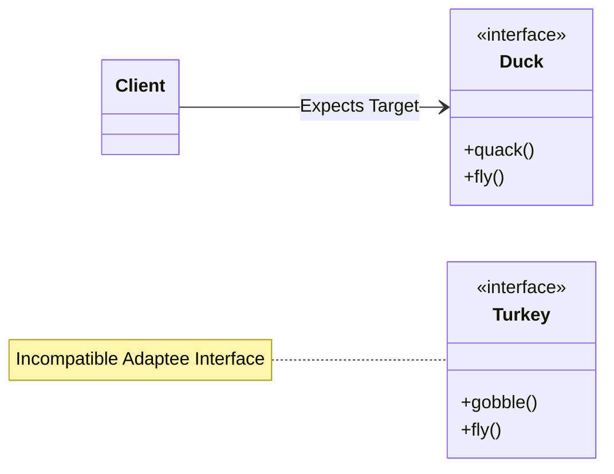
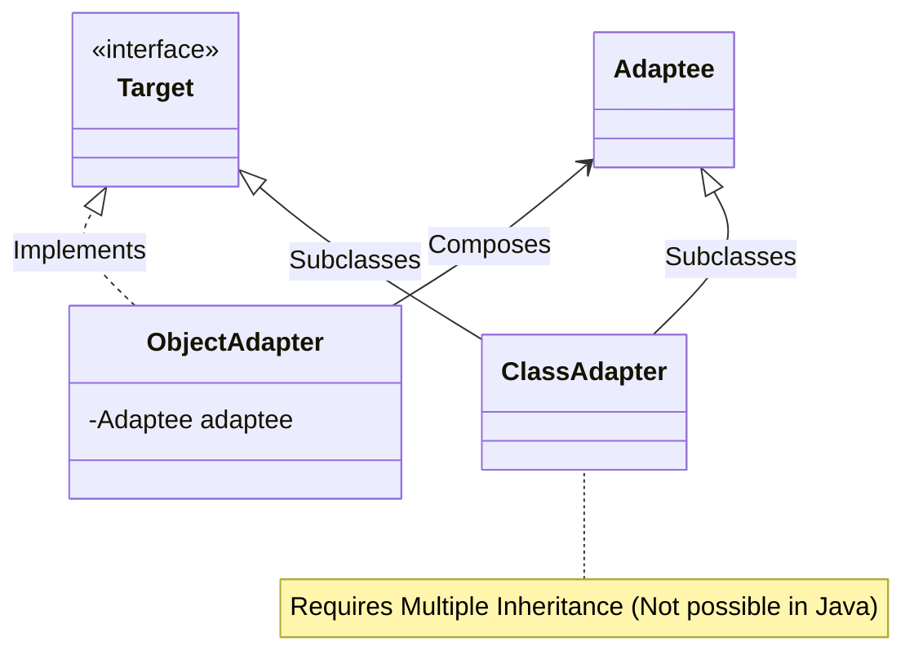
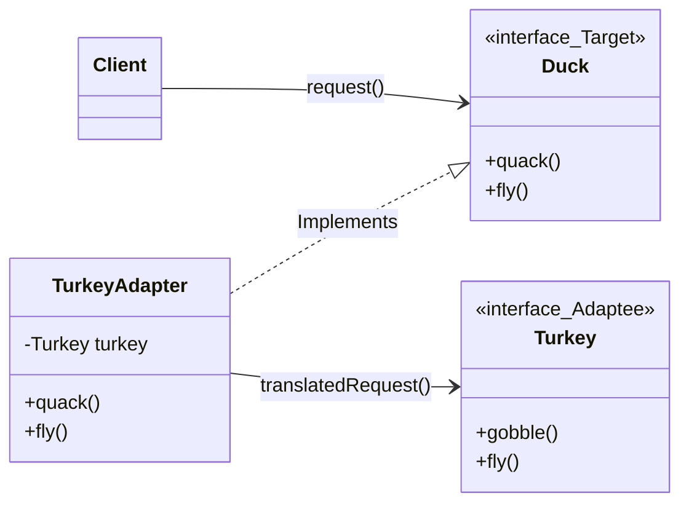
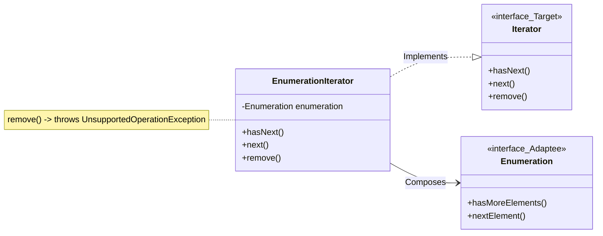
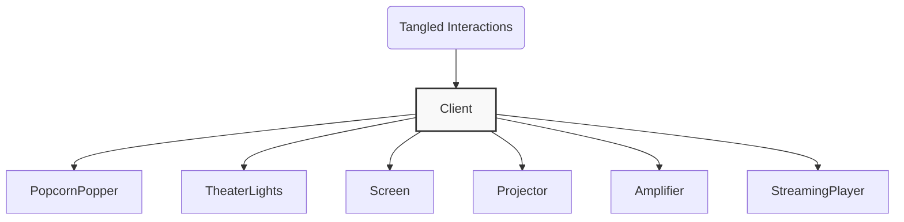
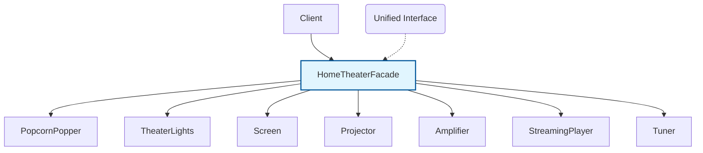
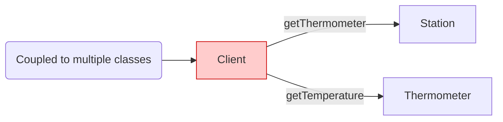
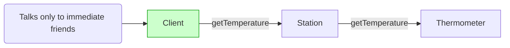

# Adapter & Facade Patterns

> 💡 **DESIGN Principles:**
> * Encapsulate what varies. 
> * Favor composition over inheritance. 
> * Program to interfaces, not implementations.
> * Strive for loosely coupled designs between objects that interact.
> * **Open Closed Principle:** Classes should be open for extension but closed for modification. 
> * **Dependency Inversion Principle:** Depend on abstractions. Do not depend on concrete classes.
> * **Principle of Least Knowledge:** Talk only to your immediate friends. 

> 🧩 **DESIGN PATTERN:**
> * The Adapter Pattern converts the interface of a class into another interface the clients expect.  Adapter lets classes work together that couldn’t otherwise because of incompatible interfaces.
> * The Facade Pattern provides a unified interface to a set of interfaces in a subsystem.  Facade defines a higher level interface that makes the subsystem easier to use. 

---

## Architecture Evolution 1: The Adapter Pattern

### Naive/Initial State



```java
// Target Interface 
public interface Duck {
    void quack(); 
    void fly(); 
}

// Adaptee Interface 
public interface Turkey {
    void gobble(); // Turkeys don’t quack, they gobble. 
    void fly(); // Turkeys can fly, although they can only fly short distances. 
}
```

### Intermediate Evolution States (Object vs. Class Adapter)



### Final Pattern-Refined State (Object Adapter)



```java
// Final Pattern-Refined: Object Adapter 
public class TurkeyAdapter implements Duck {
    Turkey turkey; 

    public TurkeyAdapter(Turkey turkey) {
        this.turkey = turkey; 
    } 

    public void quack() {
        turkey.gobble(); 
    } 

    public void fly() {
        for(int i=0; i < 5; i++) {
            turkey.fly(); 
        } 
    }
}
```

### Final Pattern-Refined State (Enumerator to Iterator Adapter)



```java
// Final Pattern-Refined: Legacy Collection Adapter 
public class EnumerationIterator implements Iterator<Object> {
    Enumeration<?> enumeration; 

    public EnumerationIterator(Enumeration<?> enumeration) {
        this.enumeration = enumeration; 
    } 

    public boolean hasNext() {
        return enumeration.hasMoreElements(); 
    } 

    public Object next() {
        return enumeration.nextElement(); 
    } 

    public void remove() {
        throw new UnsupportedOperationException(); 
    } 
}
```

---

## Architecture Evolution 2: The Facade Pattern

### Naive/Initial State



### Final Pattern-Refined State



```java
// Final Pattern-Refined: Subsystem Facade 
public class HomeTheaterFacade {
    Amplifier amp;
    Tuner tuner;
    StreamingPlayer player;
    Projector projector;
    TheaterLights lights;
    Screen screen;
    PopcornPopper popper; 

    public HomeTheaterFacade(Amplifier amp, Tuner tuner, StreamingPlayer player, Projector projector, Screen screen, TheaterLights lights, PopcornPopper popper) { 
        this.amp = amp;
        this.tuner = tuner;
        this.player = player;
        this.projector = projector;
        this.screen = screen;
        this.lights = lights;
        this.popper = popper; 
    } 

    public void watchMovie(String movie) { 
        popper.on();
        popper.pop();
        lights.dim(10);
        screen.down();
        projector.on();
        projector.wideScreenMode(); 
        amp.on();
        amp.setStreamingPlayer(player);
        amp.setSurroundSound();
        amp.setVolume(5);
        player.on();
        player.play(movie); 
    }

    public void endMovie() { 
        popper.off();
        lights.on();
        screen.up();
        projector.off();
        amp.off();
        player.stop();
        player.off(); 
    } 
}
```

---

## Architecture Evolution 3: Principle of Least Knowledge (Law of Demeter)

### Naive/Initial State



```java
// Violation of Principle 
public float getTemp() {
    Thermometer thermometer = station.getThermometer();
    return thermometer.getTemperature(); 
} 
```

### Final Pattern-Refined State



```java
// Adherence to Principle (Delegation) 
public float getTemp() {
    return station.getTemperature(); 
} 

// Method Call Boundaries Verification 
public class Car {
    Engine engine; // Component 

    public void start(Key key) {
        Doors doors = new Doors(); // Instantiated object
        boolean authorized = key.turns(); // Parameter object -> OK

        if (authorized) { 
            engine.start(); // Component object -> OK
            updateDashboardDisplay(); // Local method -> OK 
            doors.lock(); // Instantiated object -> OK
        } 
    }
    
    public void updateDashboardDisplay() {
        // update display
    }
}
```