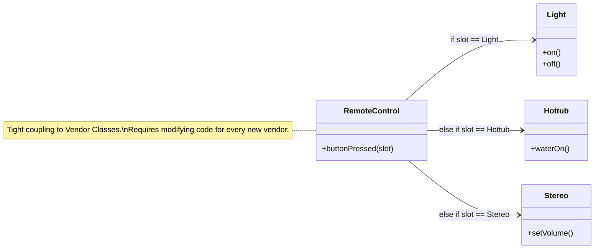
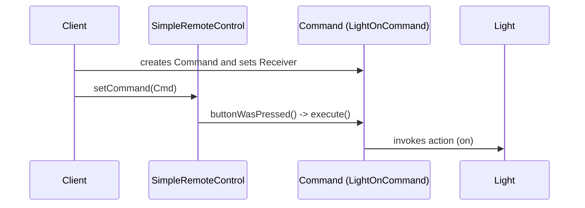
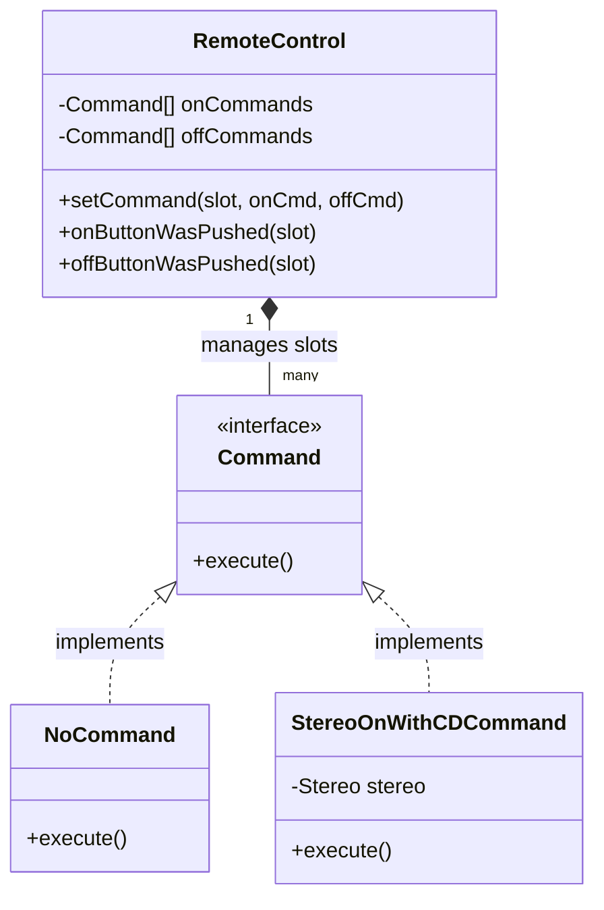
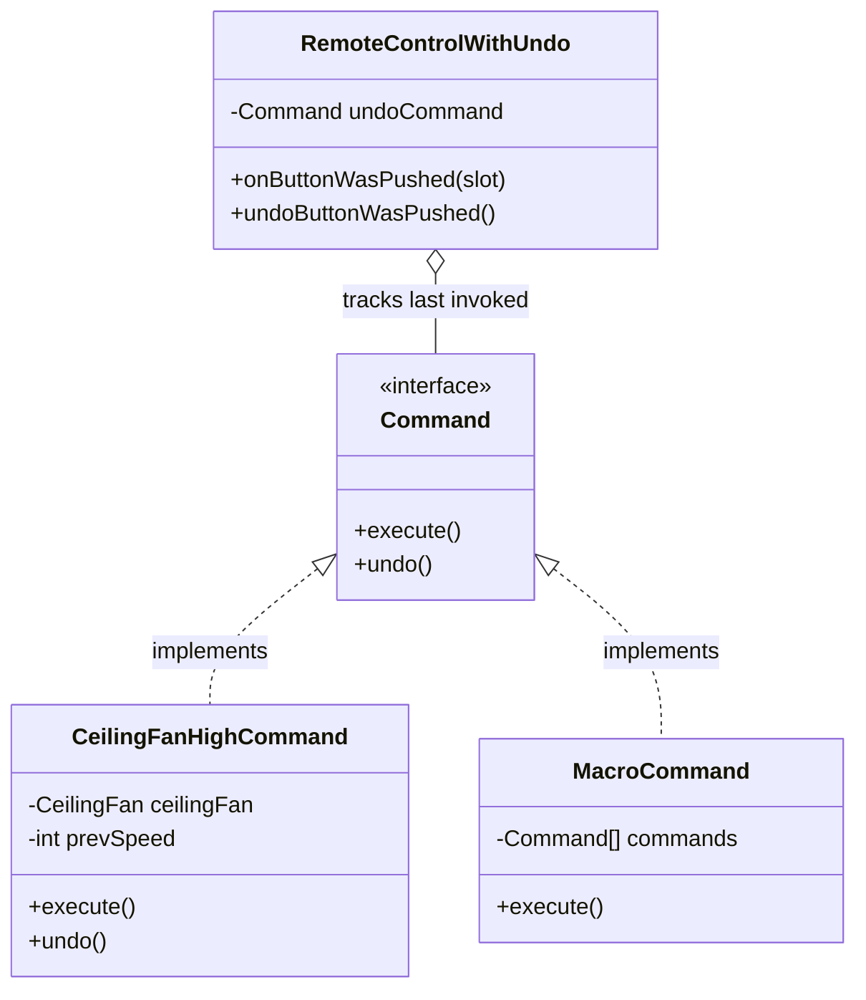

# Command Pattern

> 💡 **DESIGN Principles:**
> * Encapsulate what varies. 
> * Favor composition over inheritance. 
> * Program to interfaces, not implementations.
> * Strive for loosely coupled designs between objects that interact.
> * **Open Closed Principle:** Classes should be open for extension but closed for modification. 
> * **Dependency Inversion Principle:** Depend on abstractions. Do not depend on concrete classes. 

> 🧩 **DESIGN PATTERN:**
> 
> The Command Pattern encapsulates a request as an object, thereby letting you parameterize other objects with different requests, queue or log requests, and support undoable operations. 

---

## Change Log of Architecture

### 1. Naive/Initial State



---

### 2. Intermediate Evolution State: Command Encapsulation



```java
public interface Command {
    void execute(); 
}

public class LightOnCommand implements Command {
    Light light; 
    
    public LightOnCommand(Light light) {
        this.light = light; 
    }
    
    public void execute() {
        light.on(); 
    }
}

public class SimpleRemoteControl {
    Command slot; 

    public SimpleRemoteControl() {}

    public void setCommand(Command command) {
        slot = command; 
    }

    public void buttonWasPressed() {
        slot.execute(); 
    }
}
```

---

### 3. Intermediate Evolution State: Full Remote & Null Object Pattern



```java
public class NoCommand implements Command {
    public void execute() { } // Acts as a surrogate, does nothing 
}

public class RemoteControl {
    Command[] onCommands; 
    Command[] offCommands; 

    public RemoteControl() {
        onCommands = new Command[7]; 
        offCommands = new Command[7]; 
        Command noCommand = new NoCommand(); 
        for (int i = 0; i < 7; i++) {
            onCommands[i] = noCommand; 
            offCommands[i] = noCommand; 
        }
    }

    public void setCommand(int slot, Command onCommand, Command offCommand) {
        onCommands[slot] = onCommand; 
        offCommands[slot] = offCommand; 
    }

    public void onButtonWasPushed(int slot) {
        onCommands[slot].execute(); 
    }
}

public class StereoOnWithCDCommand implements Command {
    Stereo stereo; 
    
    public StereoOnWithCDCommand(Stereo stereo) {
        this.stereo = stereo; 
    }

    public void execute() {
        stereo.on(); 
        stereo.setCD(); 
        stereo.setVolume(11); 
    }
}
```

---

### 4. Final Pattern-Refined: State Management, Undo, and Macros



```java
public interface Command {
    void execute(); 
    void undo(); // Mirrors execute() 
}

public class CeilingFanHighCommand implements Command {
    CeilingFan ceilingFan; 
    int prevSpeed; // Tracks local state for undo 

    public CeilingFanHighCommand(CeilingFan ceilingFan) {
        this.ceilingFan = ceilingFan; 
    }

    public void execute() {
        prevSpeed = ceilingFan.getSpeed(); 
        ceilingFan.high(); 
    }

    public void undo() {
        if (prevSpeed == CeilingFan.HIGH) {
            ceilingFan.high(); 
        } else if (prevSpeed == CeilingFan.MEDIUM) {
            ceilingFan.medium(); 
        } else if (prevSpeed == CeilingFan.LOW) {
            ceilingFan.low(); 
        } else if (prevSpeed == CeilingFan.OFF) {
            ceilingFan.off(); 
        }
    }
}

public class RemoteControlWithUndo {
    Command[] onCommands;
    Command[] offCommands;
    Command undoCommand; // Stashes last executed command 

    public void onButtonWasPushed(int slot) {
        onCommands[slot].execute(); 
        undoCommand = onCommands[slot]; 
    }

    public void undoButtonWasPushed() {
        undoCommand.undo(); 
    }
}

public class MacroCommand implements Command {
    Command[] commands; 

    public MacroCommand(Command[] commands) {
        this.commands = commands; 
    }

    public void execute() {
        for (Command command : commands) {
            command.execute(); 
        }
    }
}
```