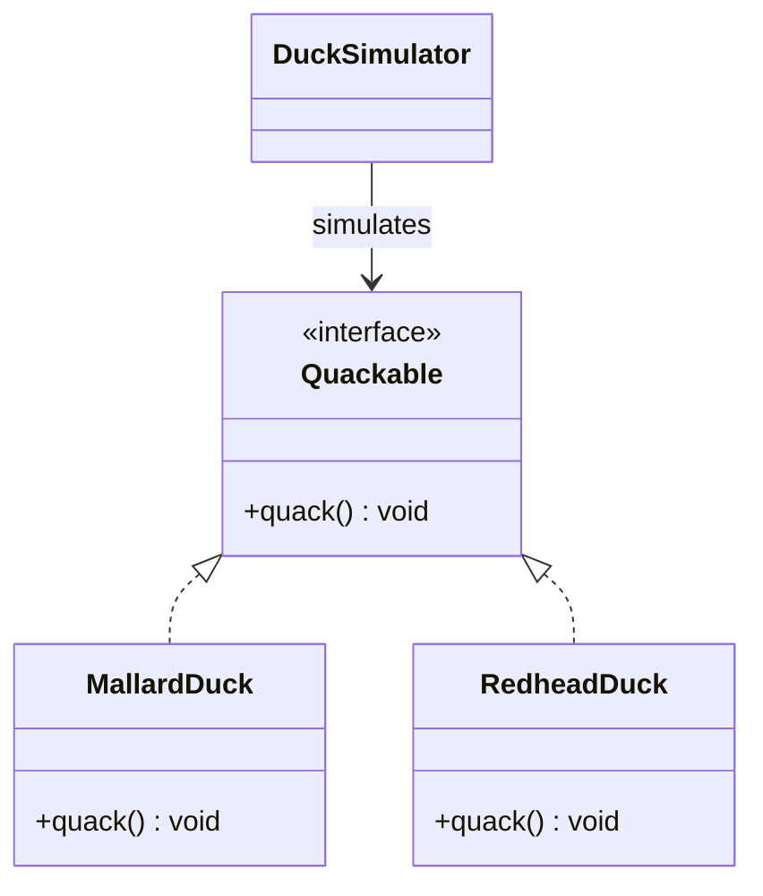
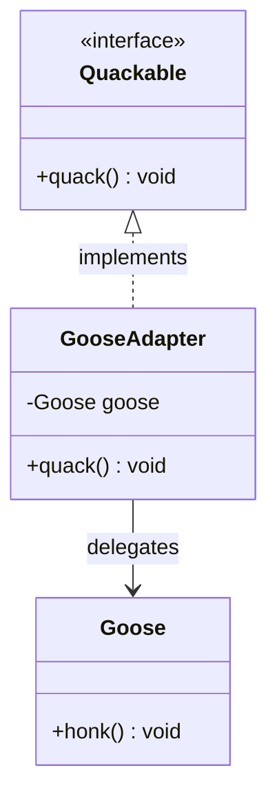
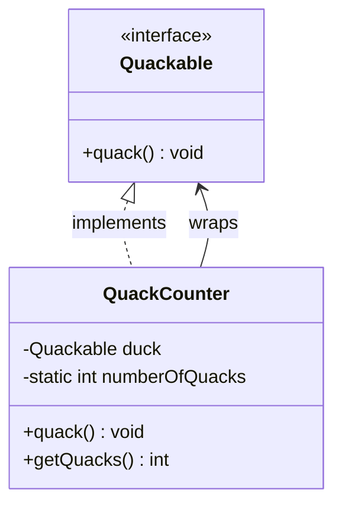
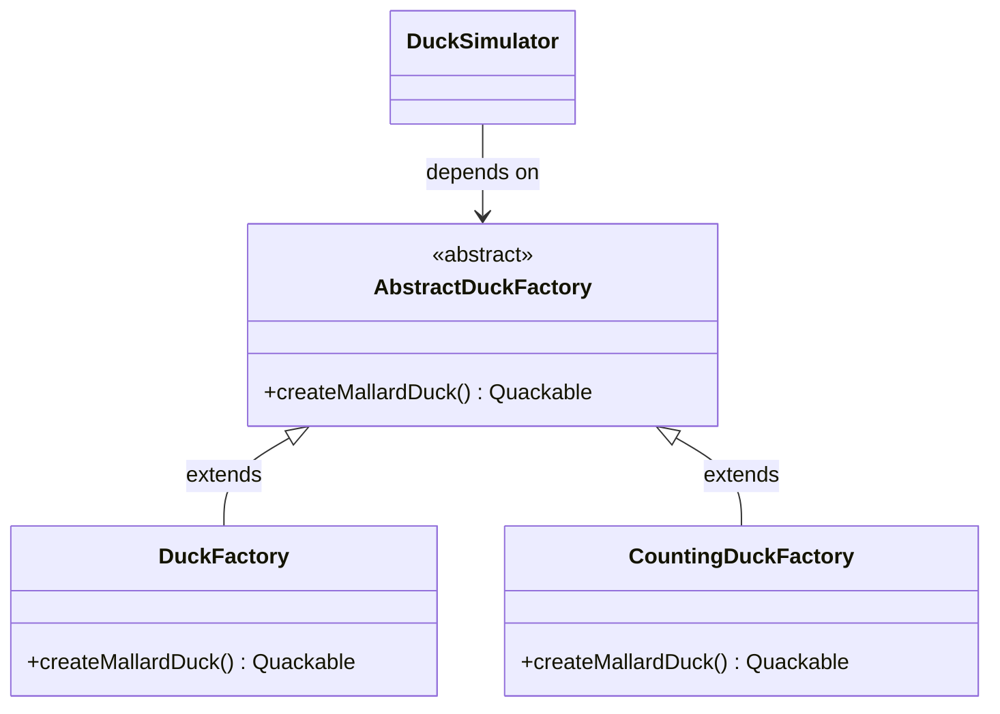
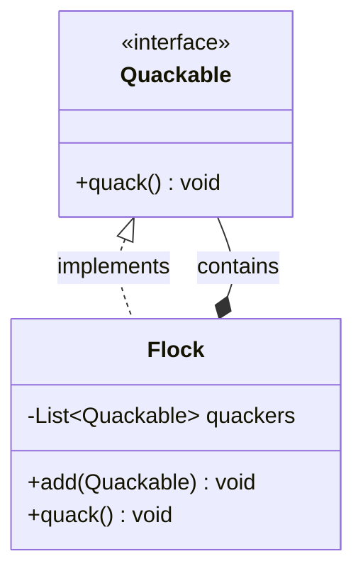
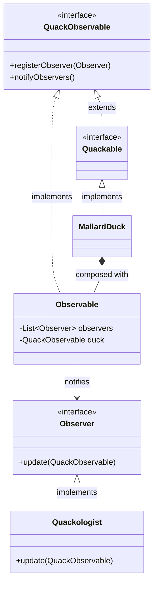
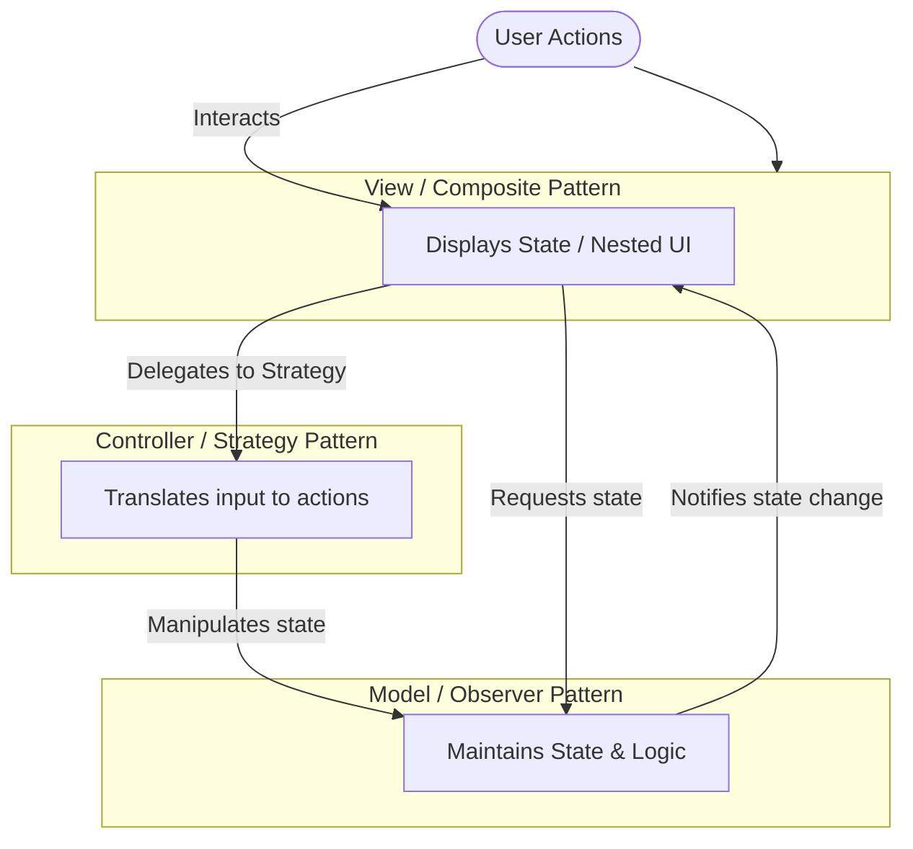
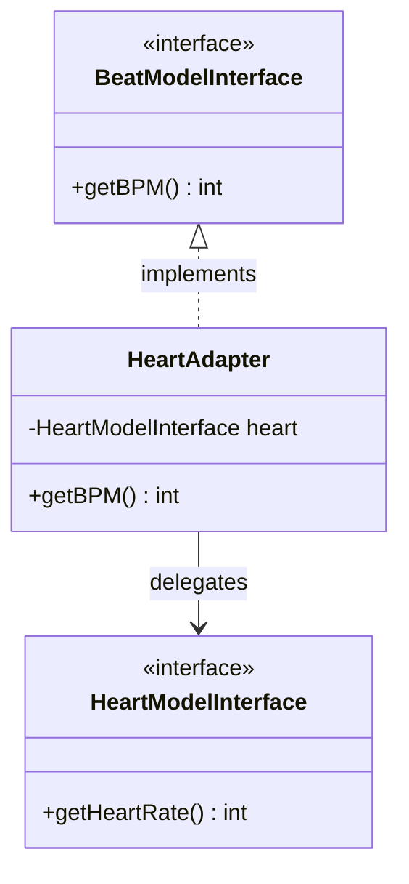

# Architectural Change Log: SimUDuck & MVC

> 💡 **DESIGN Principles:**
> * Encapsulate what varies. 
> * Favor composition over inheritance. 
> * Program to interfaces, not implementations. 
> * Strive for loosely coupled designs between objects that interact. 
> * **Open Closed Principle:** Classes should be open for extension but closed for modification. 
> * **Dependency Inversion Principle:** Depend on abstractions. Do not depend on concrete classes. 
> * **Principle of Least Knowledge:** Talk only to your immediate friends. 
> * **The Hollywood Principle:** Don’t call us, we’ll call you. 
> * **Single Responsibility Principle:** A class should have only one reason to change. 

> 🧩 **DESIGN PATTERN:**
> 
> A Compound Pattern combines two or more patterns into a solution that solves a recurring or general problem. 

---

## Part 1: SimUDuck Evolution

### 1.0 Naive/Initial State
* **Architectural Flow:** Direct implementation of a single interface. 



```java
public interface Quackable {
    void quack();
}

public class MallardDuck implements Quackable {
    public void quack() { System.out.println("Quack"); }
}

public class DuckSimulator {
    void simulate(Quackable duck) { duck.quack(); }
}
```

### 1.1 Intermediate Evolution: Adapter Pattern
* **Architectural Flow:** Adapting incompatible interfaces (`Goose` -> `Quackable`). 



```java
public class GooseAdapter implements Quackable {
    Goose goose;
    public GooseAdapter(Goose goose) { this.goose = goose; } 
    public void quack() { goose.honk(); }
}
```

### 1.2 Intermediate Evolution: Decorator Pattern
* **Architectural Flow:** Transparently adding state/behavior (Counting). 



```java
public class QuackCounter implements Quackable {
    Quackable duck;
    static int numberOfQuacks;
    
    public QuackCounter(Quackable duck) { this.duck = duck; }
    
    public void quack() {
        duck.quack();
        numberOfQuacks++;
    }
    public static int getQuacks() { return numberOfQuacks; }
}
```

### 1.3 Intermediate Evolution: Abstract Factory Pattern
* **Architectural Flow:** Encapsulating creation to guarantee decoration. 



```java
public abstract class AbstractDuckFactory {
    public abstract Quackable createMallardDuck();
}

public class CountingDuckFactory extends AbstractDuckFactory {
    public Quackable createMallardDuck() {
        return new QuackCounter(new MallardDuck());
    }
}
```

### 1.4 Intermediate Evolution: Composite & Iterator Patterns
* **Architectural Flow:** Uniform treatment of individuals and collections. 



```java
public class Flock implements Quackable {
    List<Quackable> quackers = new ArrayList<Quackable>(); 
    
    public void add(Quackable quacker) { quackers.add(quacker); }
    
    public void quack() {
        Iterator<Quackable> iterator = quackers.iterator();
        while (iterator.hasNext()) {
            Quackable quacker = iterator.next();
            quacker.quack();
        }
    }
}
```

### 1.5 Final Pattern-Refined State: Observer Pattern
* **Architectural Flow:** Event-driven notification decoupled from subjects. 



```java
public interface QuackObservable {
    void registerObserver(Observer observer);
    void notifyObservers();
}

public interface Quackable extends QuackObservable {
    void quack();
}

public class Observable implements QuackObservable {
    List<Observer> observers = new ArrayList<Observer>();
    QuackObservable duck;
    
    public Observable(QuackObservable duck) { this.duck = duck; }
    
    public void registerObserver(Observer observer) { observers.add(observer); }
    
    public void notifyObservers() {
        Iterator iterator = observers.iterator();
        while (iterator.hasNext()) {
            Observer observer = (Observer)iterator.next();
            observer.update(duck);
        }
    }
}
```

---

## Part 2: The Model-View-Controller (MVC) Compound Pattern

### 2.0 Architectural Flow
* **Architectural Flow:** Separation of concerns via Strategy, Observer, and Composite. 



### 2.1 Core Contracts

```java
// 1. MODEL: Observer Subject 
public interface BeatModelInterface {
    void initialize();
    void on();
    void off();
    void setBPM(int bpm);
    int getBPM();
    void registerObserver(BeatObserver o);
    void registerObserver(BPMObserver o);
}

// 2. VIEW: Observer & Composite 
public class DJView implements ActionListener, BeatObserver, BPMObserver {
    BeatModelInterface model;
    ControllerInterface controller;
    
    public void updateBPM() {
        int bpm = model.getBPM(); // Pulls state 
        // GUI updates via Composite...
    }
    
    public void actionPerformed(ActionEvent event) {
        // Delegates to Strategy 
        controller.increaseBPM(); 
    }
}

// 3. CONTROLLER: Strategy 
public interface ControllerInterface {
    void start();
    void stop();
    void increaseBPM();
    void setBPM(int bpm);
}

public class BeatController implements ControllerInterface {
    BeatModelInterface model;
    DJView view;
    
    public void increaseBPM() {
        int bpm = model.getBPM();
        model.setBPM(bpm + 1);
    }
}
```

### 2.2 Reusability via Adapter
* **Architectural Flow:** Mapping existing models into expected MVC architectures. 



```java
public class HeartAdapter implements BeatModelInterface {
    HeartModelInterface heart;
    
    public HeartAdapter(HeartModelInterface heart) { this.heart = heart; }
    
    public int getBPM() {
        return heart.getHeartRate();
    }
}
```