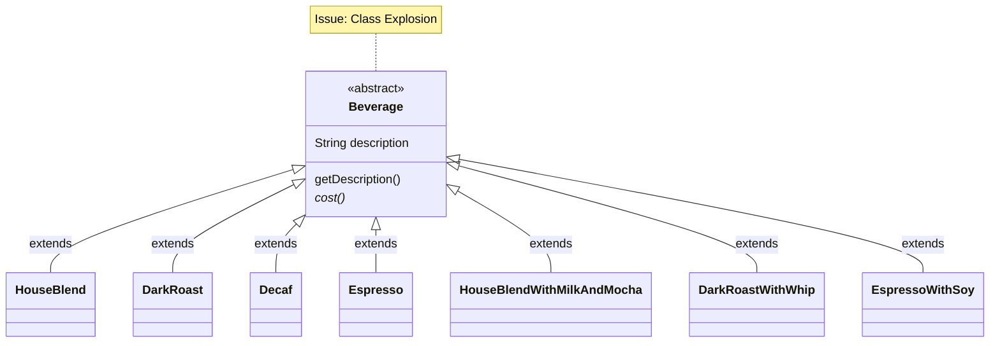
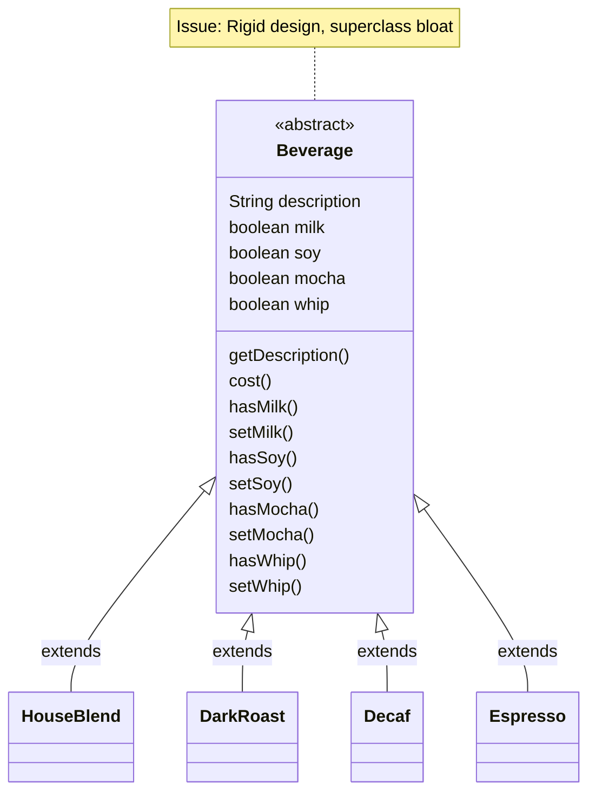
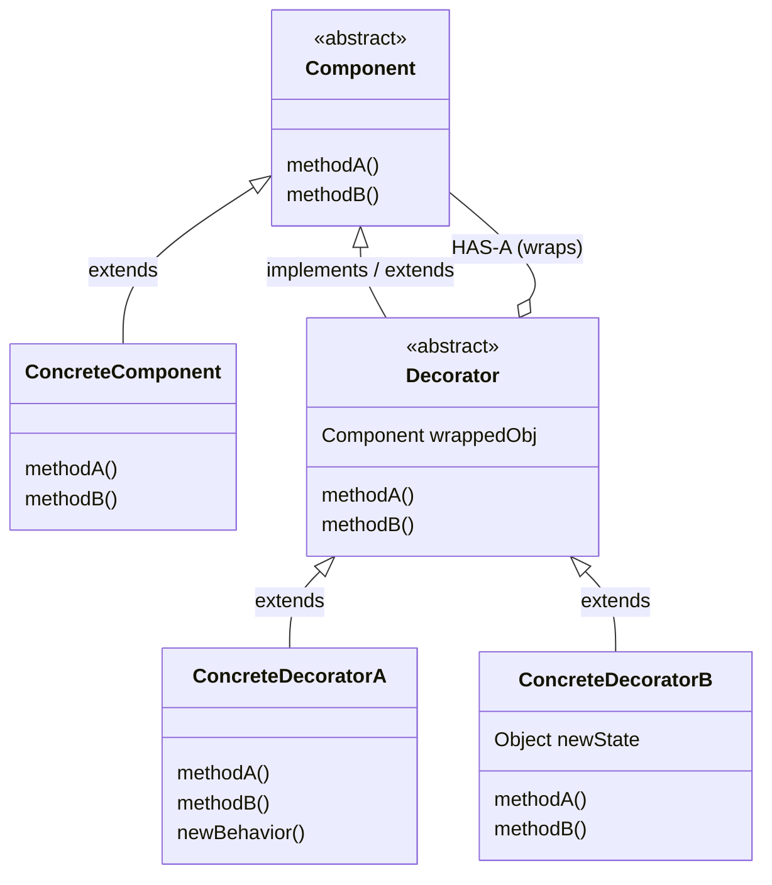
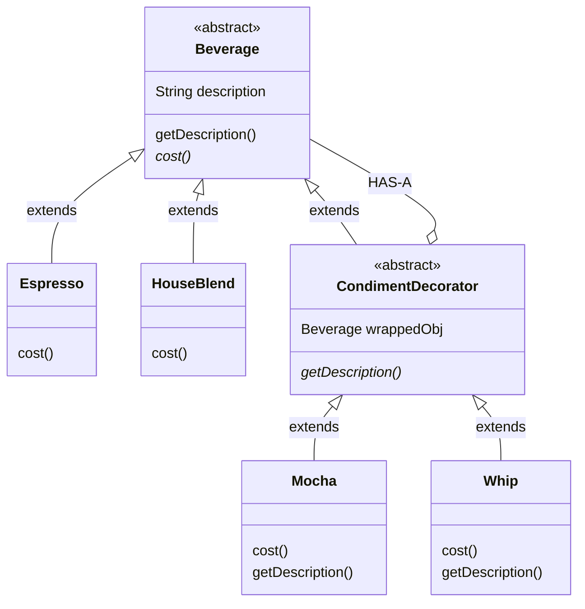

# Decorator Pattern

> 💡 **DESIGN Principles:**
> * Encapsulate what varies.
> * Favor composition over inheritance.
> * Program to interfaces, not implementations.
> * Strive for loosely coupled designs between objects that interact.
> * **Open Closed Principle:** Classes should be open for extension but closed for modification.

> 🧩 **DESIGN PATTERN:**
> Decorator - Attach additional responsibilities to an object dynamically. Decorators provide a flexible alternative to subclassing for extending functionality. 

---

## 1. Naive / Initial State



---

## 2. Intermediate Evolution State



---

## 3. Final Pattern-Refined State



### Domain Application: Beverage System



### Code Evolution

```java
// Base Component 
public abstract class Beverage {
    
    String description = "Unknown Beverage";

    public String getDescription() {
        return description;
    }

    public abstract double cost();
}
```

```java
// Concrete Component 
public class Espresso extends Beverage {
    public Espresso() {
        description = "Espresso";
    }
    public double cost() {
        return 1.99;
    }
}
```

```java
// Abstract Decorator 
public abstract class CondimentDecorator extends Beverage {
    public abstract String getDescription();
}
```

```java
// Concrete Decorator 
public class Mocha extends CondimentDecorator {
    Beverage beverage;

    public Mocha(Beverage beverage) {
        this.beverage = beverage;
    }

    public String getDescription() {
        return beverage.getDescription() + ", Mocha";
    }

    public double cost() {
        return .20 + beverage.cost();
    }
}
```

### Secondary Domain Application: Java I/O

```java
// Custom I/O Decorator extending FilterInputStream 
public class LowerCaseInputStream extends FilterInputStream {
    public LowerCaseInputStream(InputStream in) {
        super(in);
    }
    
    public int read() throws IOException {
        int c = in.read();
        return (c == -1 ? c : Character.toLowerCase((char)c));
    }
    
    public int read(byte[] b, int offset, int len) throws IOException {
        int result = in.read(b, offset, len);
        for (int i = offset; i < offset+result; i++) {
            b[i] = (byte)Character.toLowerCase((char)b[i]);
        }
        return result;
    }
}
```

```java
// Client Code / Integration Test 
public class InputTest {
    public static void main(String[] args) throws IOException {
        int c;
        try {
            InputStream in = 
                new LowerCaseInputStream(
                    new BufferedInputStream(
                        new FileInputStream("test.txt")));
            
            while((c = in.read()) >= 0) {
                System.out.print((char)c);
            }
            in.close();
        } catch (IOException e) {
            e.printStackTrace();
        }
    }
}
```