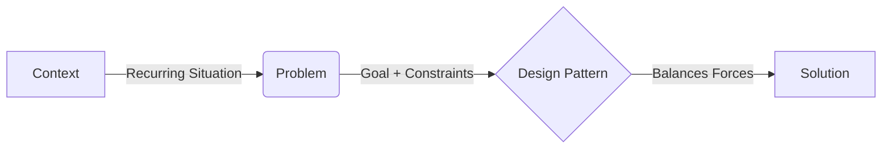
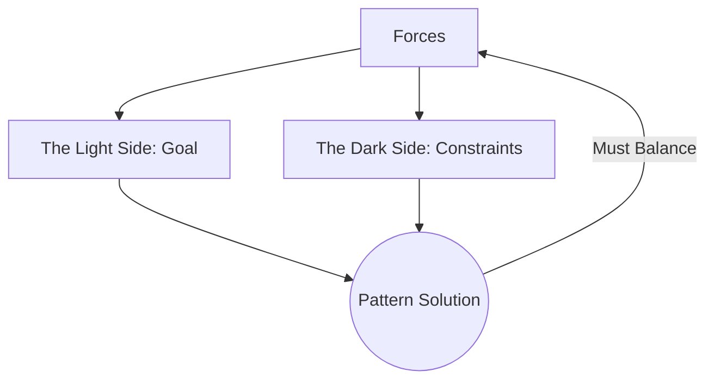
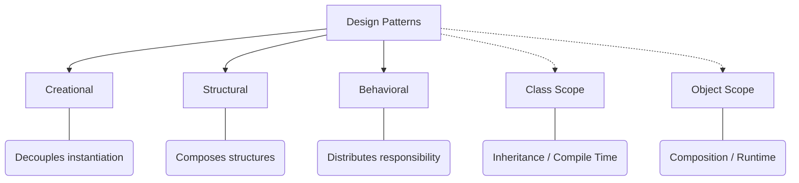
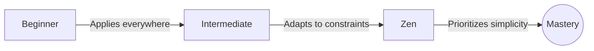
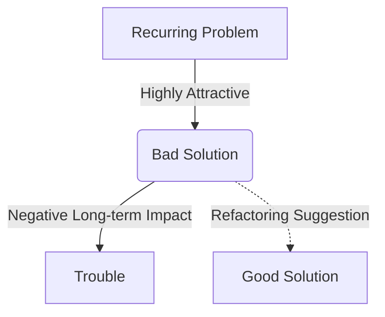
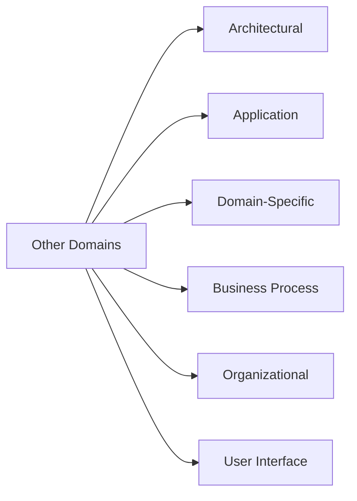

# Design Patterns: Documentation

> **RULE: KEEP IT SIMPLE (KISS)**
> 
> Solve things in the simplest way possible; do not use a pattern if a simpler solution works.

> **RULE: BEWARE HYPOTHETICALS**
> 
> Employ patterns to handle practical, expected changes, not hypothetical ones.

> **RULE: REFACTORING TIME IS PATTERNS TIME**
> 
> Reexamine your design and introduce patterns when making changes to improve code structure without altering behavior.

> **RULE: REMOVAL IS ACCEPTABLE**
> 
> Do not be afraid to remove a pattern when a system becomes complex and the planned flexibility is no longer needed.

> **WARNING: AVOID OVERENGINEERING**
> 
> Design Patterns are not magic bullets; overuse leads to code that is downright overengineered.

---

## 1. Core Definition Architecture

* **Design Pattern:** A solution to a problem in a context.
* **Context:** The recurring situation in which the pattern applies.
* **Problem:** The goal you are trying to achieve, alongside any constraints occurring in the context.
* **Solution:** A general design that anyone can apply, which resolves the goal and set of constraints.
* ***Name:*** An essential component required to form a shared vocabulary with other developers.

---

## 2. Resolving Forces

* **Forces:** The pattern gurus' terminology for the goal and the set of constraints.
* **Balance:** A useful pattern is created only when a solution balances both sides of the force.

---

## 3. Classification Matrix

* **Creational Patterns:** Involve object instantiation to decouple a client from objects it needs.
* **Structural Patterns:** Compose classes or objects into larger structures.
* **Behavioral Patterns:** Dictate how classes and objects interact and distribute responsibility.
* **Class Patterns:** Define relationships via inheritance, established at compile time.
* **Object Patterns:** Describe relationships created by composition, making them dynamic and flexible at runtime.

---

## 4. The Mindset Evolution

* **Beginner Mind:** Uses patterns everywhere for experience, falsely believing more patterns equal a better design.
* **Intermediate Mind:** Identifies where patterns belong but may force square patterns into round holes before learning adaptation.
* **Zen Mind:** Looks for natural fits, prioritizes the simplest solutions, and applies pattern adaptations based on object principles.

---

## 5. Anti-Patterns Framework

* **Definition:** Documents how to progress from a problem to a BAD solution to prevent repeated developer mistakes.
* **Anatomy:** Alerts you to why a bad solution is attractive upfront, explains why it causes trouble long-term, and suggests applicable good patterns.
* **Example (Golden Hammer):** Obsessively applying a familiar technology to architecture where it is clearly inappropriate due to fear of the unfamiliar.

---

## 6. The Patterns Zoo

* **Architectural:** The origin of patterns, applied to buildings and towns.
* **Application:** System-level architecture.
* **Domain-Specific:** Solutions for specific fields like concurrent or real-time systems.
* **Business Process:** Interaction logic between businesses, customers, and data.
* **Organizational:** Structures of human organizations, heavily used in software support.
* **User Interface:** Solutions for designing interactive software.