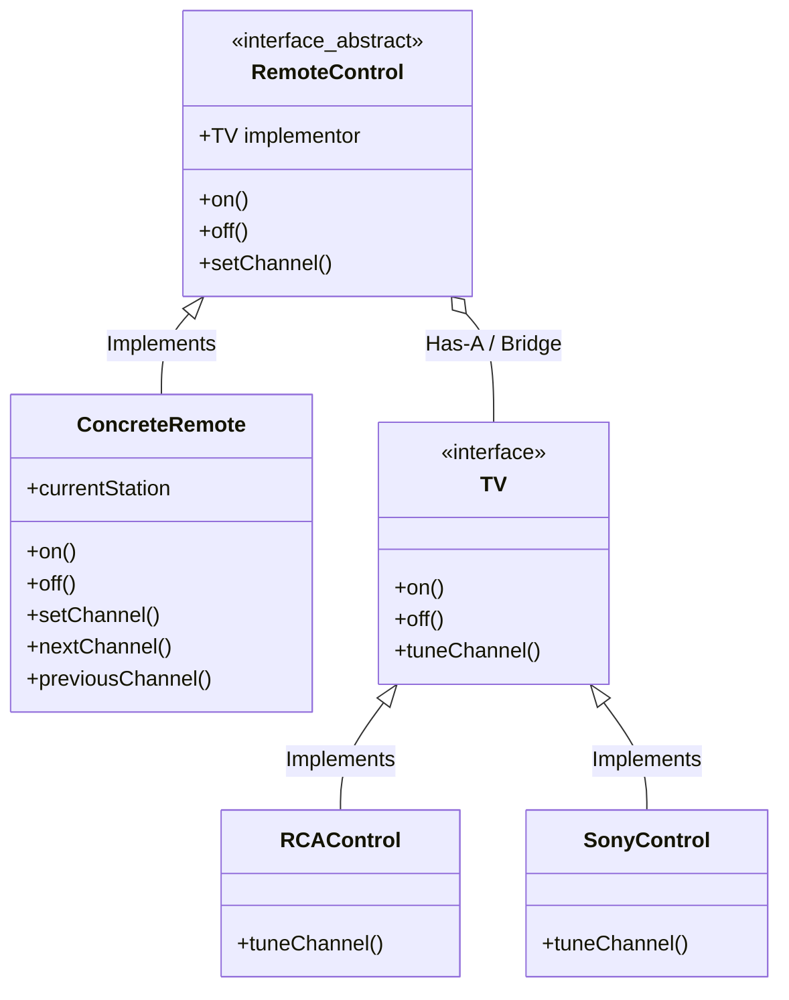
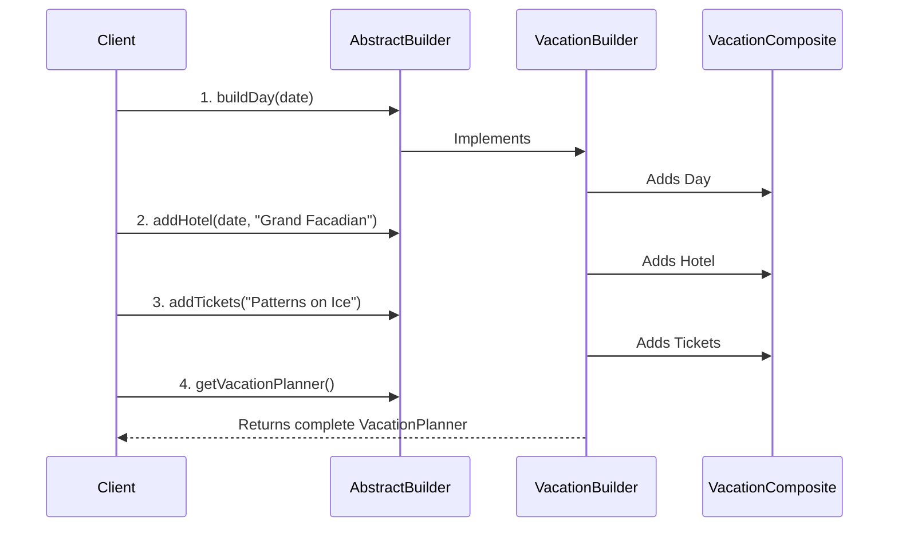
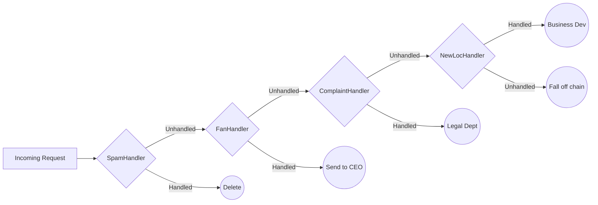
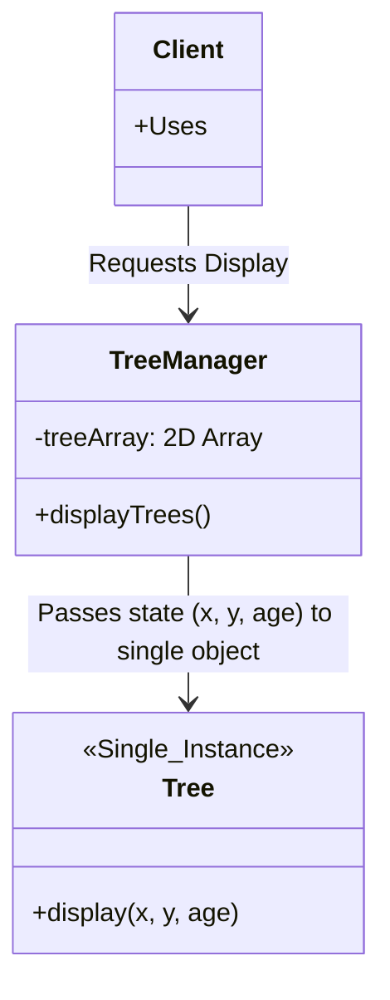
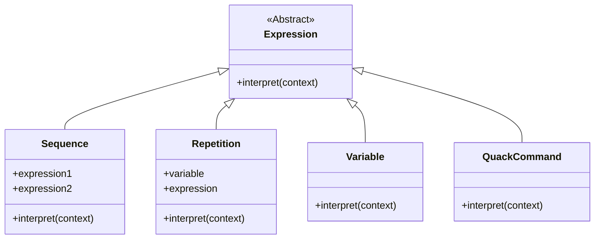
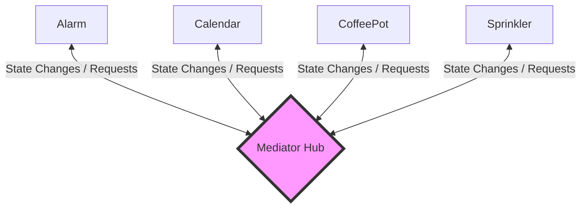
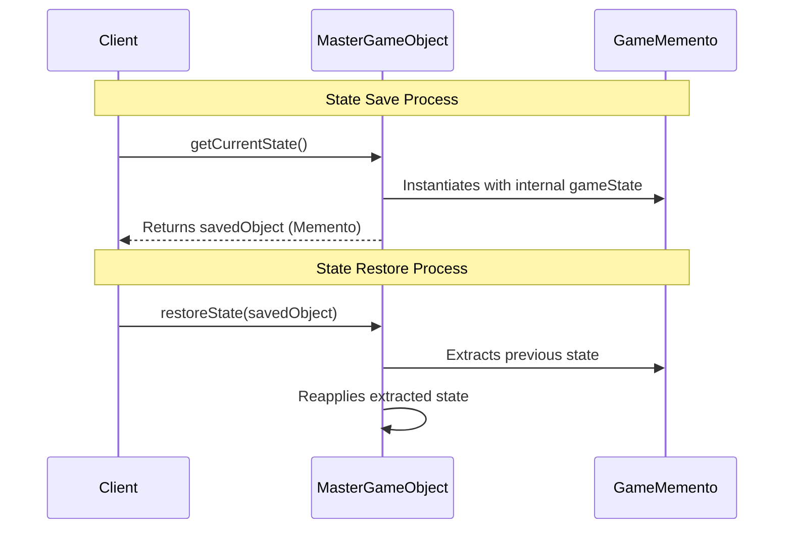
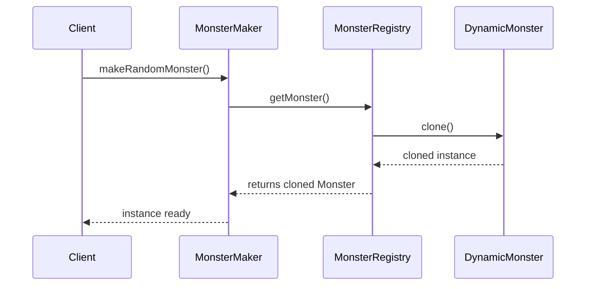
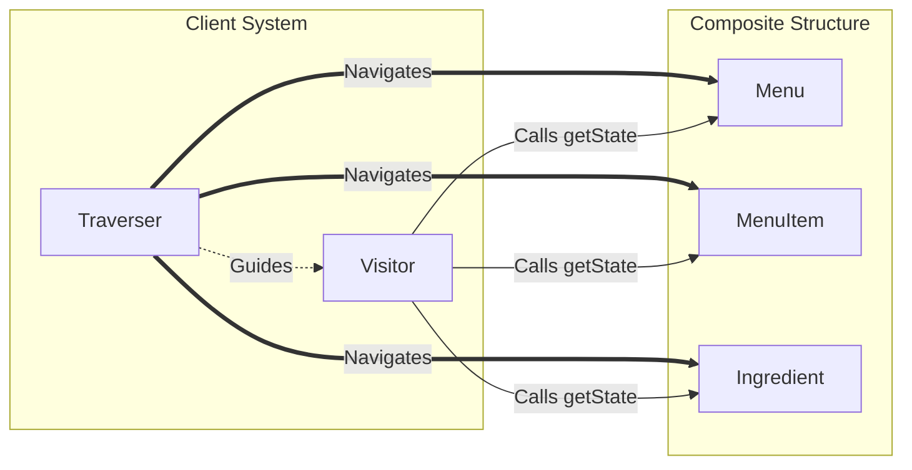

# Design Patterns: Extended Architectural Catalog

## 1. Bridge Pattern
* **Definition:** Separates an abstraction from its implementation so both can be modified independently.

> **ARCHITECTURAL RULE:** Use the Bridge Pattern to vary not only your implementations, but also your abstractions. 

* **Benefits:**
    * Decouples an implementation so that it is not bound permanently to an interface.
    * Abstraction and implementation can be extended independently.
    * Changes to the concrete abstraction classes don’t affect the client.
* **Drawbacks & Uses:**
    * Useful in graphics and windowing systems that need to run over multiple platforms.
    * Useful any time you need to vary an interface and an implementation in different ways.
    * Increases complexity.

---

## 2. Builder Pattern
* **Definition:** Encapsulates the multistep construction process of a complex composite object, hiding the internal representation from the client.

> **ARCHITECTURAL RULE:** Use the Builder Pattern to encapsulate the construction of a product and allow it to be constructed in steps. 

* **Benefits:**
    * Encapsulates the way a complex object is constructed.
    * Allows objects to be constructed in a multistep and varying process (as opposed to one-step factories).
    * Hides the internal representation of the product from the client.
    * Product implementations can be swapped in and out because the client only sees an abstract interface.
* **Drawbacks & Uses:**
    * Often used for building composite structures.
    * Constructing objects requires more domain knowledge of the client than when using a Factory.

---

## 3. Chain of Responsibility Pattern
* **Definition:** Passes a request along a dynamic chain of handlers until one object assumes the responsibility to process it.

> **ARCHITECTURAL RULE:** Use the Chain of Responsibility Pattern when you want to give more than one object a chance to handle a request. 

* **Benefits:**
    * Decouples the sender of the request and its receivers.
    * Simplifies your object because it doesn’t have to know the chain’s structure and keep direct references to its members.
    * Allows you to add or remove responsibilities dynamically by changing the members or order of the chain.
* **Drawbacks & Uses:**
    * Commonly used in Windows systems to handle events like mouse clicks and keyboard events.
    * Execution of the request isn’t guaranteed; it may fall off the end of the chain if no object handles it (this can be an advantage or a disadvantage).
    * Can be hard to observe and debug at runtime.

---

## 4. Flyweight Pattern
* **Definition:** Centralizes the state of thousands of logical objects into a single shared, state-free instance managed via a 2D array or external manager.

> **ARCHITECTURAL RULE:** Use the Flyweight Pattern when one instance of a class can be used to provide many virtual instances. 

* **Benefits:**
    * Reduces the number of object instances at runtime, saving memory.
    * Centralizes state for many “virtual” objects into a single location.
* **Drawbacks & Uses:**
    * The Flyweight is used when a class has many instances, and they can all be controlled identically.
    * A drawback of the Flyweight Pattern is that once you’ve implemented it, single, logical instances of the class will not be able to behave independently of the other instances.

---

## 5. Interpreter Pattern
* **Definition:** Maps simple grammar rules directly to a class structure to parse, interpret, and evaluate language streams.

> **ARCHITECTURAL RULE:** Use the Interpreter Pattern to build an interpreter for a language. 

* **Benefits:**
    * Representing each grammar rule in a class makes the language easy to implement.
    * Because the grammar is represented by classes, you can easily change or extend the language.
    * By adding methods to the class structure, you can add new behaviors beyond interpretation, like pretty printing and more sophisticated program validation.
* **Drawbacks & Uses:**
    * Use Interpreter when you need to implement a simple language.
    * Appropriate when you have a simple grammar and simplicity is more important than efficiency.
    * Used for scripting and programming languages.
    * This pattern can become cumbersome when the number of grammar rules is large.
    * In these cases a parser/compiler generator may be more appropriate.

---

## 6. Mediator Pattern
* **Definition:** Replaces complex many-to-many communication networks with a star topology, storing all system control logic in a single, centralized hub.

> **ARCHITECTURAL RULE:** Use the Mediator Pattern to centralize complex communications and control between related objects. 

* **Benefits:**
    * Increases the reusability of the objects supported by the Mediator by decoupling them from the system.
    * Simplifies maintenance of the system by centralizing control logic.
    * Simplifies and reduces the variety of messages sent between objects in the system.
* **Drawbacks & Uses:**
    * The Mediator is commonly used to coordinate related GUI components.
    * A drawback of the Mediator Pattern is that without proper design, the Mediator object itself can become overly complex.

---

## 7. Memento Pattern
* **Definition:** Separates and stores an object's internal state in an external container to facilitate recovery/undo functionality without breaking encapsulation boundaries.

> **ARCHITECTURAL RULE:** Use the Memento Pattern when you need to be able to return an object to one of its previous states. 

* **Benefits:**
    * Keeping the saved state external from the key object helps to maintain cohesion.
    * Keeps the key object’s data encapsulated.
    * Provides easy-to-implement recovery capability.
* **Drawbacks & Uses:**
    * The Memento is used to save state.
    * A drawback to using Memento is that saving and restoring state can be time-consuming.
    * In Java systems, consider using Serialization to save a system’s state.

---

## 8. Prototype Pattern
* **Definition:** Delegates instance creation to an active registry that clones a baseline object, bypassing traditional `new` constructors for complex or dynamic states.

> **ARCHITECTURAL RULE:** Use the Prototype Pattern when creating an instance of a given class is either expensive or complicated. 

* **Benefits:**
    * Hides the complexities of making new instances from the client.
    * Provides the option for the client to generate objects whose type is not known.
    * In some circumstances, copying an object can be more efficient than creating a new object.
* **Drawbacks & Uses:**
    * Prototype should be considered when a system must create new objects of many types in a complex class hierarchy.
    * A drawback to using Prototype is that making a copy of an object can sometimes be complicated.

---

## 9. Visitor Pattern
* **Definition:** Couples a structural Traverser with a state-collecting Visitor, allowing new behavioral methods to be injected across a composite tree without modifying its core classes.

> **ARCHITECTURAL RULE:** Use the Visitor Pattern when you want to add capabilities to a composite of objects and encapsulation is not important. 

* **Benefits:**
    * Allows you to add operations to a Composite structure without changing the structure itself.
    * Adding new operations is relatively easy.
    * The code for operations performed by the Visitor is centralized.
* **Drawbacks & Uses:**
    * The Composite classes’ encapsulation is broken when the Visitor is used.
    * Because the traversal function is involved, changes to the Composite structure are more difficult.