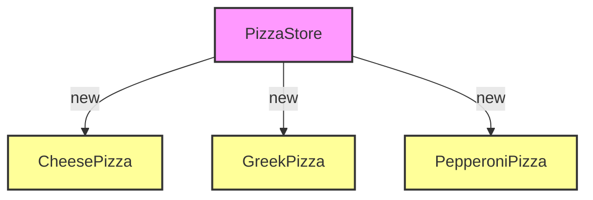
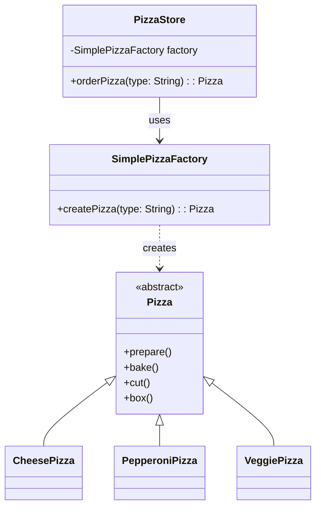
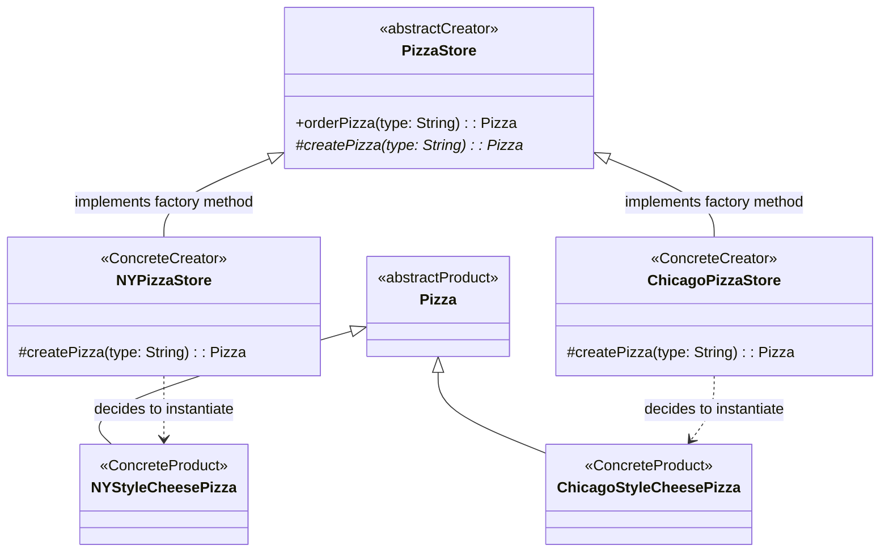
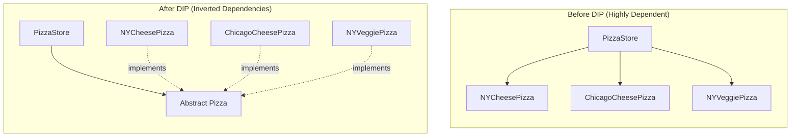
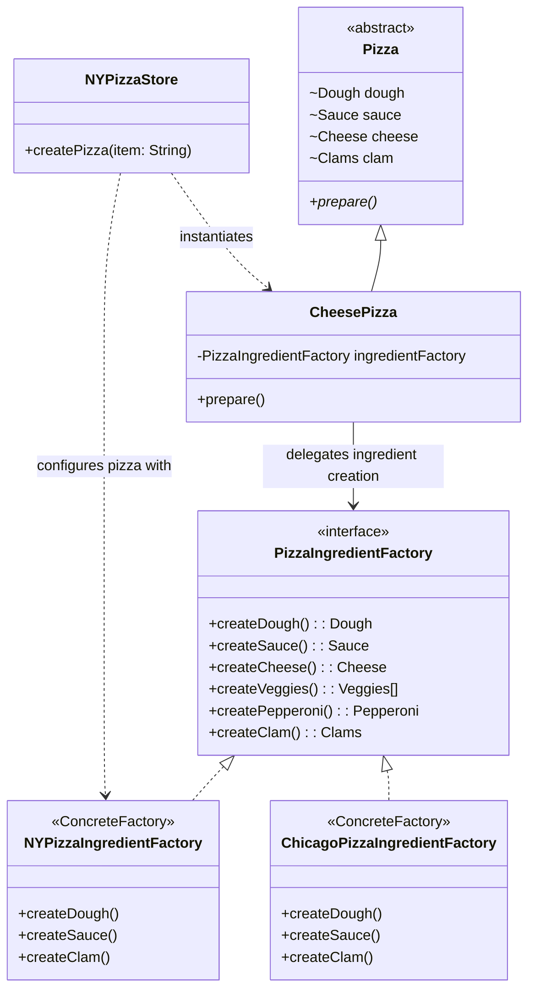
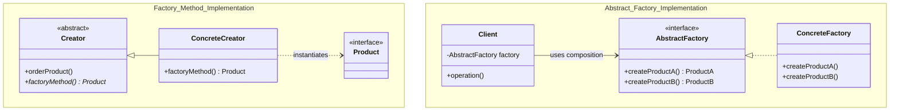
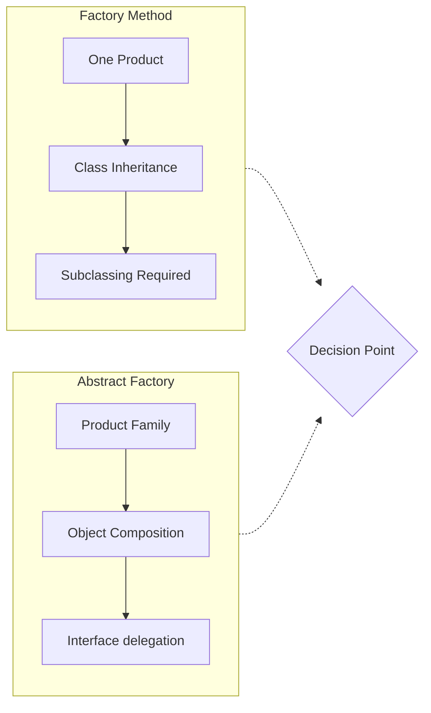

# Factory Pattern

> 💡 **DESIGN Principles:**
> * Encapsulate what varies.
> * Favor composition over inheritance.
> * Program to interfaces, not implementations.
> * Strive for loosely coupled designs between objects that interact.
> * **Open Closed Principle:** Classes should be open for extension but closed for modification.
> * **Dependency Inversion Principle:** Depend on abstractions. Do not depend on concrete classes.

> 🧩 **DESIGN PATTERNS:**
> 
> **Factory Method Pattern:** Defines an interface for creating an object, but lets subclasses decide which class to instantiate. Factory Method lets a class defer instantiation to subclasses.
>
> **Abstract Factory Pattern:** Provides an interface for creating families of related or dependent objects without specifying their concrete classes.

---

### Phase 1: Naive/Initial State



```java
Pizza orderPizza(String type) {
    Pizza pizza;
    // THIS IS WHAT VARIES - NOT CLOSED FOR MODIFICATION
    switch (type) {
        case "cheese" -> pizza = new CheesePizza();
        case "greek" -> pizza = new GreekPizza();
        case "pepperoni" -> pizza = new PepperoniPizza();
    } 

    // THIS STAYS THE SAME
    pizza.prepare();
    pizza.bake(); 
    pizza.cut();
    pizza.box();
    return pizza;
}
```

---

### Phase 2: Intermediate Evolution - Simple Factory Idiom



```java
public class SimplePizzaFactory {
    public Pizza createPizza(String type) {
        return switch (type) {
            case "cheese" -> new CheesePizza();
            case "pepperoni" -> new PepperoniPizza();
            case "clam" -> new ClamPizza();
            case "veggie" -> new VeggiePizza();
            default -> null;
        };
    }
}

public class PizzaStore {
    SimplePizzaFactory factory;

    public PizzaStore(SimplePizzaFactory factory) { 
        this.factory = factory;
    }

    public Pizza orderPizza(String type) {
        Pizza pizza = factory.createPizza(type);
        pizza.prepare();
        pizza.bake();
        pizza.cut();
        pizza.box();
        return pizza;
    }
}
```

> 📝 **Note:** In design patterns, the phrase “implement an interface” does NOT always mean “write a class that implements a Java interface, by using the ‘implements' keyword in the class declaration.” In the general use of the phrase, a concrete class implementing a method from a supertype (which could be an abstract class OR interface) is still considered to be “implementing the interface” of that supertype.

---

### Phase 3: Final Pattern-Refined - Factory Method Pattern



```java
public abstract class PizzaStore {
    public Pizza orderPizza(String type) {
        Pizza pizza;
        // Factory Method acts as the object creator
        pizza = createPizza(type);
        pizza.prepare();
        pizza.bake(); 
        pizza.cut();
        pizza.box();
        return pizza;
    }
    
    // Subclasses are counted on to handle object creation
    protected abstract Pizza createPizza(String type);
}

public class NYPizzaStore extends PizzaStore {
    protected Pizza createPizza(String item) {
        return switch (item) {
            case "cheese" -> new NYStyleCheesePizza();
            case "veggie" -> new NYStyleVeggiePizza();
            case "clam" -> new NYStyleClamPizza();
            case "pepperoni" -> new NYStylePepperoniPizza();
            default -> null;
        };
    }
}
```

---

### Architectural Analysis: Dependency Inversion Principle



---

### Phase 4: Final Pattern-Refined - Abstract Factory Pattern



```java
public interface PizzaIngredientFactory {
    Dough createDough();
    Sauce createSauce();
    Cheese createCheese();
    Veggies[] createVeggies();
    Pepperoni createPepperoni();
    Clams createClam();
}

public class NYPizzaIngredientFactory implements PizzaIngredientFactory {
    public Dough createDough() { return new ThinCrustDough(); }
    public Sauce createSauce() { return new MarinaraSauce(); }
    public Cheese createCheese() { return new ReggianoCheese(); }
    public Veggies[] createVeggies() {
        return new Veggies[]{new Garlic(), new Onion(), new Mushroom(), new RedPepper()}; 
    }
    public Pepperoni createPepperoni() { return new SlicedPepperoni(); }
    public Clams createClam() { return new FreshClams(); }
}

public class CheesePizza extends Pizza {
    PizzaIngredientFactory ingredientFactory;
 
    public CheesePizza(PizzaIngredientFactory ingredientFactory) {
        this.ingredientFactory = ingredientFactory;
    }
 
    void prepare() {
        // Collects ingredients from the local factory via composition
        dough = ingredientFactory.createDough();
        sauce = ingredientFactory.createSauce();
        cheese = ingredientFactory.createCheese();
    }
}

public class NYPizzaStore extends PizzaStore {
    protected Pizza createPizza(String item) {
        Pizza pizza = null;
        PizzaIngredientFactory ingredientFactory = new NYPizzaIngredientFactory();
 
        if (item.equals("cheese")) {
            pizza = new CheesePizza(ingredientFactory);
            pizza.setName("New York Style Cheese Pizza");
        }
        return pizza;
    }
}
```

---

## Architecture Analysis: Factory Method vs. Abstract Factory

### Comparative Architecture: Structural Breakdown



---

### Key Architectural Differentiators

