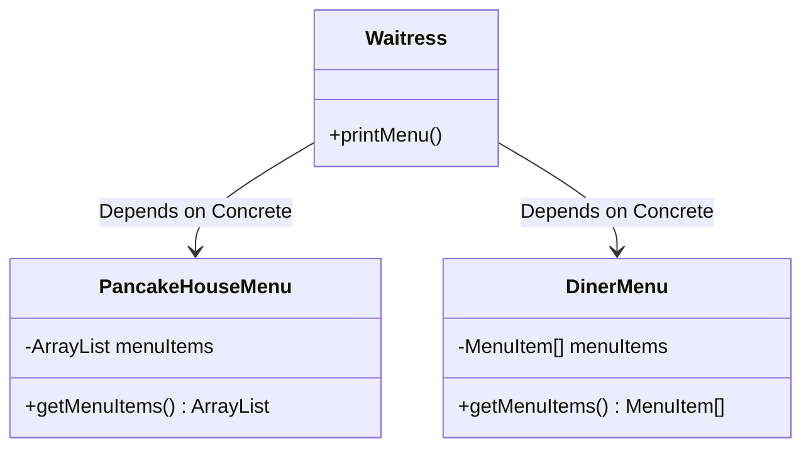
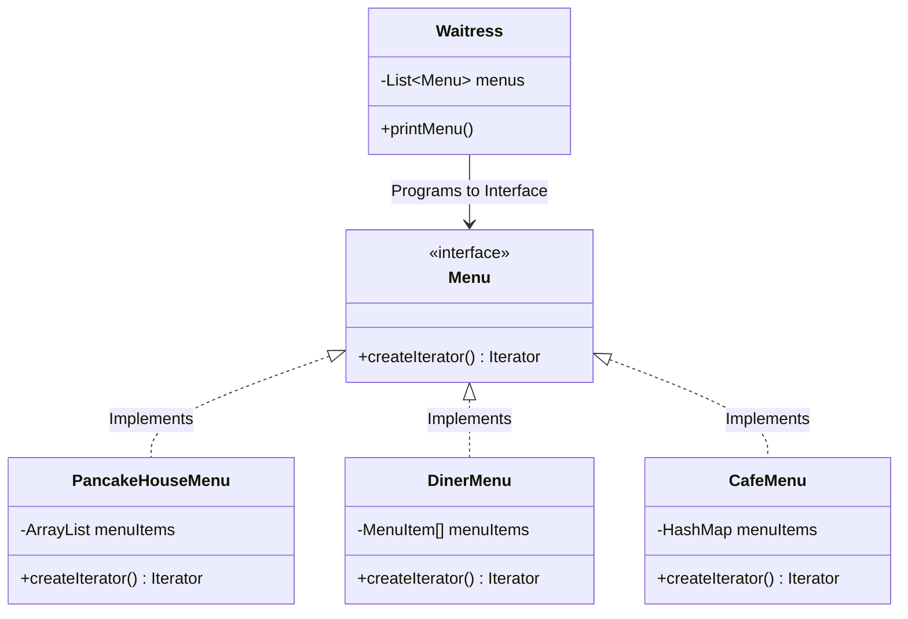
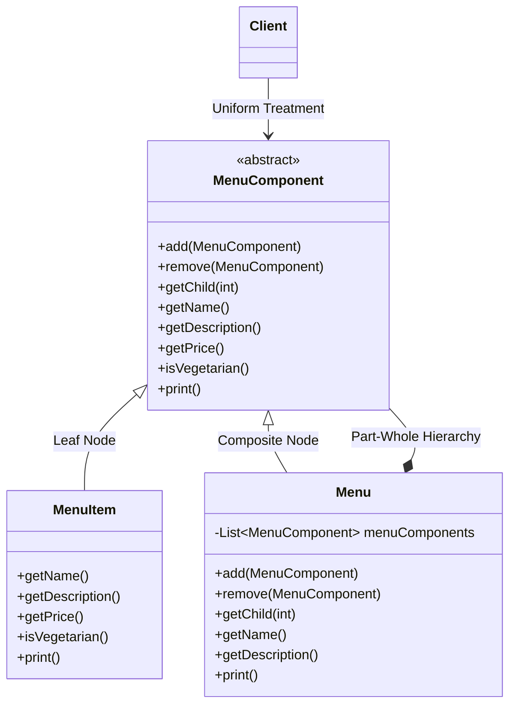

# Iterator & Composite Patterns

> 💡 **DESIGN Principles:**
> * Encapsulate what varies. 
> * Favor composition over inheritance. 
> * Program to interfaces, not implementations. 
> * Strive for loosely coupled designs between objects that interact. 
> * **Open Closed Principle:** Classes should be open for extension but closed for modification. 
> * **Dependency Inversion Principle:** Depend on abstractions. Do not depend on concrete classes. 
> * **Principle of Least Knowledge:** Talk only to your immediate friends. 
> * **The Hollywood Principle:** Don’t call us, we’ll call you. 
> * **Single Responsibility Principle:** A class should have only one reason to change.  Every responsibility of a class is an area of potential change. 
> * **Cohesion:** We say that a module or class has high cohesion when it is designed around a set of related functions, and we say it has low cohesion when it is designed around a set of unrelated functions. 

> 🧩 **DESIGN PATTERN:**
> * The Iterator Pattern provides a way to access the elements of an aggregate object sequentially without exposing its underlying representation. 
> * The Composite Pattern allows you to compose objects into tree structures to represent part-whole hierarchies.  Composite lets clients treat individual objects and compositions of objects uniformly. 

---

## 1. Naive / Initial State



```java
class Waitress {
    void printMenu() {
        // Implementation details exposed; Waitress bound to concrete classes. 
        PancakeHouseMenu pancakeHouseMenu = new PancakeHouseMenu();
        ArrayList<MenuItem> breakfastItems = pancakeHouseMenu.getMenuItems();

        DinerMenu dinerMenu = new DinerMenu();
        MenuItem[] lunchItems = dinerMenu.getMenuItems();

        // Multiple loops required for different underlying collections. 
        for (int i = 0; i < breakfastItems.size(); i++) {
            MenuItem menuItem = breakfastItems.get(i);
            System.out.println(menuItem.getName());
        }

        for (int i = 0; i < lunchItems.length; i++) {
            MenuItem menuItem = lunchItems[i];
            System.out.println(menuItem.getName());
        }
    }
}
```

---

## 2. Intermediate Evolution State (Iterator Pattern)



```java
// Common interface encapsulates iteration. 
public interface Menu {
    Iterator<MenuItem> createIterator();
}

public class Waitress {
    List<Menu> menus; 
    
    public Waitress(List<Menu> menus) { 
        this.menus = menus; 
    }

    public void printMenu() {
        Iterator<Menu> menuIterator = menus.iterator(); 
        while(menuIterator.hasNext()) { 
            Menu menu = menuIterator.next(); 
            printMenu(menu.createIterator()); 
        }
    }

    // Polymorphic iteration over any collection. 
    void printMenu(Iterator<MenuItem> iterator) { 
        while (iterator.hasNext()) { 
            MenuItem menuItem = iterator.next(); 
            System.out.println(menuItem.getName()); 
        }
    }
}
```

---

## 3. Final Pattern-Refined (Composite Pattern)



```java
// Component defines interface for all objects in composition. 
public abstract class MenuComponent {
    public void add(MenuComponent menuComponent) { 
        throw new UnsupportedOperationException(); 
    }
    public void remove(MenuComponent menuComponent) { 
        throw new UnsupportedOperationException(); 
    }
    public MenuComponent getChild(int i) { 
        throw new UnsupportedOperationException(); 
    }
    public String getName() { 
        throw new UnsupportedOperationException(); 
    }
    public void print() { 
        throw new UnsupportedOperationException(); 
    }
}

// Leaf class implements behavior of elements. 
public class MenuItem extends MenuComponent { 
    // ... constructor ... 
    public void print() { 
        System.out.print("  " + getName()); // inherited getter execution
        System.out.println("    -- " + getDescription());
    }
}

// Composite role defines behavior of components having children. 
public class Menu extends MenuComponent { 
    List<MenuComponent> menuComponents = new ArrayList<MenuComponent>(); 
    String name; 
    String description; 

    public void add(MenuComponent menuComponent) { 
        menuComponents.add(menuComponent); 
    }

    public void print() { 
        System.out.print("\n" + getName()); 
        System.out.println(", " + getDescription()); 
        System.out.println("---------------------"); 

        // Applies operations over composites and individual objects. 
        for (MenuComponent menuComponent : menuComponents) { 
            menuComponent.print(); 
        }
    }
}
```