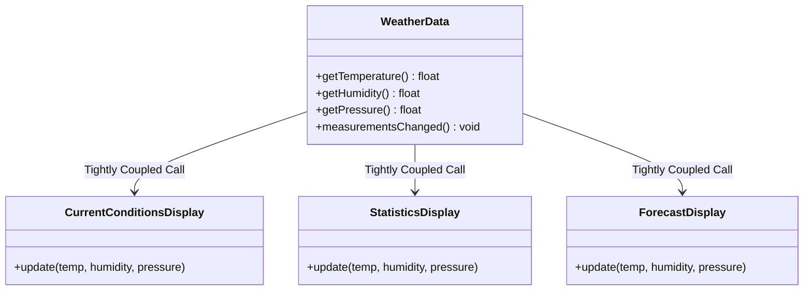
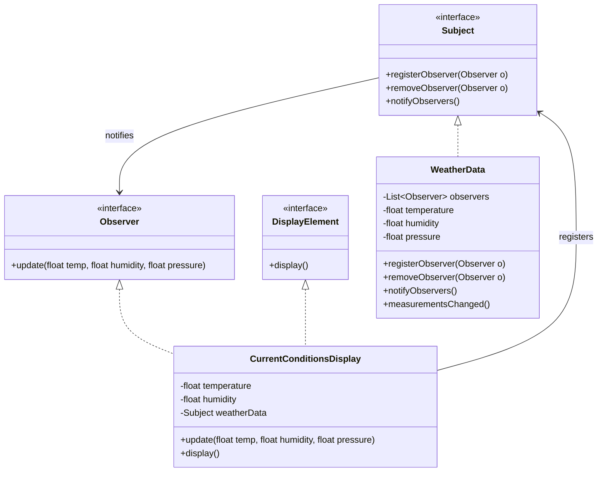
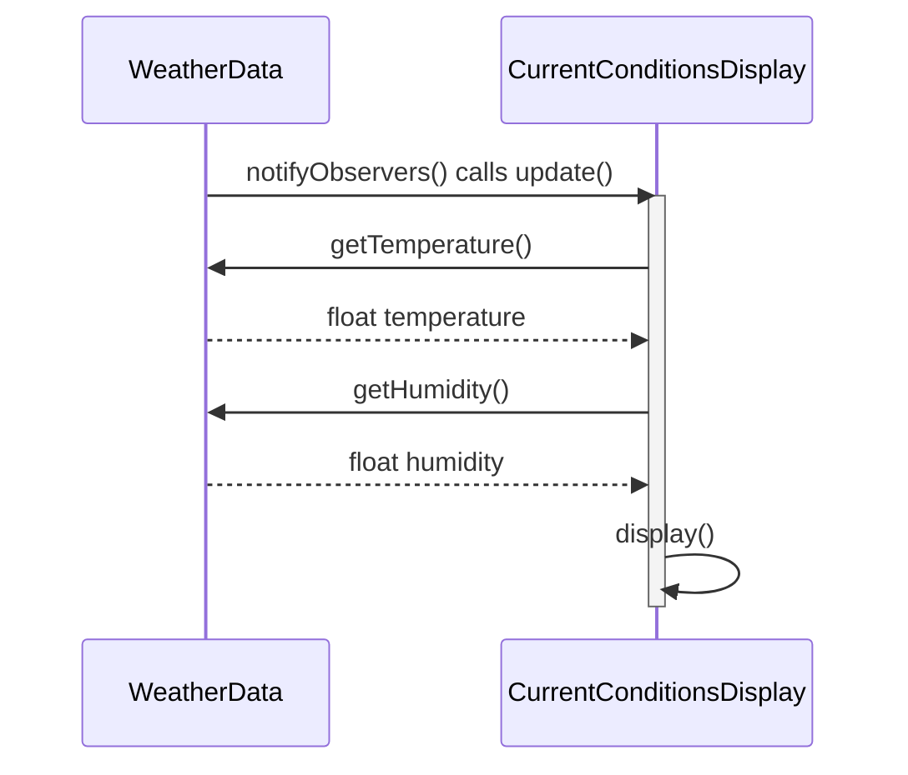

# Observer Pattern

> 💡 **DESIGN Principles:**
> * Encapsulate what varies.
> * Favor composition over inheritance.
> * Program to interfaces, not implementations.
> * Strive for loosely coupled designs between objects that interact.

> 🧩 **DESIGN PATTERN:** The Observer Pattern defines a one-to-many dependency between objects so that when one object changes state, all of its dependents are notified and updated automatically.

---

## Phase 1: Naive/Initial State



```java
public class WeatherData {
    // instance variable declarations

    public void measurementsChanged() {
        float temp = getTemperature();
        float humidity = getHumidity();
        float pressure = getPressure();

        // Area of change. Violation of encapsulation.
        currentConditionsDisplay.update(temp, humidity, pressure);
        statisticsDisplay.update(temp, humidity, pressure);
        forecastDisplay.update(temp, humidity, pressure);
    }
    
    // other WeatherData methods here
}
```

---

## Phase 2: Intermediate Evolution States (Observer - Push Model)



```java
public interface Subject {
    void registerObserver(Observer o);
    void removeObserver(Observer o);
    void notifyObservers();
}

public interface Observer {
    void update(float temp, float humidity, float pressure);
}

public interface DisplayElement {
    void display();
}

public class WeatherData implements Subject {
    private List<Observer> observers;
    private float temperature;
    private float humidity;
    private float pressure;

    public WeatherData() {
        observers = new ArrayList<Observer>();
    }

    public void registerObserver(Observer o) {
        observers.add(o);
    }
    public void removeObserver(Observer o) {
        observers.remove(o);
    }

    public void notifyObservers() {
        for (Observer observer : observers) {
            observer.update(temperature, humidity, pressure);
        }
    }

    public void measurementsChanged() {
        notifyObservers();
    }
}

public class CurrentConditionsDisplay implements Observer, DisplayElement {
    private float temperature;
    private float humidity;
    private WeatherData weatherData;

    public CurrentConditionsDisplay(WeatherData weatherData) {
        this.weatherData = weatherData;
        weatherData.registerObserver(this);
    }

    public void update(float temperature, float humidity, float pressure) {
        this.temperature = temperature;
        this.humidity = humidity;
        display();
    }

    public void display() {
        System.out.println("Current conditions: " + temperature 
            + "F degrees and " + humidity + "% humidity");
    }
}
```

---

## Phase 3: Final Pattern-Refined (Observer - Pull Model)



```java
public interface Observer {
    void update();
}

public class WeatherData implements Subject {
    private List<Observer> observers;
    private float temperature;
    private float humidity;
    private float pressure;

    public WeatherData() {
        observers = new ArrayList<Observer>();
    }

    public void registerObserver(Observer o) {
        observers.add(o);
    }
    
    public void removeObserver(Observer o) {
        observers.remove(o);
    }

    public void notifyObservers() {
        for (Observer observer : observers) {
            observer.update();
        }
    }

    public void measurementsChanged() {
        notifyObservers();
    }

    public float getTemperature() { return temperature; }
    public float getHumidity() { return humidity; }
    public float getPressure() { return pressure; }
}

public class CurrentConditionsDisplay implements Observer, DisplayElement {
    private float temperature;
    private float humidity;
    private WeatherData weatherData;

    public CurrentConditionsDisplay(WeatherData weatherData) {
        this.weatherData = weatherData;
        weatherData.registerObserver(this);
    }

    public void update() {
        this.temperature = weatherData.getTemperature();
        this.humidity = weatherData.getHumidity();
        display();
    }

    public void display() {
        System.out.println("Current conditions: " + temperature 
            + "F degrees and " + humidity + "% humidity");
    }
}
```