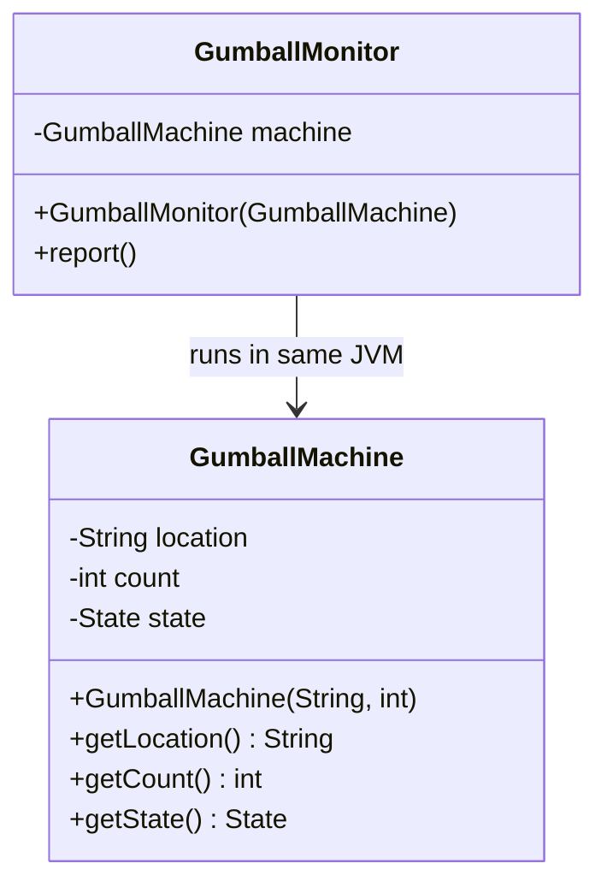
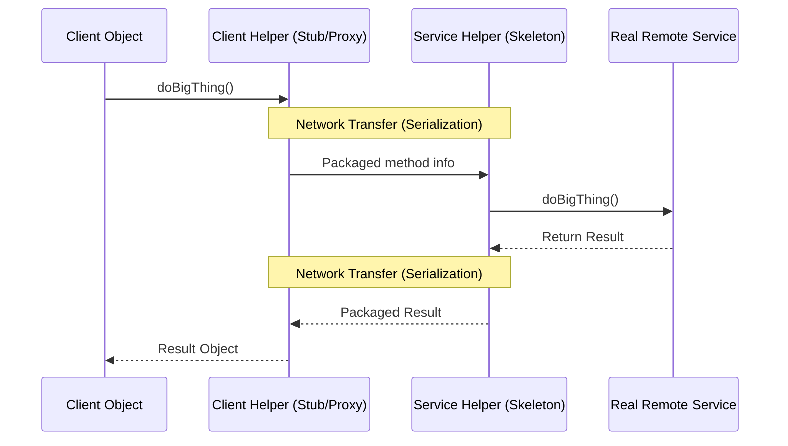
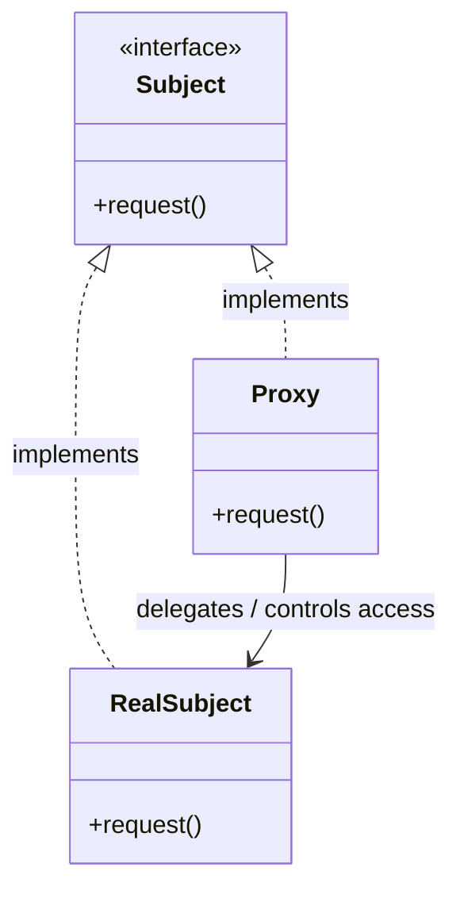
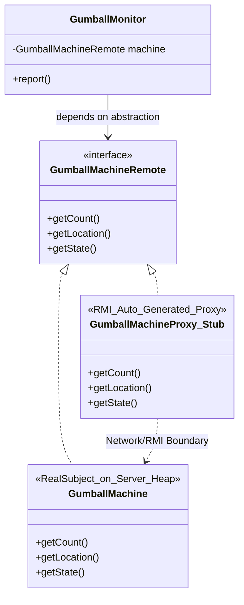

# Proxy Pattern & RMI

> 💡 **DESIGN Principles:**
> * Encapsulate what varies. 
> * Favor composition over inheritance. 
> * Program to interfaces, not implementations. 
> * Strive for loosely coupled designs between objects that interact.
> * **Open Closed Principle:** Classes should be open for extension but closed for modification. 
> * **Dependency Inversion Principle:** Depend on abstractions. Do not depend on concrete classes.
> * **Principle of Least Knowledge:** Talk only to your immediate friends. 
> * **The Hollywood Principle:** Don’t call us, we’ll call you.
> * **Single Responsibility Principle:** A class should have only one reason to change. 

> 🧩 **DESIGN PATTERN:**
> 
> The Proxy Pattern provides a surrogate or placeholder for another object to control access to it. 

---

## 1. Naive/Initial State: Local Monitoring



```java
// Local Execution
public class GumballMachine {
    String location; 
    
    public GumballMachine(String location, int count) {
        this.location = location; 
    }
    public String getLocation() {
        return location; 
    }
}

public class GumballMonitor {
    GumballMachine machine; 

    public GumballMonitor(GumballMachine machine) {
        this.machine = machine; 
    }

    public void report() {
        System.out.println("Gumball Machine: " + machine.getLocation()); 
        System.out.println("Current inventory: " + machine.getCount() + " gumballs"); 
        System.out.println("Current state: " + machine.getState()); 
    }
}
```

---

## 2. Intermediate Evolution States: RMI Detour (Remote Service)



```java
// 1. Remote Interface Definition
import java.rmi.*; 

public interface GumballMachineRemote extends Remote { 
    int getCount() throws RemoteException; 
    String getLocation() throws RemoteException; 
    State getState() throws RemoteException; 
}

// 2. Serializable Return Types
import java.io.*; 

public interface State extends Serializable { 
    void insertQuarter(); 
    void ejectQuarter(); 
    void turnCrank(); 
    void dispense(); 
}

// 3. Service Implementation (Real Subject)
import java.rmi.server.*; 

public class GumballMachine extends UnicastRemoteObject implements GumballMachineRemote { 
    private static final long serialVersionUID = 2L; 

    public GumballMachine(String location, int numberGumballs) throws RemoteException { 
        // implementation
    }
    
    public State getState() { return state; } 
    public String getLocation() { return location; } 
}
```

---

## 3. Final Pattern-Refined: Remote Proxy Integration





```java
// Client Refactored to depend on Proxy/Interface
import java.rmi.*; 

public class GumballMonitor {
    GumballMachineRemote machine; 

    public GumballMonitor(GumballMachineRemote machine) { 
        this.machine = machine; 
    }

    public void report() {
        try {
            System.out.println("Gumball Machine: " + machine.getLocation()); 
            System.out.println("Current inventory: " + machine.getCount() + " gumballs"); 
            System.out.println("Current state: " + machine.getState()); 
        } catch (RemoteException e) { 
            e.printStackTrace(); 
        }
    }
}

// Client Assembly / Execution
public class GumballMonitorTestDrive {
    public static void main(String[] args) {
        String[] location = { "rmi://[santafe.mightygumball.com/gumballmachine](https://santafe.mightygumball.com/gumballmachine)" }; 
        
        try {
            // Naming.lookup acts as the Proxy Factory over the network
            GumballMachineRemote machine = 
                    (GumballMachineRemote) Naming.lookup(location[0]); 
            
            GumballMonitor monitor = new GumballMonitor(machine); 
            monitor.report(); 
            
        } catch (Exception e) {
            e.printStackTrace(); 
        }
    }
}
```