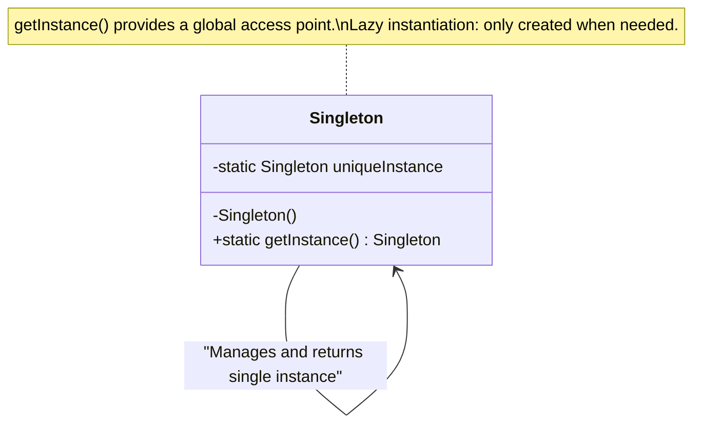
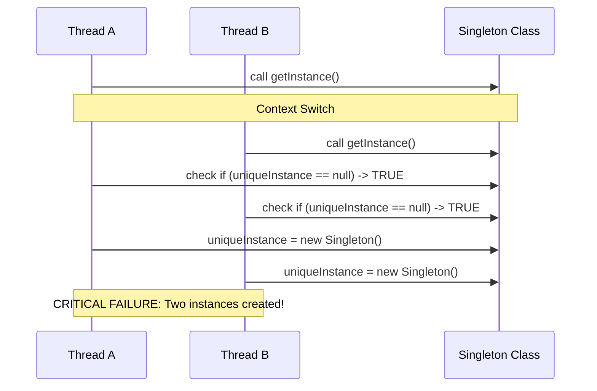
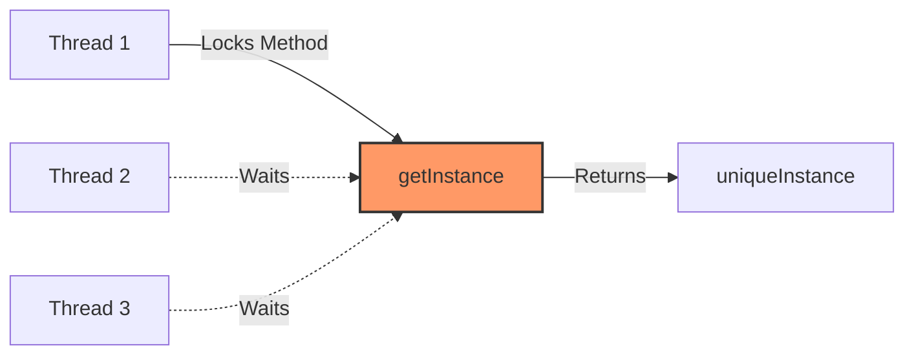
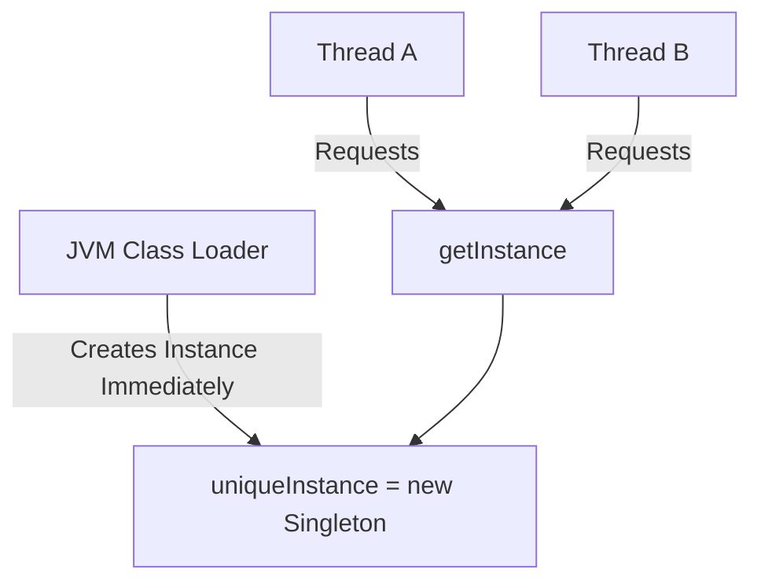
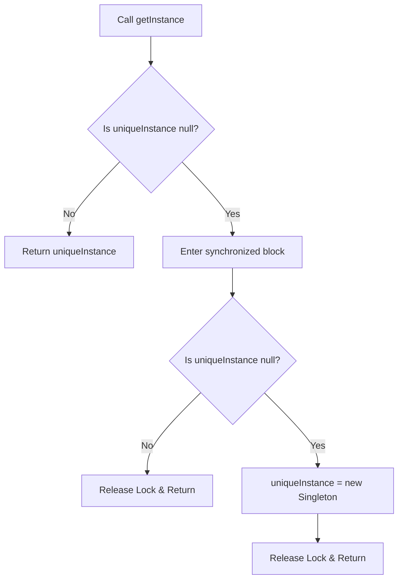
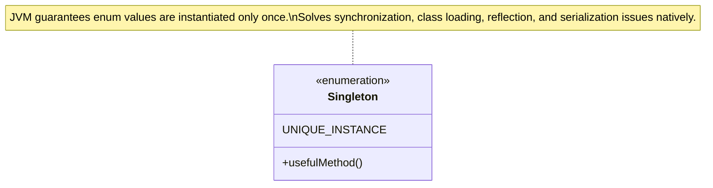

# Singleton Pattern

> 💡 **DESIGN Principles:**
> * Encapsulate what varies.
> * Favor composition over inheritance.
> * Program to interfaces, not implementations.
> * Strive for loosely coupled designs between objects that interact.
> * **Open Closed Principle:** Classes should be open for extension but closed for modification.
> * **Dependency Inversion Principle:** Depend on abstractions. Do not depend on concrete classes.

> 🧩 **DESIGN PATTERN:**
> 
> **Singleton Pattern:** The Singleton Pattern ensures a class has only one instance, and provides a global point of access to it.

---

### Phase 1: Naive/Initial State - Classic Lazy Instantiation



```java
public class Singleton {
    private static Singleton uniqueInstance;

    private Singleton() {}

    public static Singleton getInstance() {
        if (uniqueInstance == null) {
            uniqueInstance = new Singleton();
        }
        return uniqueInstance;
    }
}
```

---

### Phase 2: Intermediate Evolution - The Multithreading Collision



---

### Phase 3: Intermediate Evolution - Synchronized (Thread-Safe, High Overhead)



```java
public class Singleton {
    private static Singleton uniqueInstance;

    private Singleton() {}

    // Synchronized forces every thread to wait its turn.
    // Issue: Synchronization is only needed on the first pass, causing unnecessary runtime overhead.
    public static synchronized Singleton getInstance() {
        if (uniqueInstance == null) {
            uniqueInstance = new Singleton();
        }
        return uniqueInstance;
    }
}
```

---

### Phase 4: Intermediate Evolution - Eager Instantiation (Thread-Safe, Low Overhead, Not Lazy)



```java
public class Singleton {
    // Rely on JVM class loading to guarantee thread safety during initialization.
    private static Singleton uniqueInstance = new Singleton();

    private Singleton() {}

    public static Singleton getInstance() {
        return uniqueInstance;
    }
}
```

---

### Phase 5: Final Pattern-Refined - Double-Checked Locking



```java
public class Singleton {
    // Volatile ensures multiple threads handle the variable correctly during initialization.
    private volatile static Singleton uniqueInstance;

    private Singleton() {}

    public static Singleton getInstance() {
        if (uniqueInstance == null) { 
            synchronized (Singleton.class) { 
                if (uniqueInstance == null) { 
                    uniqueInstance = new Singleton();
                }
            }
        }
        return uniqueInstance;
    }
}
```

---

### Phase 6: Modern Java Standard - Enum Singleton



```java
public enum Singleton {
    UNIQUE_INSTANCE

    // useful fields and methods here
}

public class SingletonClient {
    public static void main(String[] args) {
        Singleton singleton = Singleton.UNIQUE_INSTANCE;
    }
}
```