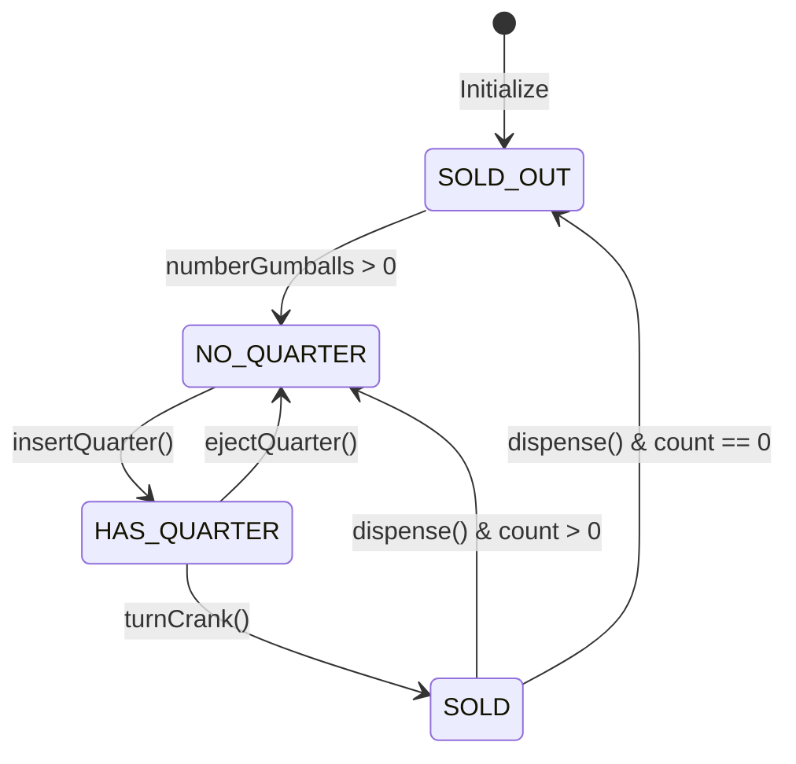
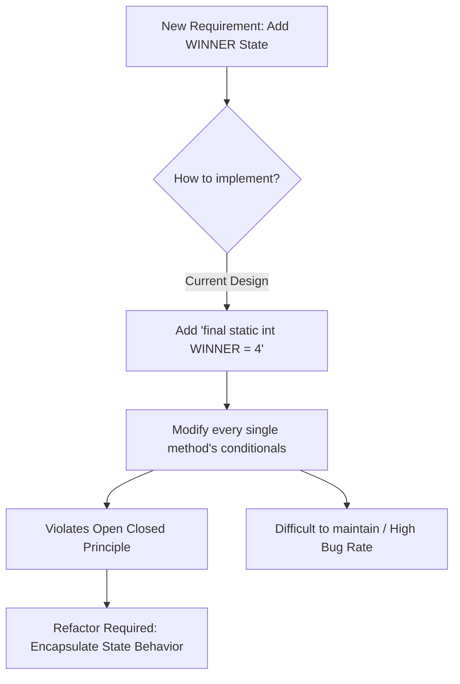
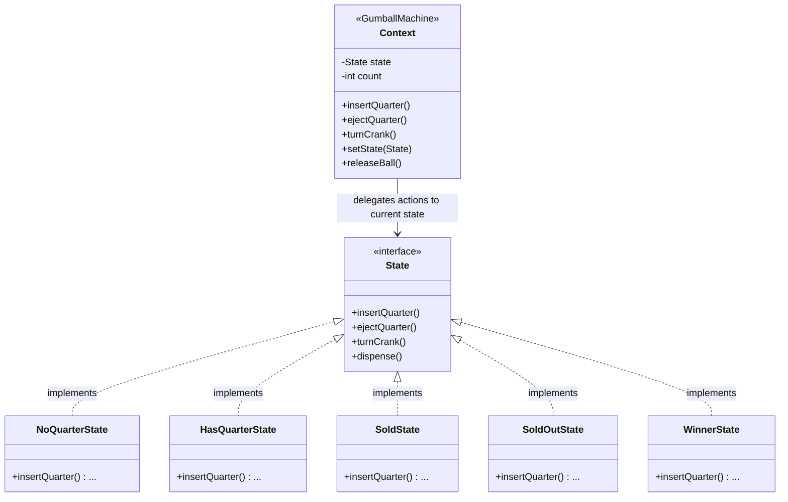

# State Pattern

> 💡 **DESIGN Principles:**
> * Encapsulate what varies. 
> * Favor composition over inheritance. 
> * Program to interfaces, not implementations. 
> * Strive for loosely coupled designs between objects that interact. 
> * **Open Closed Principle:** Classes should be open for extension but closed for modification. 
> * **Dependency Inversion Principle:** Depend on abstractions. Do not depend on concrete classes. 
> * **Principle of Least Knowledge:** Talk only to your immediate friends. 
> * **The Hollywood Principle:** Don’t call us, we’ll call you. 
> * **Single Responsibility Principle:** A class should have only one reason to change. 

> 🧩 **DESIGN PATTERN:**
> 
> The State Pattern allows an object to alter its behavior when its internal state changes. The object will appear to change its class. 

---

## Phase 1: Naive/Initial State



```java
public class GumballMachine {
    final static int SOLD_OUT = 0; 
    final static int NO_QUARTER = 1; 
    final static int HAS_QUARTER = 2; 
    final static int SOLD = 3; 
    
    int state = SOLD_OUT; 
    
    public void insertQuarter() { 
        if (state == HAS_QUARTER) {
            // Check state and act 
        } else if (state == NO_QUARTER) {
            state = HAS_QUARTER;
        } // ... 
    }
    
    public void ejectQuarter() { /* conditional logic */ } 
    public void turnCrank() { /* conditional logic */ } 
    public void dispense() { /* conditional logic */ } 
}
```

---

## Phase 2: Intermediate Evolution State (The Change Request)



---

## Phase 3: Final Pattern-Refined State



```java
// 1. Define common interface for all concrete states 
public interface State { 
    void insertQuarter(); 
    void ejectQuarter(); 
    void turnCrank(); 
    void dispense(); 
}

// 2. Encapsulate state behavior into its own class 
public class NoQuarterState implements State { 
    GumballMachine gumballMachine; 

    public NoQuarterState(GumballMachine gumballMachine) { 
        this.gumballMachine = gumballMachine; 
    } 

    public void insertQuarter() { 
        System.out.println("You inserted a quarter"); 
        gumballMachine.setState(gumballMachine.getHasQuarterState()); 
    }
    public void ejectQuarter() { System.out.println("You haven't inserted a quarter"); } 
    public void turnCrank() { System.out.println("You turned, but there's no quarter"); } 
    public void dispense() { System.out.println("You need to pay first"); } 
}

// 3. Delegate work to the State class 
public class GumballMachine { 
    State soldOutState; 
    State noQuarterState; 
    State hasQuarterState; 
    State soldState; 
    State winnerState; 
    
    State state; 
    int count = 0; 

    public GumballMachine(int numberGumballs) { 
        soldOutState = new SoldOutState(this); 
        noQuarterState = new NoQuarterState(this); 
        hasQuarterState = new HasQuarterState(this); 
        soldState = new SoldState(this); 
        winnerState = new WinnerState(this); 
        
        this.count = numberGumballs; 
        if (numberGumballs > 0) { 
            state = noQuarterState; 
        } else { 
            state = soldOutState; 
        } 
    }

    public void insertQuarter() { 
        state.insertQuarter(); 
    }
    
    public void turnCrank() { 
        state.turnCrank(); 
        state.dispense(); 
    }
    
    void setState(State state) { 
        this.state = state; 
    } 
}
```