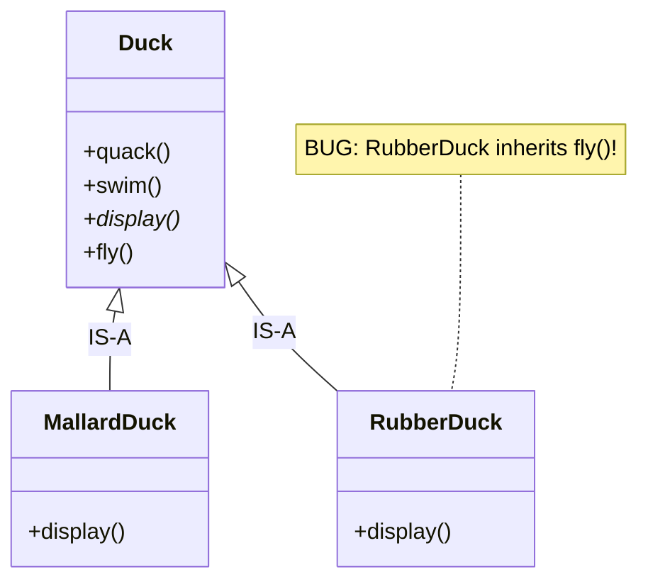
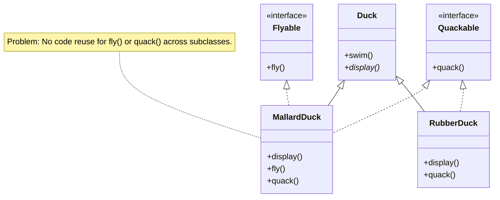
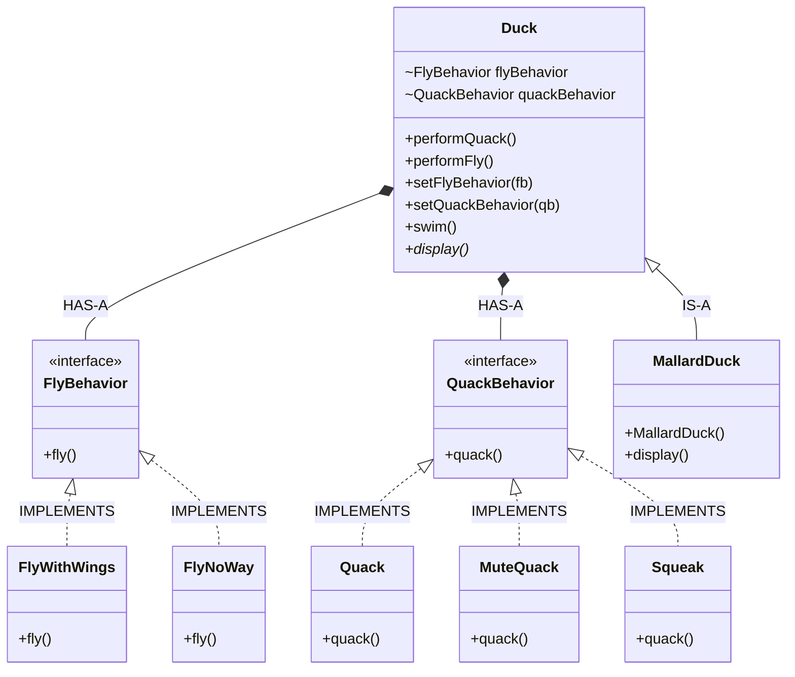

# Strategy Pattern

> 💡 **DESIGN Principle:** Favor composition over inheritance.

> 💡 **DESIGN Principle:** The one constant in software development is CHANGE.

> 💡 **DESIGN Principle:** Identify the aspects of your application that vary and separate them from what stays the same.

> 💡 **DESIGN Principle:** Program to an interface, not an implementation. “Program to an interface” really means “Program to a supertype.”

> 🧩 **DESIGN PATTERN:** The Strategy Pattern defines a family of algorithms, encapsulates each one, and makes them interchangeable.  Strategy lets the algorithm vary independently of clients that use it.

### Phase 1: The Naive State (Inheritance Problem) 



```java
public abstract class Duck {
    public void quack() { /* generic quack */ }
    public void swim() { /* generic swim */ }
    public void fly() { /* generic fly */ }
    public abstract void display();
}

public class RubberDuck extends Duck {
    public void display() { /* looks like a rubber duck */ }
    // Inherits fly() - inappropriate behavior
}
```

### Phase 2: Intermediate Evolution (Interface Duplication) 



### Phase 3: Final Pattern-Refined (Behavior Families & Delegation) 



```java
// Behavior Interfaces 
public interface FlyBehavior {
    void fly();
}

public interface QuackBehavior {
    void quack();
}

// Concrete Behavior Families 
public class FlyWithWings implements FlyBehavior {
    public void fly() { System.out.println("I'm flying!"); }
}

public class FlyNoWay implements FlyBehavior {
    public void fly() { System.out.println("I can't fly"); }
}

public class Quack implements QuackBehavior {
    public void quack() { System.out.println("Quack"); }
}

public class MuteQuack implements QuackBehavior {
    public void quack() { System.out.println("<< Silence >>"); }
}

public class Squeak implements QuackBehavior {
    public void quack() { System.out.println("Squeak"); }
}

// Superclass with Delegation and Dynamic Setters 
public abstract class Duck {
    FlyBehavior flyBehavior;
    QuackBehavior quackBehavior;

    public Duck() {}

    public abstract void display();

    public void performFly() {
        flyBehavior.fly(); // Delegation 
    }

    public void performQuack() {
        quackBehavior.quack(); // Delegation 
    }

    public void swim() {
        System.out.println("All ducks float, even decoys!");
    }
    
    // Dynamic Setters 
    public void setFlyBehavior(FlyBehavior fb) {
        flyBehavior = fb;
    }

    public void setQuackBehavior(QuackBehavior qb) {
        quackBehavior = qb;
    }
}

// Concrete Duck 
public class MallardDuck extends Duck {
    public MallardDuck() {
        quackBehavior = new Quack(); 
        flyBehavior = new FlyWithWings();
    }

    public void display() {
        System.out.println("I'm a real Mallard duck");
    }
}
```

### Phase 4: Implementation Testing 

```java
public class MiniDuckSimulator {
    public static void main(String[] args) {
        Duck mallard = new MallardDuck();
        
        // Delegates to Quack and FlyWithWings 
        mallard.performQuack(); 
        mallard.performFly();   
        
        // Dynamic change at runtime 
        mallard.setFlyBehavior(new FlyNoWay());
        mallard.performFly();
    }
}
```