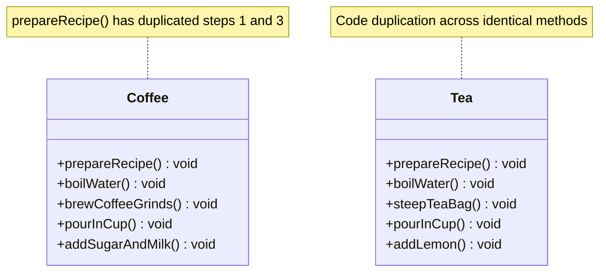
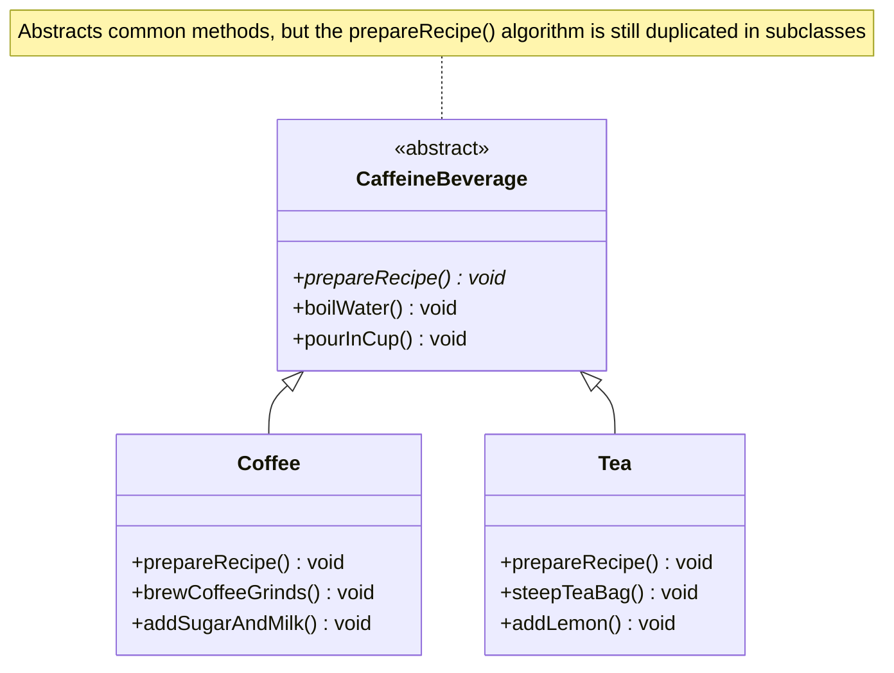
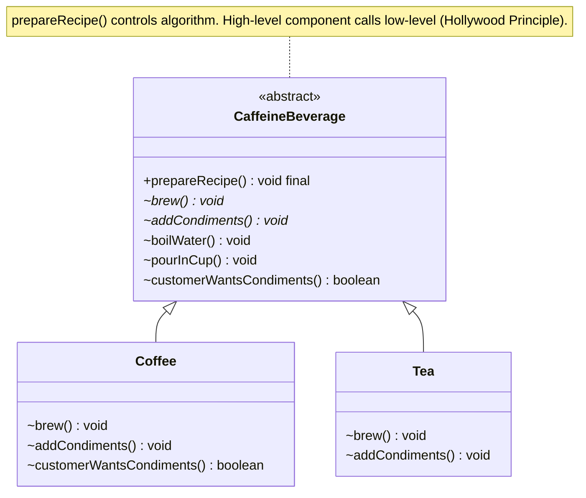
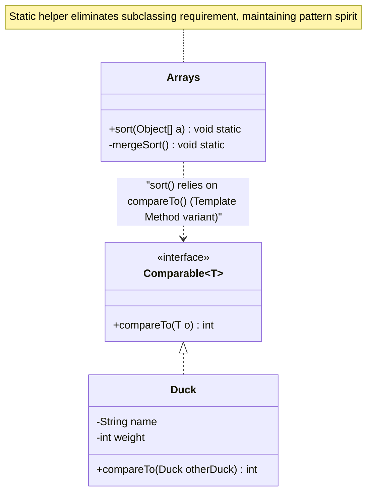

# Template Method Pattern

> 💡 **DESIGN Principles:**
> * Encapsulate what varies. 
> * Favor composition over inheritance. 
> * Program to interfaces, not implementations. 
> * Strive for loosely coupled designs between objects that interact. 
> * **Open Closed Principle:** Classes should be open for extension but closed for modification. 
> * **Dependency Inversion Principle:** Depend on abstractions. Do not depend on concrete classes. 
> * **Principle of Least Knowledge:** Talk only to your immediate friends. 
> * **The Hollywood Principle:** Don’t call us, we’ll call you. 

> 🧩 **DESIGN PATTERN:**
> * The Template Method Pattern defines the skeleton of an algorithm in a method, deferring some steps to subclasses. 
> Template Method lets subclasses redefine certain steps of an algorithm without changing the algorithm’s structure. 

---

## Phase 1: Naive / Initial State



```java
// Naive implementation with structural duplication
public class Coffee {
    void prepareRecipe() {
        boilWater();
        brewCoffeeGrinds(); // Specific to Coffee 
        pourInCup();
        addSugarAndMilk(); // Specific to Coffee 
    }
    public void boilWater() { System.out.println("Boiling water"); } // Duplicated 
    public void brewCoffeeGrinds() { System.out.println("Dripping Coffee through filter"); }
    public void pourInCup() { System.out.println("Pouring into cup"); } // Duplicated 
    public void addSugarAndMilk() { System.out.println("Adding Sugar and Milk"); }
}

public class Tea {
    void prepareRecipe() {
        boilWater();
        steepTeaBag(); // Specific to Tea 
        pourInCup();
        addLemon(); // Specific to Tea 
    }
    public void boilWater() { System.out.println("Boiling water"); } // Duplicated 
    public void steepTeaBag() { System.out.println("Steeping the tea"); }
    public void pourInCup() { System.out.println("Pouring into cup"); } // Duplicated 
    public void addLemon() { System.out.println("Adding Lemon"); }
}
```

---

## Phase 2: Intermediate Evolution State



---

## Phase 3: Final Pattern-Refined State (Template Method + Hollywood Principle)



```java
// Final Pattern-Refined implementation using Template Method and Hooks
public abstract class CaffeineBeverage {
    
    // Template Method defining the algorithm skeleton 
    final void prepareRecipe() { // Final to prevent subclass algorithm modification 
        boilWater();
        brew();
        pourInCup();
        if (customerWantsCondiments()) { // Optional conditional hook implementation 
            addCondiments();
        }
    }

    // Primitive operations deferred to concrete subclasses 
    abstract void brew();
    abstract void addCondiments();

    // Concrete operations shared by all subclasses 
    void boilWater() {
        System.out.println("Boiling water");
    }
    
    void pourInCup() {
        System.out.println("Pouring into cup");
    }

    // Hook: Subclasses can override, but are not forced to 
    boolean customerWantsCondiments() {
        return true; // Default implementation 
    }
}

public class Tea extends CaffeineBeverage {
    public void brew() {
        System.out.println("Steeping the tea"); // Subclass provides step 2 implementation 
    }
    public void addCondiments() {
        System.out.println("Adding Lemon"); // Subclass provides step 4 implementation 
    }
}

public class Coffee extends CaffeineBeverage {
    public void brew() {
        System.out.println("Dripping Coffee through filter");
    }
    public void addCondiments() {
        System.out.println("Adding Sugar and Milk");
    }
    
    // Overriding the Hook
    public boolean customerWantsCondiments() {
        // Custom logic to determine if condiments are needed 
        String answer = getUserInput();
        return answer.toLowerCase().startsWith("y");
    }
    
    private String getUserInput() {
        // Emulating UI/Input retrieval
        return "y";
    }
}
```

---

## Supplemental: Arrays Sort Example (Template Method Pattern in the Wild)

