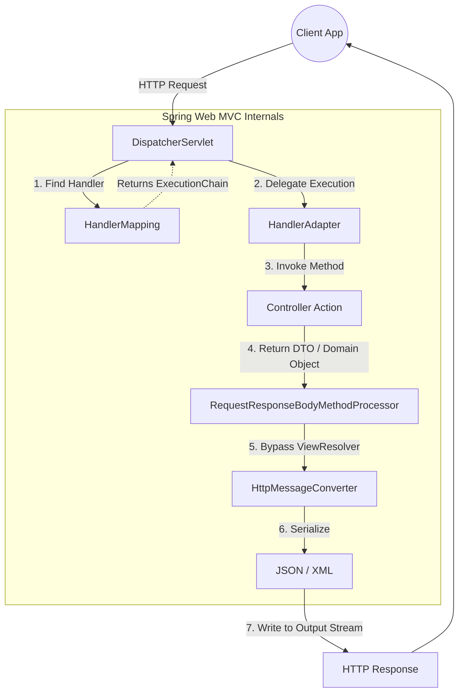
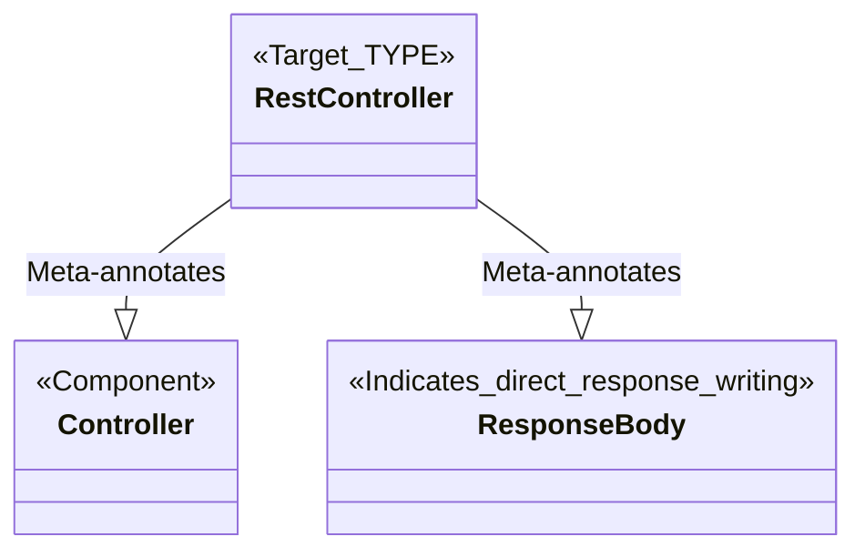

# Chapter 10 - Implementing REST Services
## Architecture & Under-The-Hood Internals

REST (Representational State Transfer) services are one of the most common mechanisms for implementing communication between two applications. While often used to establish communication between a web app client and a server, they are equally critical for interactions between mobile apps and backend systems, or even for direct backend-to-backend microservice communication.

---

## 1. The Request Processing Flow: MVC vs. REST

In Spring, REST services rely on the exact same Spring MVC mechanism used for standard web applications. The fundamental difference lies in how the `DispatcherServlet` handles the controller's return value.

When rendering a traditional web page, the dispatcher looks for a `ViewResolver` to map a return string to an HTML template. When implementing REST endpoints, the `ViewResolver` is bypassed entirely. Instead, the dispatcher servlet writes the data returned by the controller's action directly into the HTTP response body.

### Architectural Flow: DispatcherServlet to HTTP Response

The following diagram bridges the conceptual explanation with Spring's internal routing components:



### Under the Hood: `HttpMessageConverter`
By default, Spring creates a string representation of your returned object formatted as JSON. JSON is a simple format representing objects as attribute-value pairs.
Behind the scenes, when the `@ResponseBody` annotation is detected, Spring delegates the serialization to the `RequestResponseBodyMethodProcessor`. This processor iterates through a list of registered `HttpMessageConverter` implementations (typically `MappingJackson2HttpMessageConverter` if Jackson is on the classpath) to translate the Java object into a JSON string and write it directly to the response output stream.

---

## 2. Controller Annotations and Syntaxes

REST endpoints are exposed simply by implementing a controller action mapped to an HTTP method and path.

### The Evolution of the REST Controller

Historically, developers used the `@Controller` annotation to mark a class as a Spring MVC controller, making its instance a bean in the Spring context. To instruct the dispatcher servlet not to return a view name, the `@ResponseBody` annotation was required.

However, repeating `@ResponseBody` on every single controller action creates annoying code duplication. To solve this, Spring introduced the `@RestController` annotation.



Using `@RestController` instructs Spring that every action within that class acts as a REST endpoint, thereby preventing the duplication of `@ResponseBody`.

---

## 3. Managing the HTTP Response

The HTTP response is the mechanism the backend uses to send data back to the client. It consists of response headers, a response body, and a response status.

### Returning Data Transfer Objects (DTOs)
When modeling data transferred between two applications, we refer to the object as a Data Transfer Object (DTO). To send an object to the client, you simply make the controller's action return that object.

### Granular Control with `ResponseEntity`
By default, Spring automatically sets common HTTP statuses (e.g., 200 OK for success, 404 Not Found for missing resources, 500 Error on server for backend exceptions). If a custom status or specific header is required, Spring provides the `ResponseEntity` class.

The `ResponseEntity` allows for explicit configuration of the HTTP response status, headers, and body.

```java
@GetMapping("/france")
public ResponseEntity<Country> france() {
    Country c = Country.of("France", 67);
    return ResponseEntity
            .status(HttpStatus.ACCEPTED) // Custom Status 202
            .header("continent", "Europe") // Custom Header
            .body(c); // Response Body
}
```

---

## 4. Exception Handling Architecture

Exceptions are frequently used to signal specific business logic conditions, such as a user not having enough money to complete a payment.

While you can catch exceptions directly inside the controller's action and return a customized `ResponseEntity`, this couples the error logic to specific endpoints and often leads to code duplication.

### The Global Aspect: `@RestControllerAdvice`
The best practice is to separate the exception management responsibility. Spring allows you to implement a REST controller advice using the `@RestControllerAdvice` annotation. This acts as an AOP (Aspect-Oriented Programming) aspect that intercepts exceptions thrown by controller actions.

Within this class, you define exception handler methods using the `@ExceptionHandler` annotation to map specific exceptions to custom logic.

```mermaid
sequenceDiagram
    participant Client
    participant DS as DispatcherServlet
    participant Ctrl as @RestController
    participant Resolver as HandlerExceptionResolver
    participant Advice as @RestControllerAdvice

    Client->>DS: POST /payment
    DS->>Ctrl: execute makePayment()
    Ctrl-->>DS: throws NotEnoughMoneyException
    
    rect rgb(50, 50, 50)
        Note right of DS: Spring Exception Interception Phase
        DS->>Resolver: resolveException()
        Resolver->>Advice: Match @ExceptionHandler(NotEnoughMoneyException.class)
        Advice-->>Resolver: Return ErrorDetails (HTTP 400)
    end
    
    Resolver-->>DS: Translated Response
    DS-->>Client: HTTP 400 Bad Request
```



### Under the Hood: `HandlerExceptionResolver`
When a controller throws an exception, the `DispatcherServlet` catches it and delegates it to a chain of `HandlerExceptionResolver` beans. The most critical of these is the `ExceptionHandlerExceptionResolver`, which scans the application context for `@ControllerAdvice` and `@RestControllerAdvice` beans to find an `@ExceptionHandler` method matching the thrown exception's type.

---

## 5. Ingesting Client Data via `@RequestBody`

While data can be passed via path variables or request parameters, larger amounts of data (typically more than 50-100 characters) should be sent in the HTTP request body.

To extract this data, annotate the controller action's parameter with `@RequestBody`.

* **Deserialization:** Spring assumes the incoming body is formatted as JSON and attempts to decode it into an instance of the specified parameter type.
* **Validation:** If the underlying `HttpMessageConverter` (Jackson) fails to map the JSON payload to the Java object's fields, Spring automatically rejects the call and returns an HTTP "400 Bad Request".

> **Note on HTTP GET:** Historically, prior to 2014, HTTP GET requests did not support a request body. The HTTP specification (RFC 7231) was updated to permit it, though it remains uncommon in standard REST conventions.