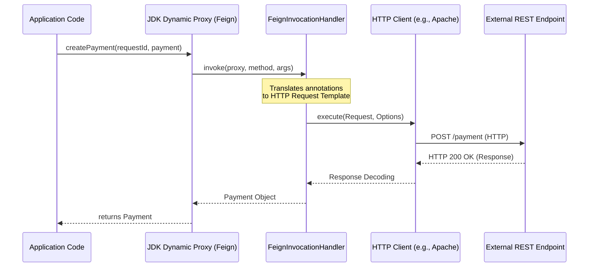
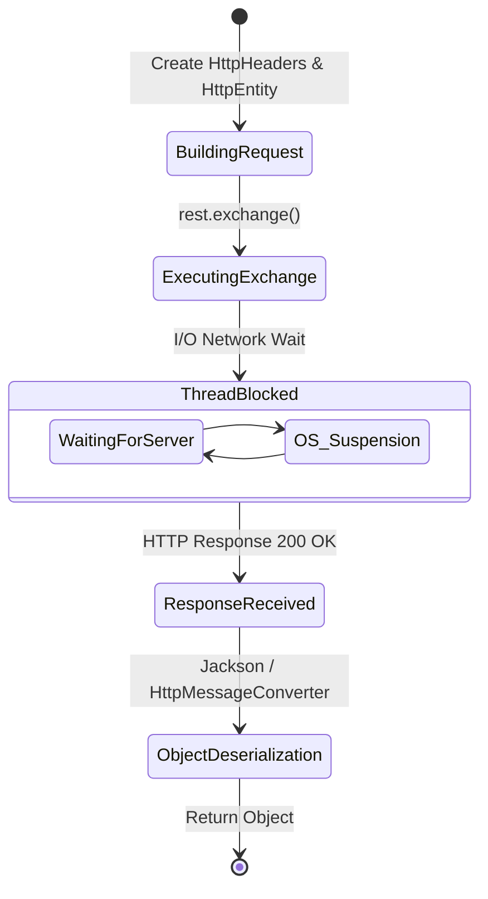
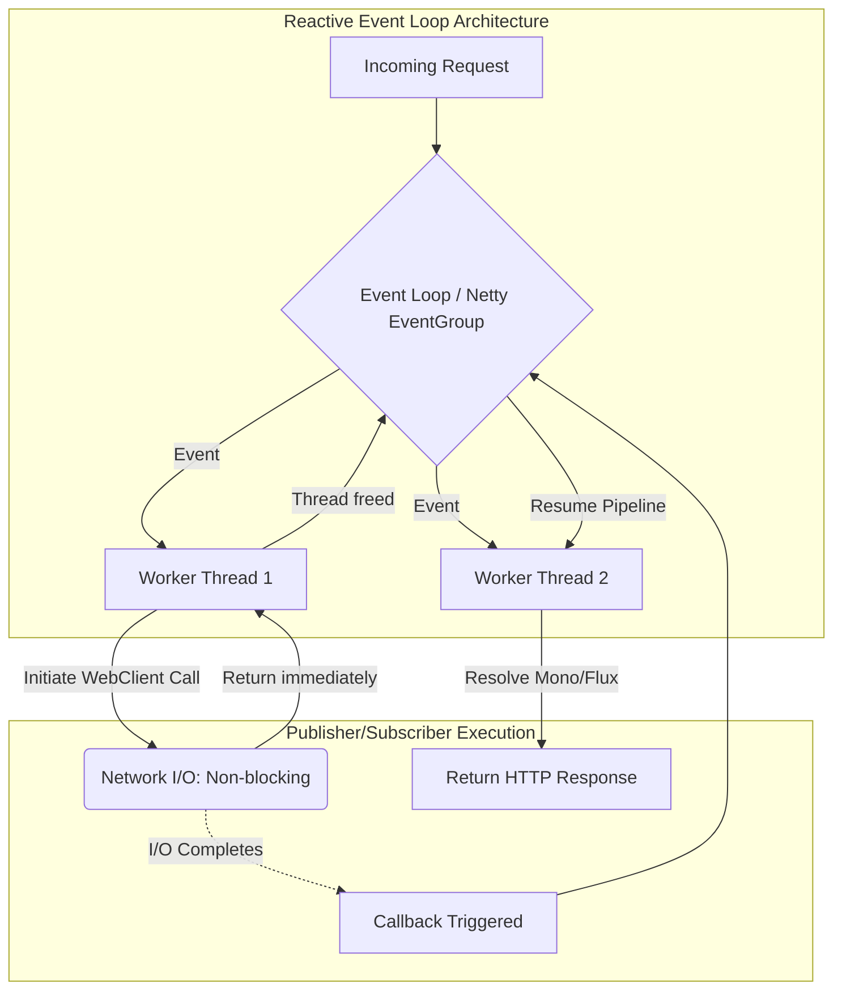

# Chapter 11 - Consuming REST Endpoints

## Overview
REST services are a common way to implement the communication between two system components. The client of a web app can call the backend, and so can another backend component. In backend solutions composed of multiple services, components need to exchange data by calling exposed REST endpoints. Spring offers three primary methodologies for consuming REST endpoints.

| Component        | Architecture Model    | Status           | Target Paradigm               |
|:-----------------|:----------------------|:-----------------|:------------------------------|
| **OpenFeign**    | Declarative Proxy     | Active           | Modern, Synchronous MVC apps. |
| **RestTemplate** | Imperative Template   | Maintenance Mode | Legacy apps (Pre-Spring 5).   |
| **WebClient**    | Reactive Event-Driven | Active           | Asynchronous WebFlux apps.    |

---

## 1. Spring Cloud OpenFeign

Spring Cloud OpenFeign is the recommended tool for consuming REST endpoints in modern, non-reactive applications. It offers a simple syntax that makes calling an endpoint straightforward. You only need to write an interface, and the framework provides the implementation dynamically.

### Book Explanation vs. Under-the-Hood Internals

The text notes that developers define an interface based on annotations, and Spring magically implements the methods. Under the hood, this relies on Spring's dynamic proxy mechanism and dependency injection containers.

When you annotate a configuration class with `@EnableFeignClients`, Spring registers a `FeignClientsRegistrar`. During context initialization, this registrar scans the classpath for `@FeignClient` interfaces. For each interface, Spring creates a `FeignClientFactoryBean` which ultimately utilizes `ReflectiveFeign` to generate a JDK Dynamic Proxy. This proxy translates method calls into HTTP requests using a configured HTTP client (like `HttpURLConnection`, Apache HttpClient, or OkHttp).



### Key Implementation Steps
* Use the `@EnableFeignClients` annotation on a configuration class to enable the functionality and locate client contracts.
* Define an interface representing the REST client contract.
* Annotate the interface with `@FeignClient`, specifying the name and base URL.
* Map interface methods to endpoints using standard Spring annotations like `@PostMapping` or `@GetMapping`.
* Use `@RequestHeader` and `@RequestBody` to map method arguments to HTTP request elements.

```java
@FeignClient(name = "payments", url = "${name.service.url}")
public interface PaymentsProxy {
    @PostMapping("/payment")
    Payment createPayment(@RequestHeader String requestId, @RequestBody Payment payment);
}
```

---

## 2. RestTemplate

RestTemplate is a well-known tool developers have used since Spring 3. However, it has been put in maintenance mode starting with Spring 5 and will eventually be deprecated. Despite this, learning RestTemplate is essential because many existing Spring projects still rely on it.

### Book Explanation vs. Under-the-Hood Internals

The text instructs to use `HttpHeaders` for headers, create an `HttpEntity` for the payload, and execute the call via the `exchange()` method. Under the hood, `RestTemplate` operates on a strict thread-per-request blocking execution model.

Internally, `RestTemplate` uses a `ClientHttpRequestFactory` abstraction. By default, this uses the `SimpleClientHttpRequestFactory` which wraps standard Java `java.net.HttpURLConnection`. When `exchange()` is invoked, the executing thread is entirely suspended (blocked) by the OS while waiting for the network I/O to complete, which is a significant scalability bottleneck compared to reactive approaches.



> Note: When something is deprecated or legacy, it doesn't mean you should not learn it, as these technologies often persist in projects for years.

---

## 3. WebClient & Reactive Paradigms

WebClient is built on a methodology called reactive programming. Spring documentation recommends WebClient as an alternative, but this is primarily valid for reactive apps. If you decide to implement a reactive app, you should use WebClient.

### Book Explanation vs. Under-the-Hood Internals

The text notes that in non-reactive apps, threads are blocked during I/O operations, leading to idle threads and wasted resources. In a reactive app, tasks are independent, and threads can switch to other backlog tasks instead of staying idle.

Under the hood, Spring WebFlux and WebClient utilize Project Reactor and an underlying non-blocking server/client engine (usually Reactor Netty). It implements the Reactor Pattern utilizing an Event Loop. Instead of dedicating a thread per request, a small number of threads loop continuously to handle events. When an HTTP call is made, an event is registered, and the thread moves on. Once the I/O completes, an interrupt triggers an event, and a worker thread resumes processing the callback (the `Mono` or `Flux` subscriber pipeline).



### Understanding Publishers and Subscribers
* A task returns a producer to allow other tasks to subscribe to it.
* A task uses a subscriber to attach to a producer of another task and consume the result once it ends.
* The `Mono` class defines a producer for a single value.
* Instead of building flows by chaining them on a single thread, reactive apps link dependencies between tasks through producers and consumers.

```java
public Mono<Payment> createPayment(String requestId, Payment payment) {
    return webClient.post()
            .uri(url + "/payment")
            .header("requestId", requestId)
            .body(Mono.just(payment), Payment.class)
            .retrieve()
            .bodyToMono(Payment.class);
}
```