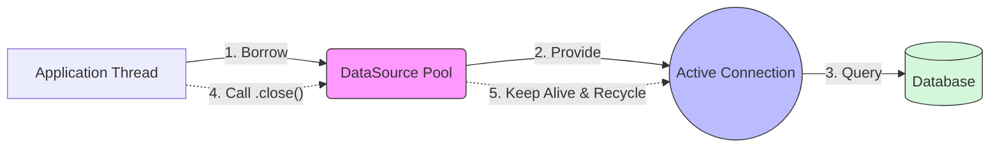
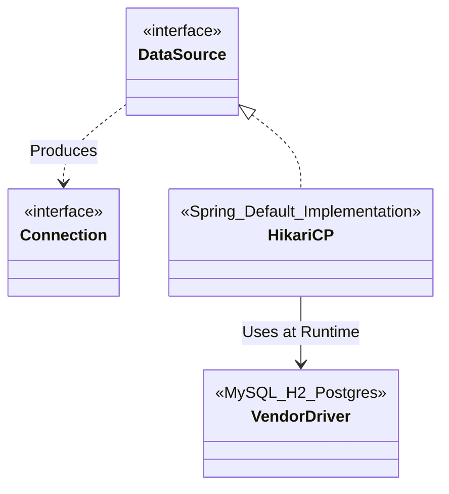
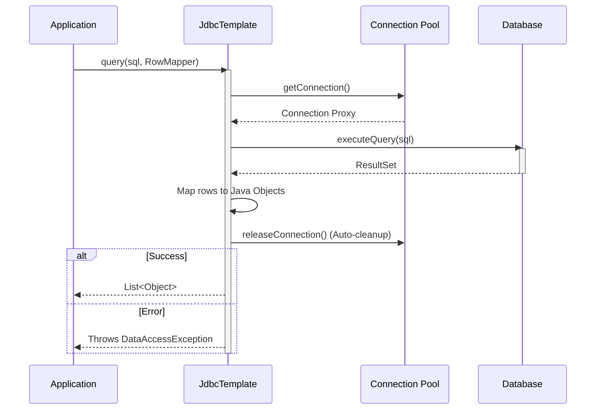
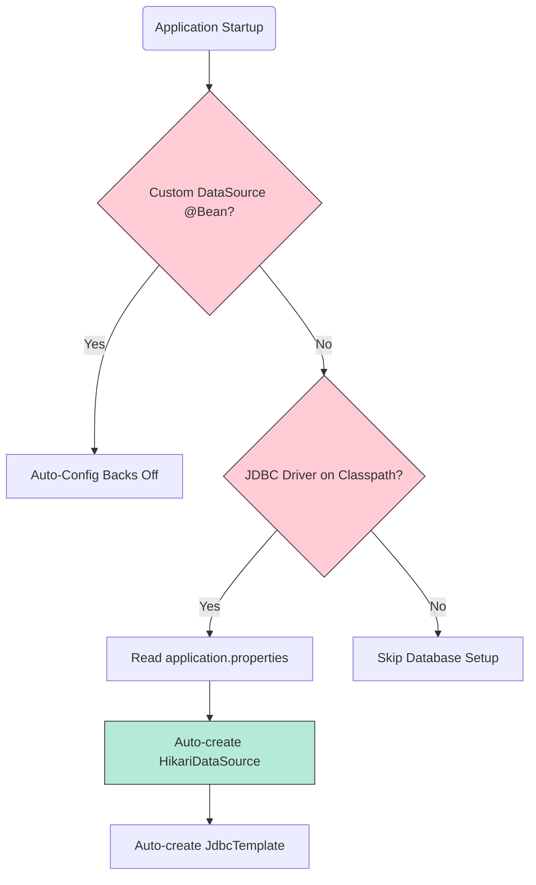
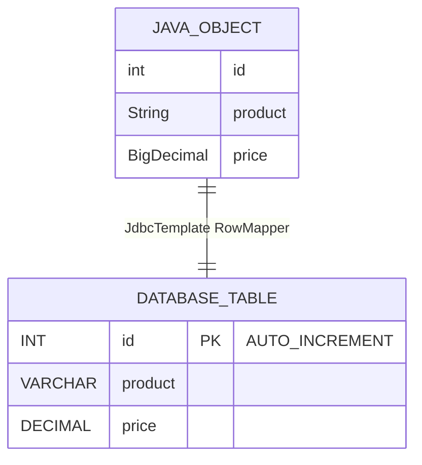

# Chapter 12 - Using data sources in Spring apps

### 1. Connection Pooling (DataSource)

---

### 2. JDBC SPI Architecture

---

### 3. JdbcTemplate Execution Flow

---

### 4. Spring Boot Auto-Configuration Logic

---

### 5. Data Mapping
