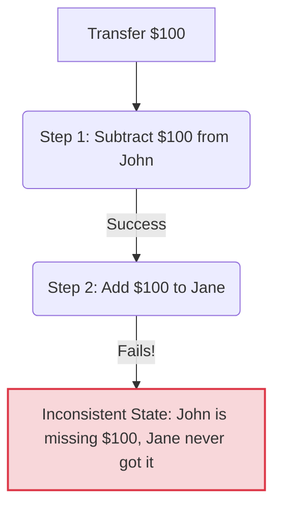
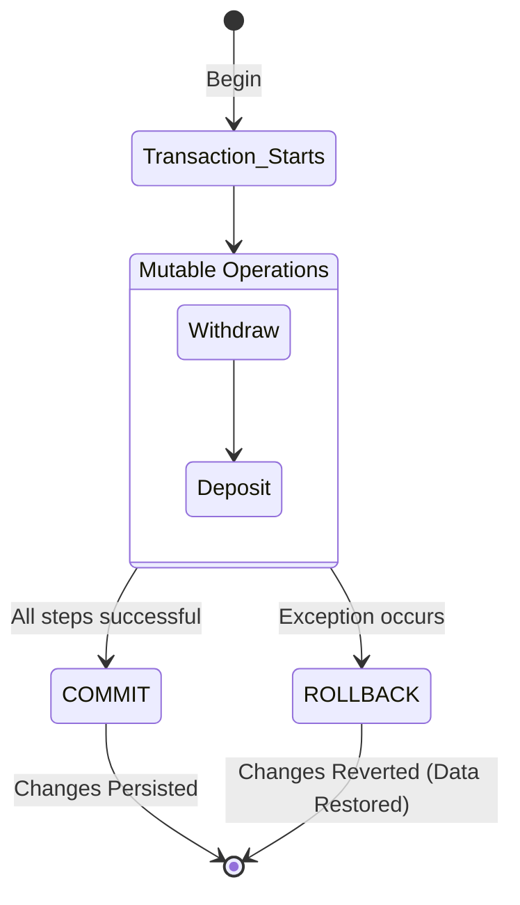
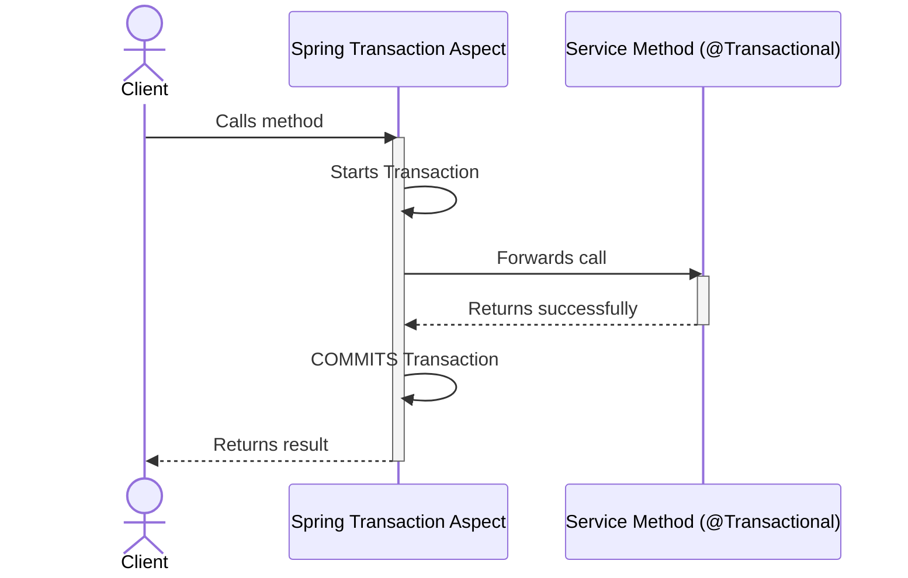
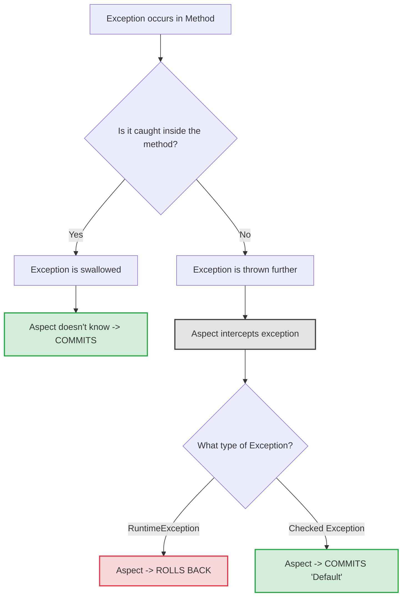
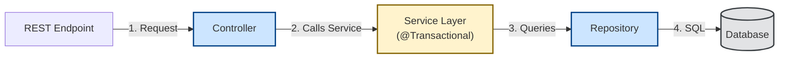

# Chapter 13 - Using transactions in Spring apps

## 1. The Core Problem: Data Inconsistency
When an app executes multiple mutable operations (e.g., transferring money), partial execution leads to corrupted data. If a withdrawal succeeds but the deposit fails, money is lost from the system.

---

## 2. The Solution: Transactions & Atomicity
A transaction ensures **atomicity**—operations either execute altogether or not at all.
* **Commit:** If all steps succeed, changes are permanently stored.
* **Rollback:** If any step fails, data reverts exactly to how it was before starting.

---

## 3. How Spring Manages Transactions (AOP)
Declaring a transaction in Spring is done via the `@Transactional` annotation. Spring uses an **Aspect** behind the scenes to intercept the method call and wrap it in transaction logic.

---

## 4. The Rules of Exception Handling
Spring relies entirely on exceptions to know when to roll back.
1. **Uncaught Runtime Exceptions:** Trigger an automatic rollback.
2. **Swallowed Exceptions:** If you catch an exception inside your method using `try-catch` and don't throw it further, Spring won't see it, and will accidentally commit.
3. **Checked Exceptions:** By default, Spring **does not** roll back for checked exceptions (like `SQLException`), as they are expected to be handled by the developer.

---

## 5. Standard Application Architecture
In a standard Spring setup, business logic sits in the Service layer, which uses Repositories for data access. The `@Transactional` annotation is placed on the Service method to encompass all downstream database operations.

