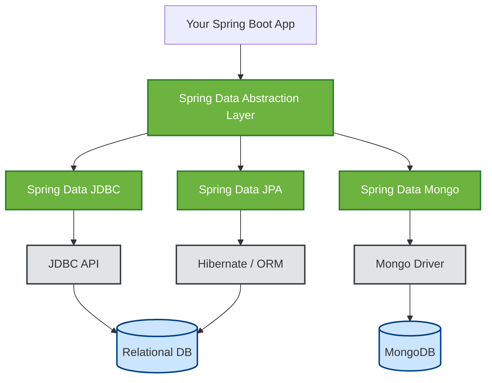
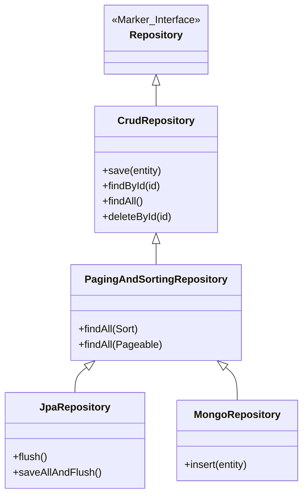
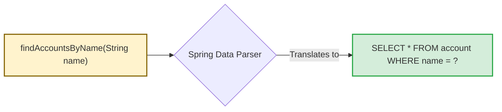
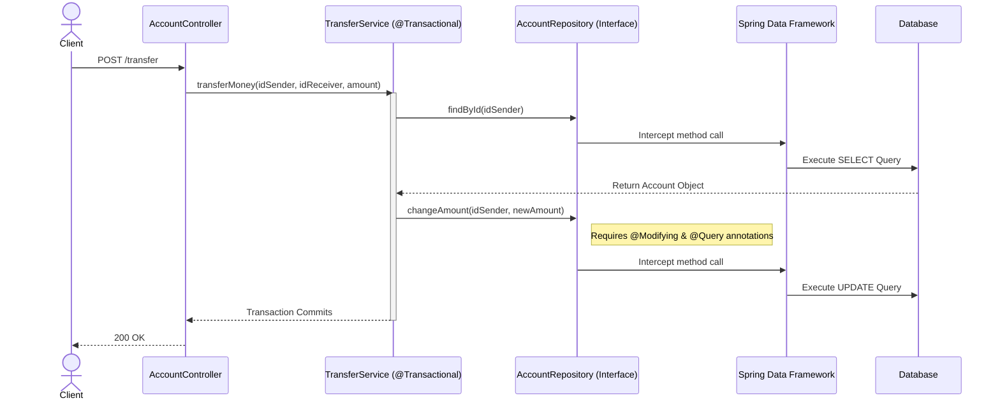

# Chapter 14 - Implementing data persistence with Spring Data

## 1. The Core Problem & The Spring Data Solution
Without Spring Data, developers must learn different APIs, libraries, and abstractions for every database technology (e.g., pure JDBC, Hibernate, MongoDB). Spring Data solves this by providing a **unified abstraction layer** over all persistence technologies.

* **Less Code:** You write simple interfaces, and Spring Data generates the implementation at runtime.
* **Modular:** You only import the specific dependency you need (e.g., `spring-data-jdbc`, `spring-data-jpa`, `spring-data-mongodb`).



---

## 2. The Repository Interface Hierarchy
Spring Data utilizes **interface segregation**. Instead of one massive contract, it breaks operations down into a hierarchy. You simply extend the interface that matches your app's needs.

* **`Repository<T, ID>`:** A marker interface. It provides no operations by default.
* **`CrudRepository<T, ID>`:** Adds basic CREATE, READ, UPDATE, and DELETE operations.
* **`PagingAndSortingRepository<T, ID>`:** Adds capabilities to fetch data in chunks (pages) and sort results.
* **Tech-Specific Repositories:** Interfaces like `JpaRepository` or `MongoRepository` add operations unique to their underlying technologies.



---

## 3. Defining Custom Operations
When basic CRUD isn't enough, you can define custom repository operations. Spring Data offers two ways to do this:

### A. Method Name Translation (The Magic Way)
Spring Data parses your method name based on specific rules and generates the SQL query automatically.



### B. The `@Query` Annotation (The Recommended Way)
Relying on method names can lead to extremely long names for complex queries, performance hits during startup, and accidental breakage if refactored. It is highly recommended to explicitly write your queries using `@Query`.

| Feature                | Method Name Translation               | `@Query` Annotation        |
|:-----------------------|:--------------------------------------|:---------------------------|
| **Readability**        | Poor for complex queries              | Clean and explicit         |
| **Performance**        | Slower app startup (parsing overhead) | Faster                     |
| **Safety**             | Fragile against IDE refactoring       | Stable against refactoring |
| **Data Modifications** | Not supported for updates             | Handled via `@Modifying`   |

---

## 4. Standard Spring Data JDBC Architecture
To implement this in a real app, you define a model class with an `@Id`, extend a Repository interface, and inject it into your `@Transactional` service layer.



### Repository Implementation Example
```java
public interface AccountRepository extends CrudRepository<Account, Long> {
    
    // Explicit query for fetching records
    @Query("SELECT * FROM account WHERE name = :name")
    List<Account> findAccountsByName(String name);
    
    // Explicit query for modifying records (requires @Modifying)
    @Modifying
    @Query("UPDATE account SET amount = :amount WHERE id = :id")
    void changeAmount(long id, BigDecimal amount);
}
```