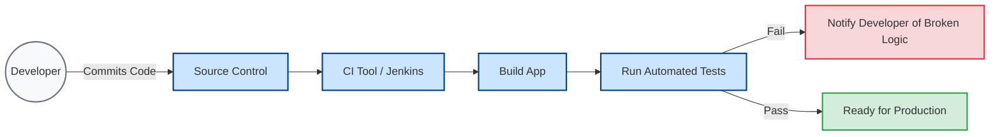
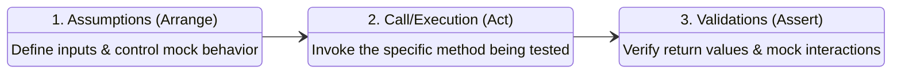
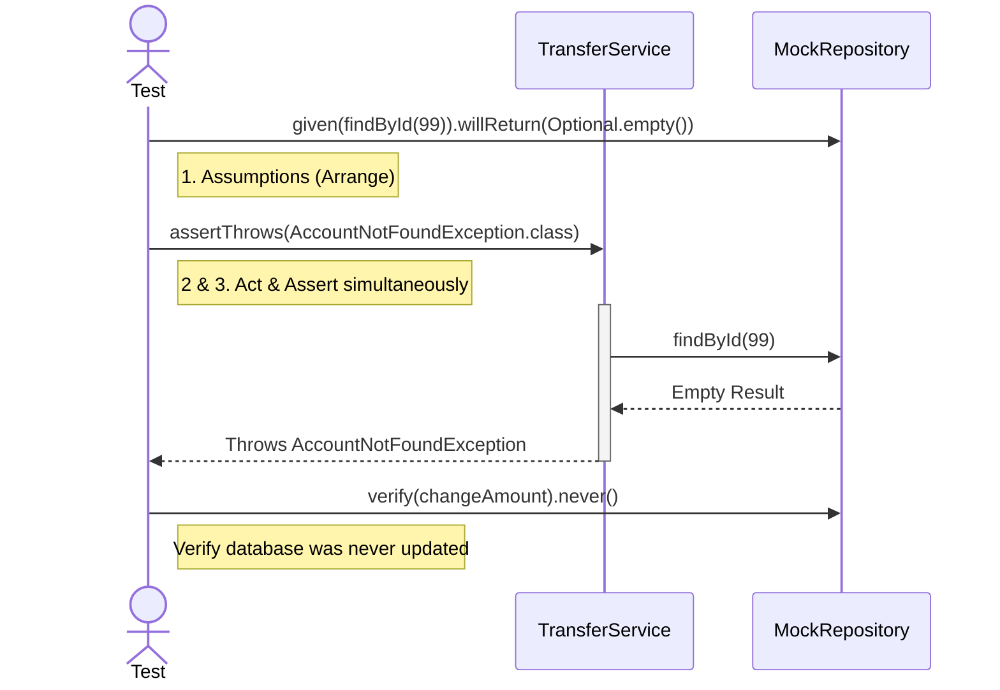

# Chapter 15 - Testing your Spring app

## 1. The Purpose of Testing & CI/CD
Tests are short pieces of logic validating that your app works as expected. They are essential for **regression testing** (ensuring new changes don't break existing features) and act as living documentation. In modern development, tests are automated via a Continuous Integration (CI) pipeline.

---

## 2. The Anatomy of a Test
Whether unit or integration, every correctly implemented test follows a strict three-step lifecycle (often referred to as Arrange-Act-Assert or Given-When-Then).

---

## 3. Unit Tests vs. Spring Integration Tests
Spring applications primarily rely on two layers of testing.

* **Unit Tests:** Lightning-fast, strictly isolated. They test *only* the business logic of a single class. All external dependencies (like databases or other services) are replaced with **Mocks** (fake objects you control).
* **Integration Tests:** Slower, context-aware. They test how multiple real components interact with each other and with the Spring Framework (e.g., verifying `@Transactional` or database queries work).

```mermaid
graph TD
    classDef test fill:#e2e3e5,stroke:#383d41,stroke-width:2px;
    classDef target fill:#cce5ff,stroke:#004085,stroke-width:2px;
    classDef mock fill:#fff3cd,stroke:#856404,stroke-width:2px,stroke-dasharray: 5 5;
    classDef real fill:#d4edda,stroke:#28a745,stroke-width:2px;

    subgraph "Unit Testing (Strict Isolation)"
        UT[Unit Test]:::test -->|Calls| Svc1[TransferService]:::target
        Svc1 -.->|Fake Interaction| MockRepo[Mocked AccountRepository]:::mock
    end

    subgraph "Spring Integration Testing (Context Loaded)"
        IT[Integration Test]:::test -->|Calls| Svc2[TransferService]:::target
        Svc2 -->|Real Interaction| RealRepo[Real AccountRepository]:::real
        RealRepo -->|SQL Queries| DB[(H2 In-Memory DB)]:::real
    end
```

---

## 4. Key Testing Annotations
Using the right annotations dictates whether you are spinning up a lightweight unit test or a heavy Spring context integration test.

| Annotation                            | Test Type   | Purpose                                                                                                                                 |
|:--------------------------------------|:------------|:----------------------------------------------------------------------------------------------------------------------------------------|
| `@ExtendWith(MockitoExtension.class)` | Unit        | Enables Mockito annotations in the test class without loading Spring.                                                                   |
| `@Mock`                               | Unit        | Creates a fake, controllable object (a mock) of a dependency.                                                                           |
| `@InjectMocks`                        | Unit        | Creates the actual object you are testing and automatically injects the `@Mock` dependencies into it.                                   |
| `@SpringBootTest`                     | Integration | Boots up the full Spring Application Context for the test.                                                                              |
| `@Autowired`                          | Integration | Injects a *real* bean from the Spring Context into the test.                                                                            |
| `@MockBean`                           | Integration | Replaces a real bean in the Spring Context with a mock. Useful if you want to test context integration but still skip a specific layer. |

---

## 5. Happy Paths vs. Exception Flows
A robust test suite covers both successful executions and expected failures.

### The Exception Flow (Testing for Errors)
You must verify that your application throws the correct exceptions and halts execution when faced with invalid states (e.g., trying to transfer money from an account that doesn't exist).

