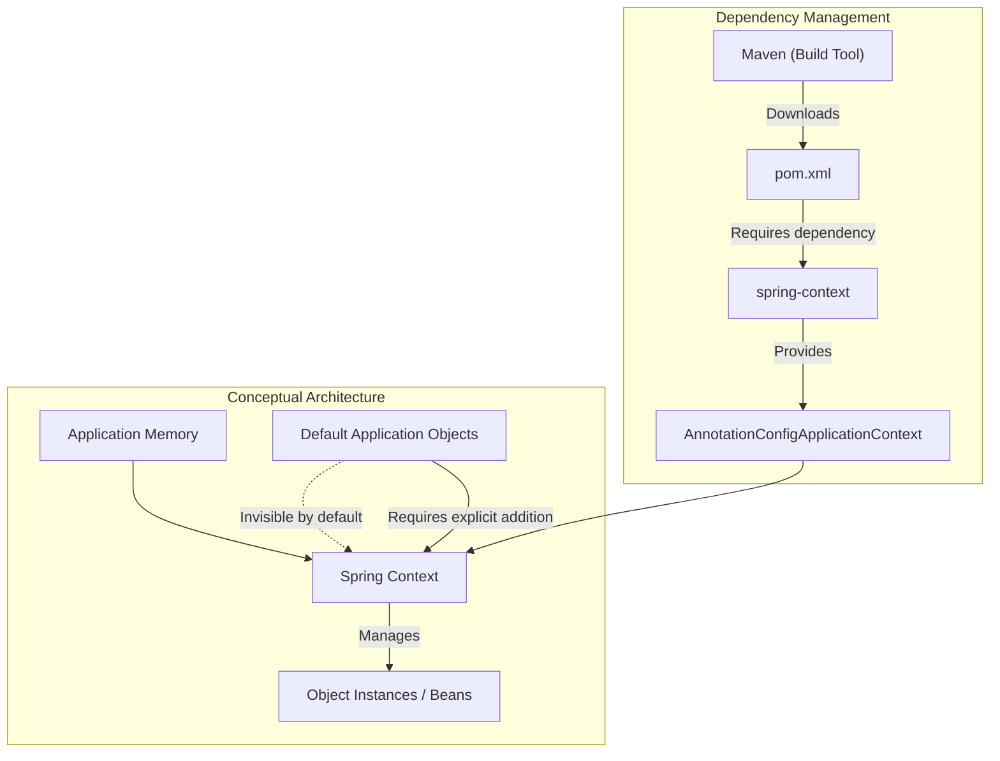
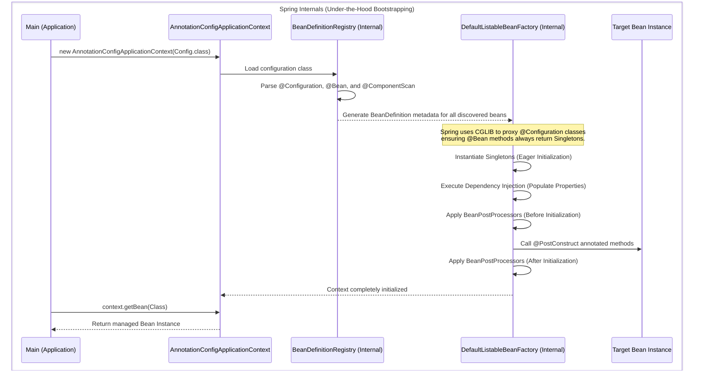
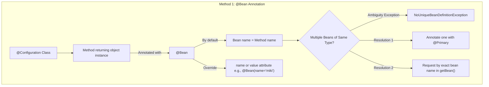
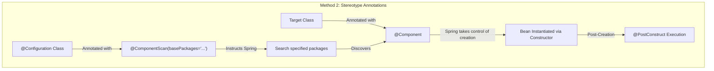
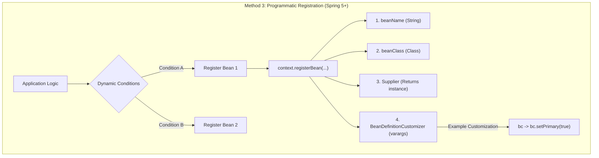
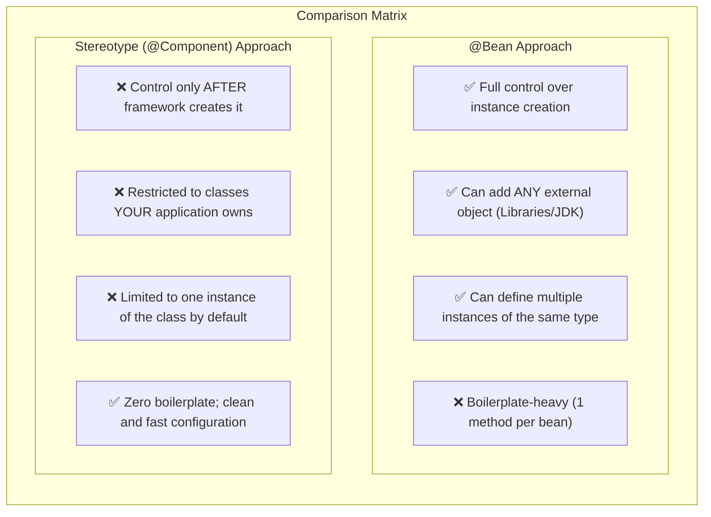

# Chapter 2 - The Spring Context (Defining Beans)







```java
// Configuration class acting as a source of bean definitions 
@Configuration
public class ProjectConfig {

    // Spring intercepts this call via CGLIB proxy to manage singleton scope
    @Bean(name = "miki") // Customizing the bean identifier 
    @Primary // Resolves ambiguity if multiple Parrots exist 
    Parrot parrot() {
        var p = new Parrot(); // Full control over instantiation 
        p.setName("Miki");
        return p; // Spring takes this returned instance and adds it to context 
    }
    
    // Capable of adding external classes (e.g., java.lang.String) 
    @Bean
    String hello() {
        return "Hello";
    }
}
```



```java
// Marking the class for Spring classpath scanning 
@Component
public class Parrot {
    private String name;

    // Executed by Spring BeanPostProcessor immediately after constructor 
    @PostConstruct
    public void init() {
        this.name = "Kiki"; // Customization after Spring creates the instance 
    }
}

// Instructing Spring's ClassPathBeanDefinitionScanner where to look 
@Configuration
@ComponentScan(basePackages = "main")
public class ProjectConfig {
}
```



```java
public class Main {
    public static void main(String[] args) {
        var context = new AnnotationConfigApplicationContext(ProjectConfig.class);

        Parrot x = new Parrot(); // Application creates the instance 
        x.setName("Kiki");

        // Supplier functional interface returns the created instance 
        Supplier<Parrot> parrotSupplier = () -> x;

        // Programmatic addition to BeanDefinitionRegistry directly 
        context.registerBean(
            "parrot1", 
            Parrot.class, 
            parrotSupplier, 
            bc -> bc.setPrimary(true) // Dynamic BeanDefinition customization 
        );
    }
}
```

