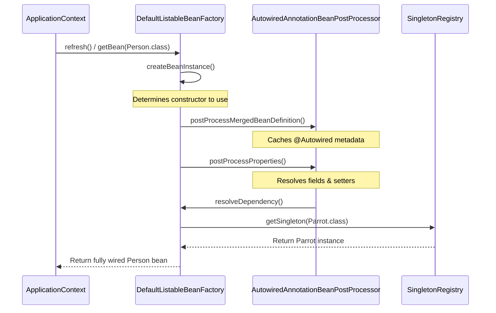
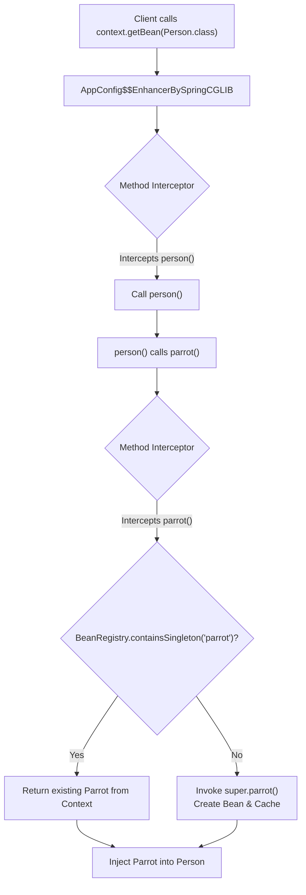
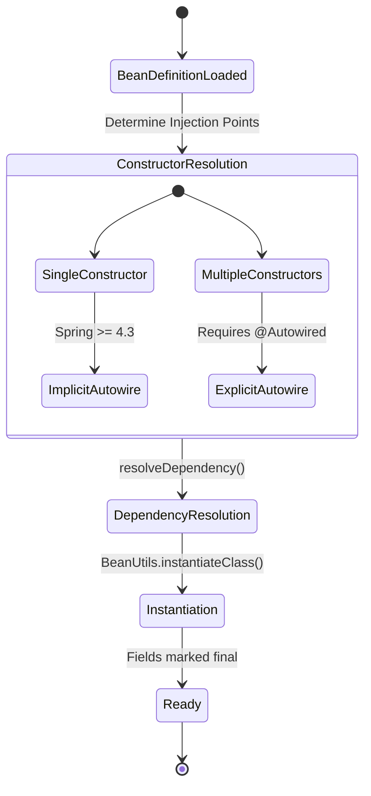
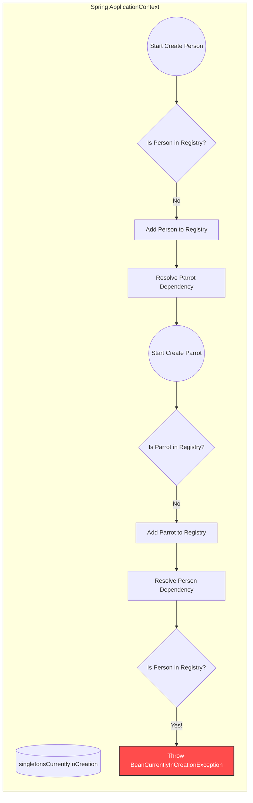
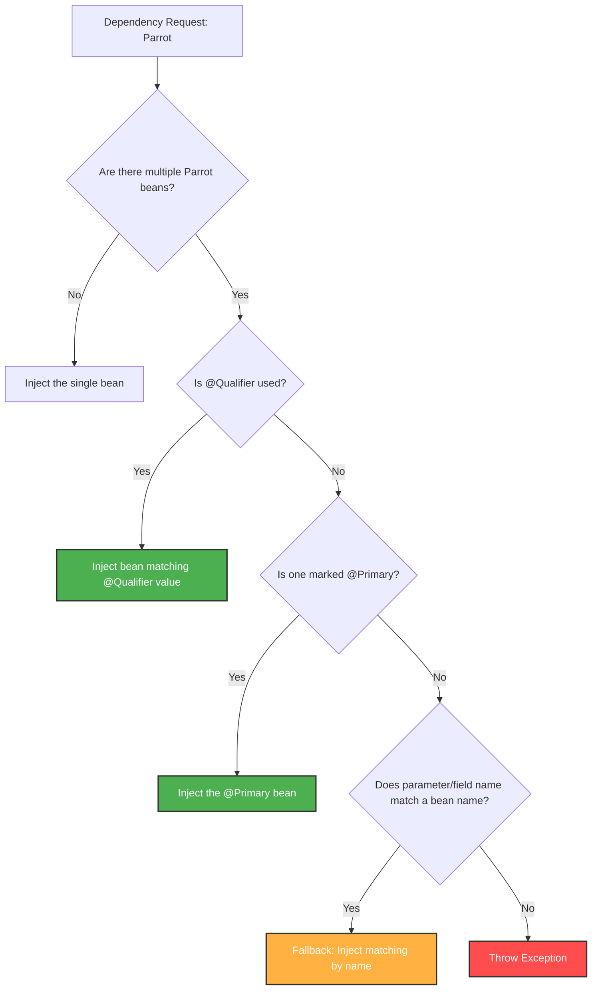

# Chapter 3 - The Spring Context (Wiring Beans)

## 1. The Core IoC and Dependency Injection (DI) Flow

Dependency Injection (DI) is an application of the IoC principle. Instead of an application controlling its execution and fetching dependencies, a framework (the dependency) sets a value into a field or parameter.

### Architectural Flow of Bean Wiring
Under the hood, Spring uses the `BeanFactory` and various `BeanPostProcessor` implementations to resolve and inject dependencies.



---

## 2. Wiring via `@Bean` Methods

When defining beans in a configuration class using the `@Bean` annotation, there are two primary ways to establish relationships: direct method calls and method parameters.

### 2.1 Direct Method Calls & CGLIB Proxying

The most straightforward wiring approach is directly calling the method that creates the bean.

While it might look like calling the method directly creates multiple instances of the returned object , Spring ensures only one instance is created overall. Spring intercepts the method calls, checking if the bean exists in the context before executing the method logic.

**Under the Hood: Configuration Class Enhancer**
Spring achieves this interception by wrapping `@Configuration` classes in a CGLIB proxy at startup. The `ConfigurationClassPostProcessor` replaces the user-defined config class with a dynamic subclass.



### 2.2 Wiring Using Method Parameters

An alternative to direct method calls is relying on Spring to provide a value through a method parameter. When Spring calls the `@Bean` method, it searches for a bean of the parameter's type in its context and injects it. This approach does not require the target bean to be defined in the same configuration class.

```java
@Bean
public Person person(Parrot parrot) { // Spring resolves 'parrot'
    Person p = new Person();
    p.setParrot(parrot);
    return p;
}
```

---

## 3. The `@Autowired` Annotation

When you can modify the source code of a class (i.e., it is not an external dependency), you can use the `@Autowired` annotation to mark properties where Spring should inject context values.

### 3.1 Injection Strategies Comparison

| Strategy        | Usage                                                       | Pros                                                                   | Cons / Notes                                                                                           |
|:----------------|:------------------------------------------------------------|:-----------------------------------------------------------------------|:-------------------------------------------------------------------------------------------------------|
| **Field**       | Annotating the field directly. Often used in examples/POCs. | Simple, low boilerplate.                                               | Cannot be `final`. Difficult to initialize/manage in unit tests. Relies heavily on Reflection.         |
| **Constructor** | Annotating the constructor. Recommended for production.     | Allows fields to be `final` (immutable). Easy to instantiate in tests. | Boilerplate code (though `@Autowired` can be omitted if only one constructor exists since Spring 4.3). |
| **Setter**      | Annotating the setter method. Rarely used.                  | Allows optional dependencies.                                          | Cannot use `final` fields. Harder to read and doesn't aid testing.                                     |

### 3.2 Constructor Injection Flow (Recommended)

Constructor injection ensures the bean is fully initialized with its required dependencies before it is returned to the context.



---

## 4. Circular Dependencies

A circular dependency occurs when Bean A requires Bean B for instantiation, but Bean B simultaneously requires Bean A. This results in a deadlock state where neither bean can be completely created.

When encountered, Spring's `DefaultSingletonBeanRegistry` throws a `BeanCurrentlyInCreationException`. This is generally an indicator of bad class design that requires refactoring.

### State Registry Deadlock



---

## 5. Disambiguating Multiple Beans

When the Spring context contains multiple beans of the same type, it needs rules to determine which specific bean to inject into a field or parameter. If Spring cannot decide, the application fails with a `NoUniqueBeanDefinitionException`.

### Resolution Hierarchy

Spring resolves ambiguities using the following decision tree:



**Best Practices for Disambiguation:**
Relying on the variable or parameter name (Fallback logic) is risky because simple refactoring can break the application. Instead, explicitly state your intention using the `@Qualifier("beanName")` annotation.