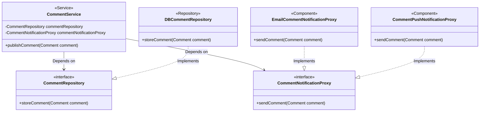
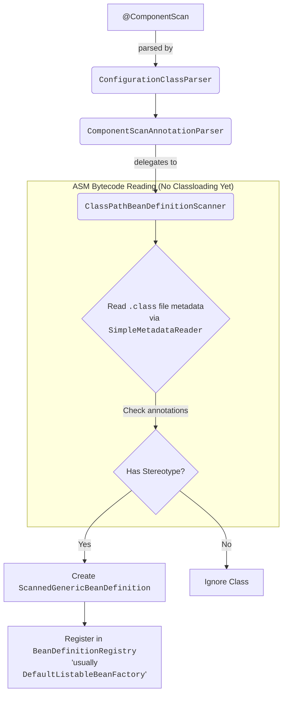
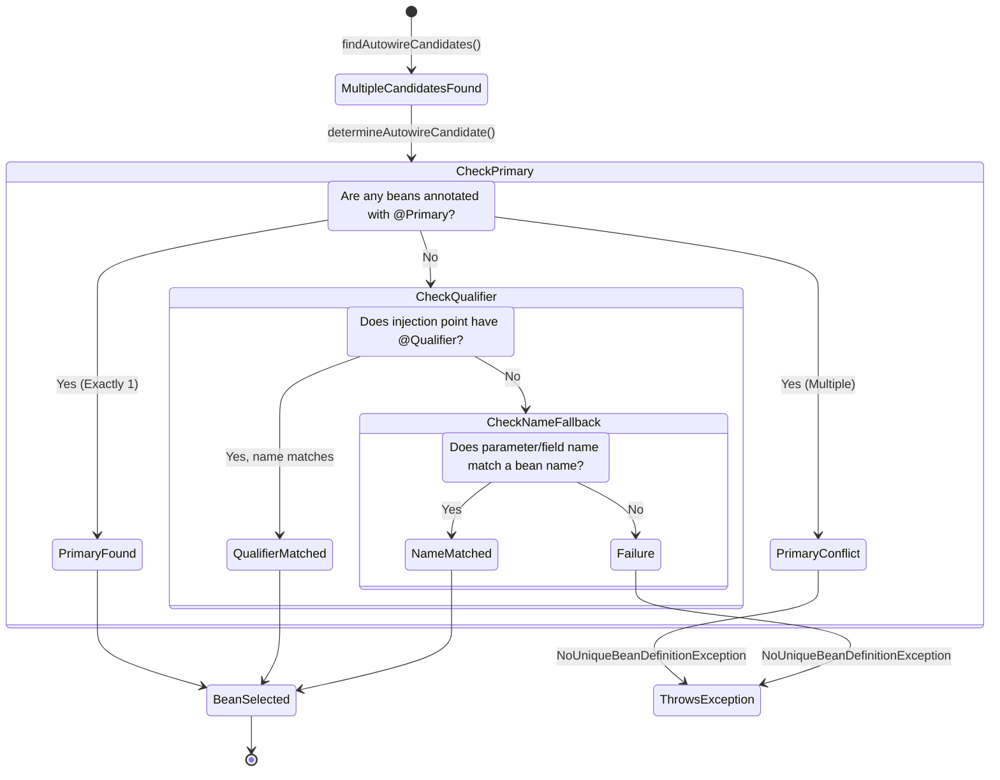
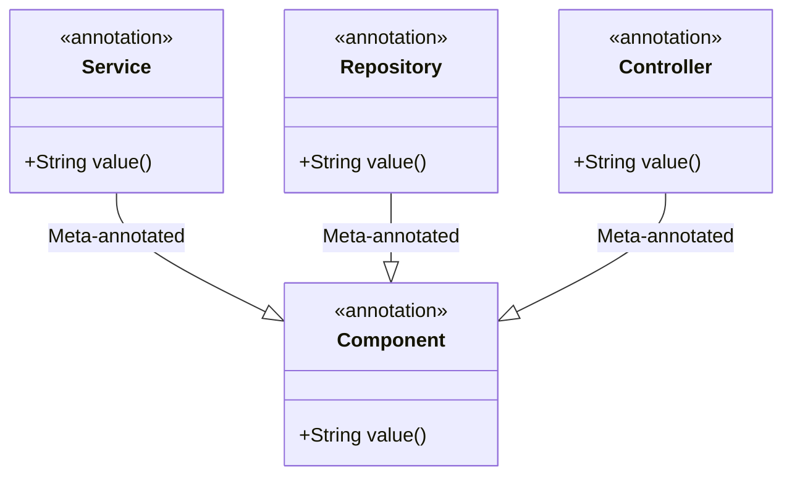

# Chapter 4 - The Spring Context (Using Abstractions)

## 1. Architectural Decoupling via Interfaces

The foundational principle of this chapter is decoupling object responsibilities. By relying on interfaces (contracts) rather than concrete implementations, objects define *what* they need rather than *how* it is implemented.

### The Use Case: Comment System Architecture



---

## 2. Component Scanning Engine (Under the Hood)

When you annotate a configuration class with `@ComponentScan`, Spring does not magically discover beans. It relies on a rigorous classpath scanning engine.

### The Scanning Lifecycle



**Internal Deep Dive:**
Spring uses **ASM** (a Java bytecode manipulation framework) via `MetadataReaderFactory` to read `.class` files from the disk without actually loading them into the JVM via `ClassLoader`. This allows Spring to aggressively scan thousands of classes rapidly, only converting them to `BeanDefinition` objects if they possess a stereotype annotation (`@Component`, `@Service`, `@Repository`).

---

## 3. Dependency Resolution Lifecycle

When `CommentService` requests a `CommentRepository` and a `CommentNotificationProxy` via its constructor, Spring's Inversion of Control (IoC) container resolves these abstractions to concrete beans.

### Autowiring Resolution Sequence

```mermaid
sequenceDiagram
    autonumber
    participant IoC as DefaultListableBeanFactory
    participant AABPP as AutowiredAnnotationBeanPostProcessor
    participant Resolver as QualifierAnnotationAutowireCandidateResolver
    participant Registry as BeanDefinitionRegistry

    IoC->>AABPP: determineConstructorsFromBeanPostProcessors()
    AABPP->>IoC: Return constructor matching dependencies
    IoC->>IoC: instantiateBean()
    
    rect rgb(30, 40, 50)
        Note over IoC, Registry: Dependency Resolution Phase
        IoC->>IoC: resolveDependency(DependencyDescriptor)
        IoC->>Registry: getBeansOfType(CommentNotificationProxy.class)
        Registry-->>IoC: Map<String, Bean> [emailProxy, pushProxy]
    end
    
    IoC->>IoC: determineAutowireCandidate()
    IoC->>Resolver: check annotations (@Primary, @Qualifier)
    Resolver-->>IoC: Return matching bean name
    
    IoC-->>AABPP: Inject resolved instances into CommentService
```



**Internal Deep Dive:**
The `DefaultListableBeanFactory.doResolveDependency()` method is the core engine here. When it encounters an interface (e.g., `CommentNotificationProxy`), it calls `findAutowireCandidates()`. If multiple candidates match the interface type, it falls into a disambiguation routine managed by the `QualifierAnnotationAutowireCandidateResolver`.

---

## 4. Disambiguation Strategy: `@Primary` and `@Qualifier`

When multiple implementations of an interface exist, Spring throws a `NoUniqueBeanDefinitionException`. Spring resolves this using a strict precedence tree.

### Candidate Selection State Machine



**Internal Deep Dive:**
* **`@Primary`:** Actively modifies the `BeanDefinition`. When `isPrimary()` evaluates to true, it short-circuits the candidate resolution process.
* **`@Qualifier`:** Evaluates the `DependencyDescriptor` (the injection point) against the candidate bean names and their declared qualifier metadata.

```java
// Spring Internal Reference: AnnotationConfigUtils
// How @Qualifier metadata is mapped during scanning
RootBeanDefinition bd = new RootBeanDefinition(CommentPushNotificationProxy.class);
bd.addQualifier(new AutowireCandidateQualifier(Qualifier.class, "PUSH"));
```

---

## 5. Stereotype Meta-Annotations

The book introduces `@Service` and `@Repository` as domain-specific variants of `@Component`.

### The Annotation Meta-Model



**Internal Deep Dive:**
Java does not natively support annotation inheritance. Spring bypasses this limitation using `AnnotationUtils` and `MergedAnnotations`.

When Spring's `ClassPathBeanDefinitionScanner` reads `DBCommentRepository`, it sees `@Repository`. It recursively traverses the annotation tree of `@Repository`, discovers it is annotated with `@Component`, and thus treats `DBCommentRepository` as a component.

This meta-annotation model allows Spring to attach behavior dynamically—for instance, `PersistenceExceptionTranslationPostProcessor` searches specifically for beans annotated with `@Repository` to apply database exception translation, something it does *not* do for generic `@Component` or `@Service` beans.
