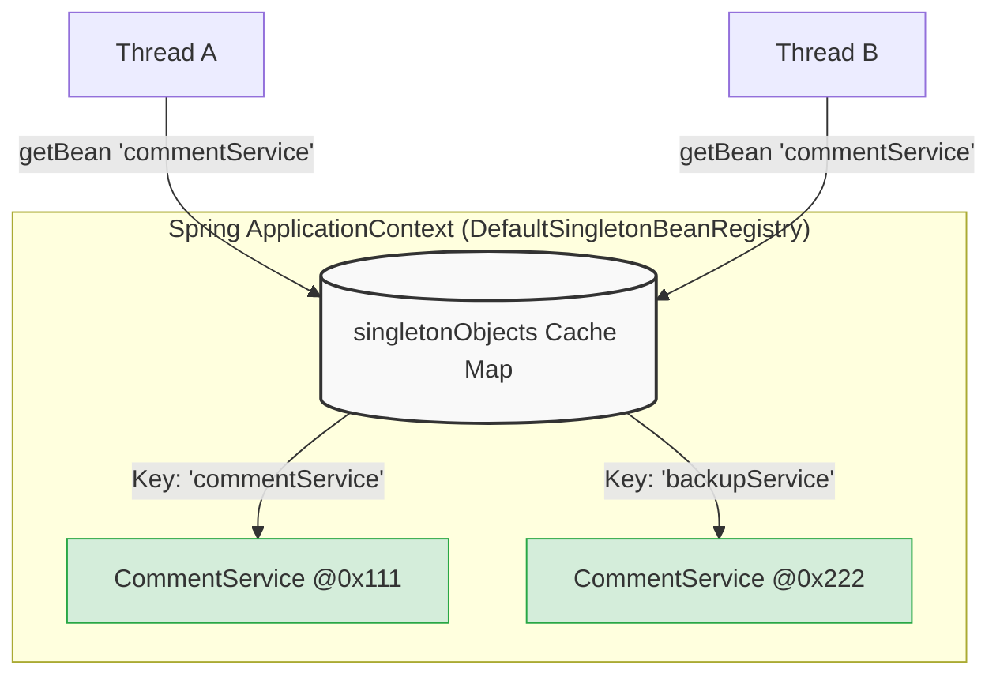
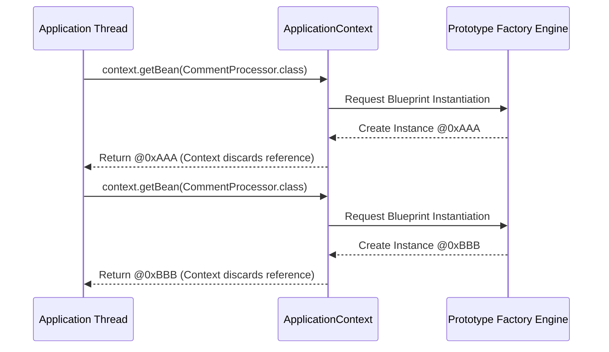
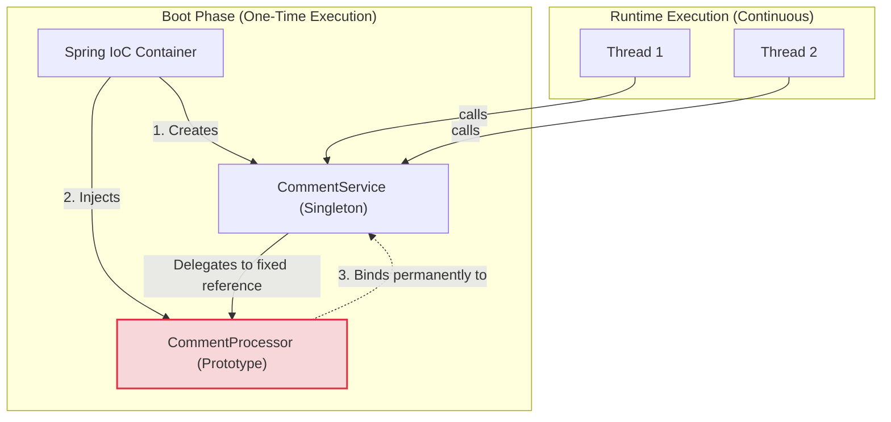

# Chapter 5 - Spring Context (Bean Scopes & Lifecycle Architecture)

## 1. Scope Paradigms: The Architectural Divide

In Spring, an object instance's lifecycle and visibility are dictated by its **scope**. The two most prevalent scopes in enterprise Spring applications are **Singleton** and **Prototype**.

### The Singleton Scope (Default Cache Model)
By default, Spring manages beans as singletons. However, a Spring Singleton is fundamentally different from the classical Gang of Four Singleton design pattern. While the classical pattern restricts instantiation to a single object per JVM/ClassLoader, Spring's singleton definition means **unique per bean name (ID)** within a specific context. You can have multiple instances of the same Java class if they are registered under distinct names.

Under the hood, Spring implements this using a Level-1 Cache mechanism inside the `DefaultSingletonBeanRegistry`, specifically utilizing a `ConcurrentHashMap` (the `singletonObjects` map).



### The Prototype Scope (Blueprint Factory Model)
When declared as a prototype using `@Scope`, Spring acts purely as an object factory. The framework manages the object's type but does not retain a reference to the created instance. Every explicit or implicit request for the bean generates a brand-new object instance on the heap.



---

## 2. Singleton Initialization: Eager vs. Lazy pipelines

Spring manages the timing of singleton creation through two distinct strategies:

| Strategy            | Behavior & Internal Mechanism                                                                                                                                                                        | Trade-offs                                                                                                                                       |
|:--------------------|:-----------------------------------------------------------------------------------------------------------------------------------------------------------------------------------------------------|:-------------------------------------------------------------------------------------------------------------------------------------------------|
| **Eager (Default)** | Spring initializes all singleton beans simultaneously when the context boots. Internally, this happens during the `finishBeanFactoryInitialization` phase of `AbstractApplicationContext.refresh()`. | Fails fast if beans cannot be created or dependencies are missing. Uses more memory at startup.                                                  |
| **Lazy (`@Lazy`)**  | Instantiation is deferred. Spring only creates the instance the first time it is explicitly requested or injected.                                                                                   | Saves memory in massive monolithic apps with rarely used modules. Risk of encountering fatal configuration errors at runtime instead of startup. |

```mermaid
stateDiagram-v2
    [*] --> ContextStartup
    ContextStartup --> ReadBeanDefinitions: Scan @Configuration & @ComponentScan
    state "Initialization Decision Phase" as EvalPhase
    state EvalPhase {
        ReadBeanDefinitions --> IsLazy
        state "IsLazy?" as IsLazy
        IsLazy --> CreateImmediately: No (Eager - Default)
        IsLazy --> StoreDefinitionOnly: Yes (@Lazy)
    }

    CreateImmediately --> SingletonCache: Store in singletonObjects
    StoreDefinitionOnly --> [*]: Wait for Client Request
    state "Runtime Phase" as RuntimePhase
    state RuntimePhase {
        ClientRequest --> CheckCache: getBean()
        CheckCache --> SingletonCache: Cache Hit
        CheckCache --> InstantiateOnDemand: Cache Miss (Lazy Execution)
        InstantiateOnDemand --> SingletonCache: Store & Return
    }
```



---

## 3. Concurrency and Thread Safety

Because Spring applications (like web servers) process tasks concurrently, multiple threads will simultaneously share and interact with the same singleton instances.

### The Race Condition Hazard
If a singleton bean contains mutable state (e.g., class-level variables that change during execution), threads will overwrite each other's data, causing race conditions and unpredictable outcomes. Synchronizing these methods is an anti-pattern as it destroys application throughput.

Instead, **Singletons must be designed as stateless or immutable**.

### The Solution: Constructor Injection + Immutability
To guarantee thread safety, leverage constructor dependency injection and mark class fields as `final`.

```java
@Service
public class CommentService {
    // Marked final to strictly prevent mutation after context initialization
    private final CommentRepository commentRepository;

    public CommentService(CommentRepository commentRepository) {
        this.commentRepository = commentRepository;
    }
}
```

If a bean *must* be mutable (e.g., maintaining state for a specific processing pipeline), it should be declared as a **Prototype**. Because each thread receives a distinct prototype instance, race conditions are structurally eliminated.

---

## 4. The Scope Impedance Mismatch

A critical architectural flaw occurs when a Prototype bean is injected directly into a Singleton bean.

Because the Singleton is instantiated exactly once during startup, Spring resolves and injects its dependencies exactly once. Consequently, the Singleton receives a single prototype instance and will reuse that exact same instance for its entire lifetime, completely defeating the purpose of the prototype scope.



### Internal Solutions for Impedance Mismatch

To solve this, the Singleton must dynamically fetch a new Prototype instance at runtime, rather than caching it at compile-time.

**Option A: Direct Context Lookup (The Book's Approach)**
Inject the `ApplicationContext` into the Singleton and explicitly call `context.getBean()` inside the execution method. While functional, this tightly couples business logic to the Spring Framework.

**Option B: `ObjectProvider<T>` (The Idiomatic Internal Approach)**
Spring provides `ObjectProvider<T>` to defer dependency resolution. This is the recommended enterprise approach for scope mismatch.

```java
@Service
public class CommentService {
    // 1. Inject an ObjectProvider instead of the raw Prototype bean
    private final ObjectProvider<CommentProcessor> processorProvider;

    public CommentService(ObjectProvider<CommentProcessor> processorProvider) {
        this.processorProvider = processorProvider;
    }

    public void sendComment(Comment c) {
        // 2. Fetch a fresh prototype instance directly from the IoC factory on every execution
        CommentProcessor p = processorProvider.getObject(); 
        
        p.setComment(c);   
        p.processComment();   
    }
}
```