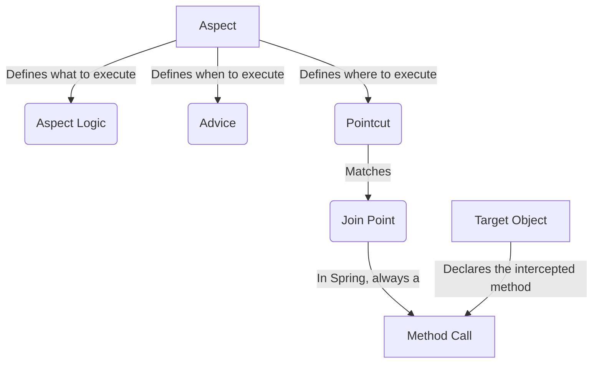
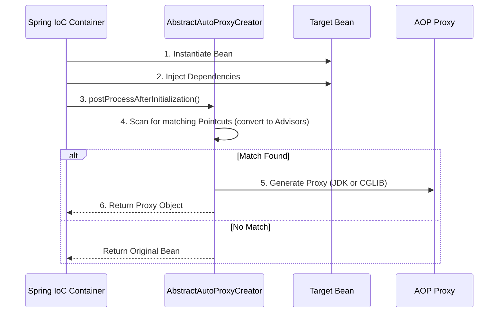
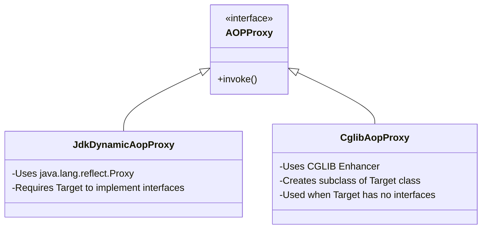
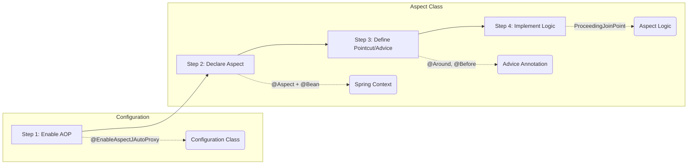
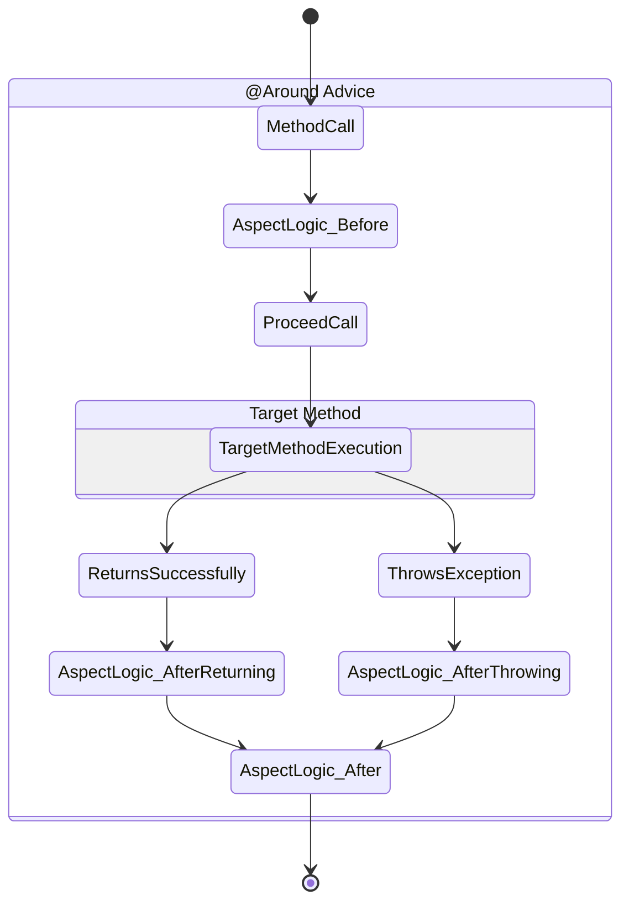
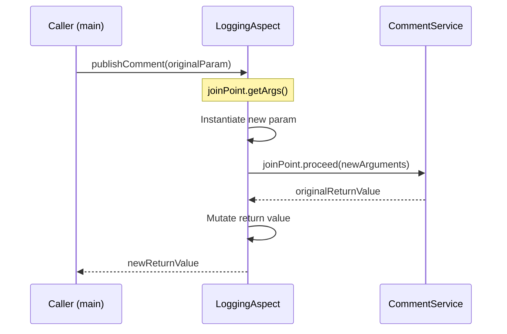
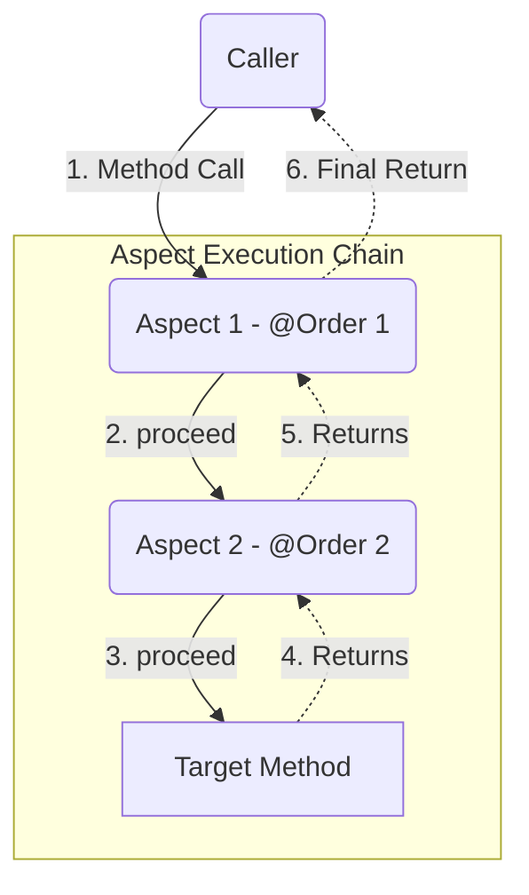
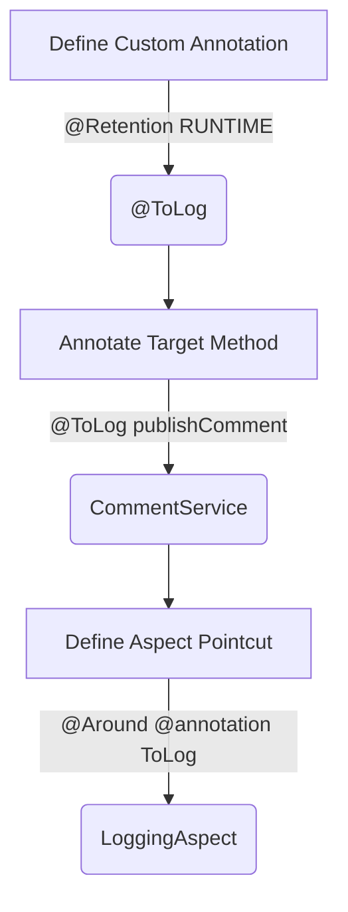

# Chapter 6 - Using aspects with Spring AOP (Architecture, Implementation, and Internals)

## 1. Core AOP Concepts & Terminology

Aspect-Oriented Programming helps extract and decouple cross-cutting concerns (like logging, transactions, and security) from business logic.

* **Aspect**: A modularization of a concern that cuts across multiple classes; it defines what code the framework should execute.
* **Advice**: The action taken by an aspect at a particular join point, specifying when the app should execute the logic (e.g., Before, After, Around).
* **Pointcut**: A predicate that tells Spring which method calls to intercept.
* **Join Point**: The event that triggers the aspect; in Spring AOP, this is exclusively a method call.
* **Target Object**: The bean declaring the method intercepted by the aspect.

## 2. Under the Hood: The Proxying Mechanism (Weaving)

*Spring Start Here* notes that Spring achieves AOP by providing a "proxy object instead of the real bean". This approach is named weaving. The proxy applies the aspect logic and delegates the call to the actual method. Below is the source-of-truth internal process.

### Proxy Creation Lifecycle
When the Spring `ApplicationContext` initializes, a `BeanPostProcessor` (specifically `AnnotationAwareAspectJAutoProxyCreator`) intercepts bean creation. It evaluates all beans against registered Pointcuts.

### JDK Dynamic Proxies vs. CGLIB
Internally, the framework utilizes two different strategies for creating these proxies depending on the Target Object's structure:

*Note: In the book's `CommentService` example, since the service does not implement an interface, Spring transparently defaults to a CGLIB proxy, generating a dynamic subclass at runtime to intercept method calls.*

## 3. Implementation Flow

Implementing an aspect requires four specific steps.

**Critical Constraint:** The `@Aspect` annotation is not a stereotype annotation. Using `@Aspect` tells Spring the class is an aspect, but Spring won't create a bean for it automatically. You must explicitly declare it as a bean using `@Bean` or a stereotype like `@Component`.

## 4. Advice Types and State Alteration

Spring AOP supports five types of advice: `@Around`, `@Before`, `@After`, `@AfterReturning`, and `@AfterThrowing`.

`@Around` is the most powerful advice because it completely wraps the target method. It receives a `ProceedingJoinPoint` parameter, representing the intercepted method.

### Intercepting and Altering Execution

Aspects can intercept a method call and alter its execution by changing the value of the parameters sent or changing the returned value received by the caller.

*Under the hood:* When `joinPoint.proceed(Object[] args)` is called, the `ReflectiveMethodInvocation` substitutes the original arguments array with the newly provided array before reflecting the method execution onto the target object. The `proceed()` method is designed to throw any `Throwable` coming from the intercepted method.

## 5. Aspect Execution Chain & Ordering

When multiple aspects intercept the same method, they create an execution chain. By default, Spring does not guarantee the order in which two aspects execute. The `@Order` annotation is used to explicitly define the execution sequence.

* **Order Valuation**: The smaller the number, the earlier that aspect executes.
* *Under the hood:* Spring translates all aspect rules into a sorted list of `MethodInterceptor` instances. Calling `proceed()` on the `JoinPoint` advances an internal index, popping the next interceptor off the stack until the target method is reached, naturally creating the Russian-doll (wrapping) effect observed on the return path.

## 6. Pointcut Strategies

### AspectJ Expression Language
You can use AspectJ pointcut language to match methods by package, return type, name, and parameters.
`@Around("execution(* services.*.*(..))")`

### Annotation-Driven Pointcuts
A modern, robust alternative to complex expressions is defining a custom annotation (e.g., `@ToLog`).

**Critical Details:** 
* By default, Java annotations cannot be intercepted at runtime; you must explicitly set the retention policy using `@Retention(RetentionPolicy.RUNTIME)`.
* The pointcut expression becomes `@annotation(ToLog)` to target the specific annotated methods.