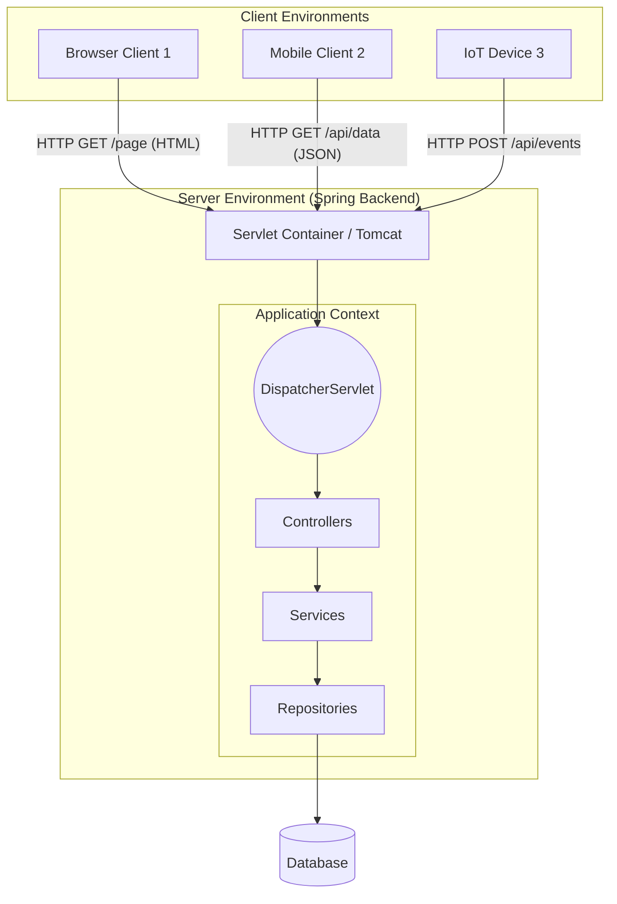
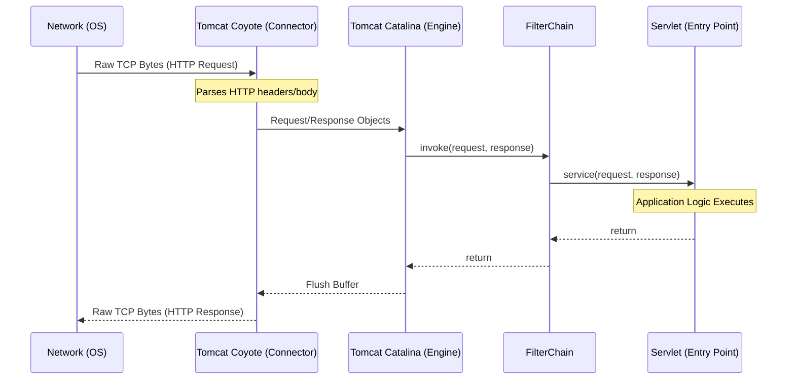
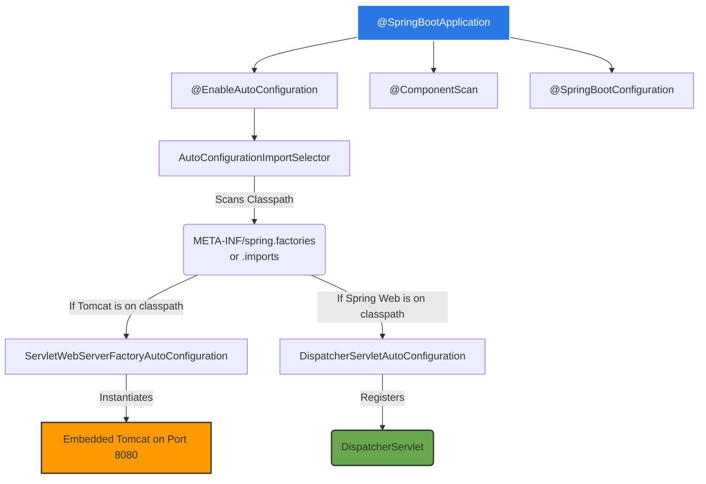
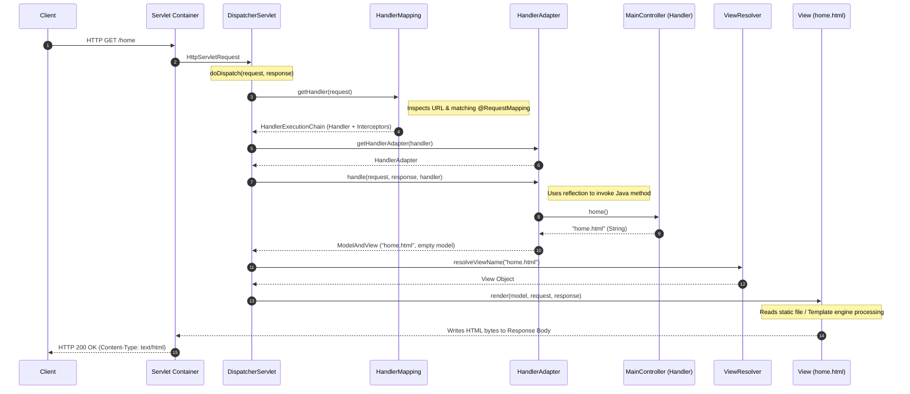

# Chapter 7 - Understanding Spring Boot and Spring MVC (Internals & Architecture)

## 1. Web Application Architecture

A web application consists of a client side (frontend) accessed via a web browser , and a server side (backend) that processes logic and manages data. The backend routinely handles concurrent connections from multiple users accessing the app across different platforms.

### Architectural Fashions
Spring supports two primary paradigms for delivering web applications:

1.  **Server-Side Rendering (SSR):** The backend processes the request and responds with fully prepared view formats (HTML, CSS, JS) that the browser renders directly.
2.  **Frontend-Backend Separation (CSR/API):** The backend serves only raw, structured data (e.g., JSON or XML). An independent frontend application (e.g., React, Angular) receives this data, interprets it, and dynamically updates the browser DOM.

### Architecture Topology Diagram



---

## 2. The Servlet Container and Request Translation

Browsers communicate using the Hypertext Transfer Protocol (HTTP). Java applications do not natively process raw TCP/IP HTTP network streams; they rely on a **Servlet Container** (like Apache Tomcat, Jetty, or Undertow) to translate network traffic into Java objects.

When Tomcat receives a request, it parses the HTTP byte stream, constructs `HttpServletRequest` and `HttpServletResponse` objects, and delegates them to a standard Java object known as a **Servlet**.

### Servlet Container Request Lifecycle (Under the Hood)



In the pre-Spring Boot era, developers manually configured multiple Servlets for distinct paths (e.g., `/home`, `/profile`) inside a `web.xml` file. Spring MVC centralizes this through a single **Front Controller** servlet.

---

## 3. Spring Boot Magic: Autoconfiguration & Starters

Spring Boot orchestrates complex Spring ecosystem configurations dynamically, applying the **convention-over-configuration** principle to eliminate boilerplate setup.

### Dependency Starters
Instead of specifying dozens of disparate dependencies, developers declare **dependency starters** (e.g., `spring-boot-starter-web`). A starter acts as a capability-oriented BOM (Bill of Materials) that groups compatible dependencies (Spring Context, AOP, Tomcat, Jackson) without requiring explicit version tags.

### Autoconfiguration Internals
Spring Boot's main class relies on the `@SpringBootApplication` annotation. This meta-annotation triggers a sophisticated internal lifecycle.

```java
@SpringBootApplication // Combines @Configuration, @EnableAutoConfiguration, @ComponentScan
public class Main {
    public static void main(String[] args) {
        SpringApplication.run(Main.class, args);
    }
}
```



*Under the hood:* The `AutoConfigurationImportSelector` evaluates `Condition` classes (like `@ConditionalOnClass(Tomcat.class)`). Because `spring-boot-starter-web` provides Tomcat , Spring Boot automatically boots an embedded Tomcat instance on port 8080  and maps the core `DispatcherServlet` to the root path `/`.

---

## 4. The Spring MVC Request Flow (Deep Dive)

Spring MVC handles requests via a strictly defined sequence of component interactions. While the framework handles the orchestration, the developer is only responsible for writing the **Controller** and the **View** (HTML).

### Developer Implementation
A static web page requires an HTML file in `resources/static` and a Controller.

```java
@Controller // Registers bean & marks as web handler 
public class MainController {

    @RequestMapping("/home") // Maps HTTP path to method 
    public String home() {
        return "home.html"; // Returns the logical view name 
    }
}
```

### Framework Execution (DispatcherServlet Internals)

When an HTTP request arrives, Tomcat directs it to the `DispatcherServlet`. The servlet executes its `doDispatch()` method, which coordinates several specialized internal beans.



### Component Breakdown
1.  **DispatcherServlet:** The front controller and central hub that routes all HTTP requests through the Spring ecosystem.
2.  **HandlerMapping:** Scans the application context for `@RequestMapping` annotations and builds a mapping registry. It returns a `HandlerExecutionChain` that includes the selected controller method and any mapped pre- / post-interceptors.
3.  **HandlerAdapter:** Bridges the gap between the dispatcher and the highly variable signatures of controller methods. It handles data binding, validation, and actually invokes the Java method via reflection.
4.  **ViewResolver:** Maps the string returned by the controller (`"home.html"`) to a physical `View` object.
5.  **View:** Responsible for writing the final content (HTML, JSON) into the output stream of the `HttpServletResponse`.