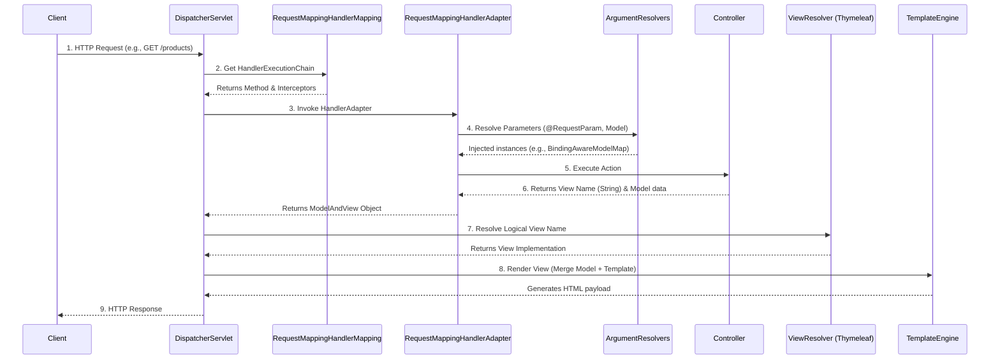
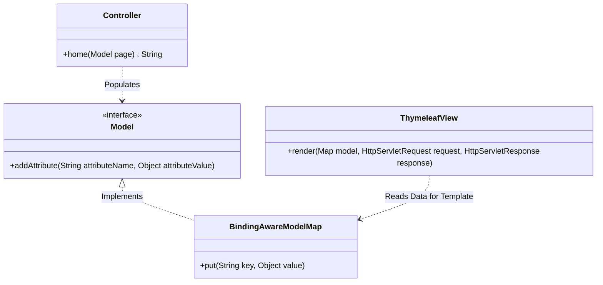
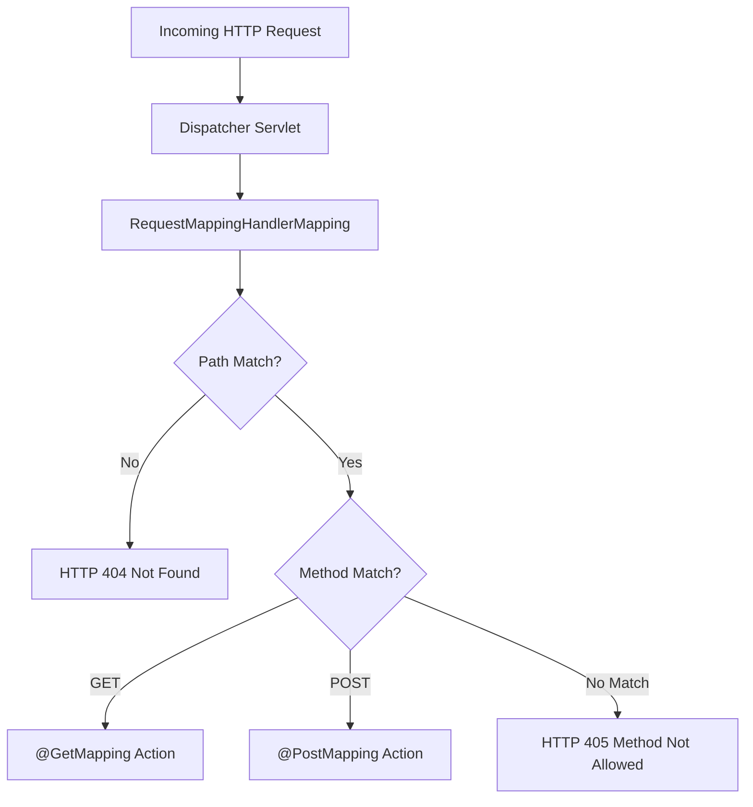
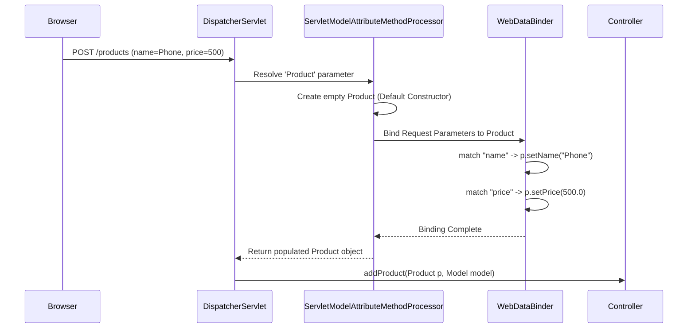

# Chapter 8 - Implementing web apps with Spring Boot and Spring MVC

## 1. Introduction & Overview
Modern web applications require dynamic views where content changes based on data processed by the server. This chapter details how to transition from static pages to dynamic web applications using Spring Boot, Spring MVC, and template engines.

---

## 2. The Complete Spring MVC Request Processing Lifecycle
While the book describes a high-level 5-step flow, the actual Spring MVC architecture utilizes a highly decoupled system of specialized components.

### 2.1 Standard Flow vs. Internal Implementation
The text outlines that the Dispatcher Servlet uses handler mapping to find the controller action, executes it, and returns a view name.

Under the hood, Spring relies on specific interfaces to manage this lifecycle:
* **`DispatcherServlet`**: The central Front Controller.
* **`RequestMappingHandlerMapping`**: Scans for `@Controller` and `@RequestMapping` annotations to build a mapping registry.
* **`RequestMappingHandlerAdapter`**: Handles the reflection-based execution of the specific controller method.
* **`HandlerMethodArgumentResolver`**: A strategy interface responsible for resolving incoming request data into method parameters.
* **`ViewResolver`**: Resolves the returned logical `String` view name into an actual View implementation.

### 2.2 Lifecycle Diagram



---

## 3. Implementing Dynamic Views with Thymeleaf
A template engine is a dependency that easily retrieves and displays variable data sent by the controller. Thymeleaf is chosen for its low complexity and use of simple HTML static files as templates.

### 3.1 Setup and Project Structure
To enable Thymeleaf, the `spring-boot-starter-thymeleaf` dependency must be added to the `pom.xml`. In contrast to static files (placed in `resources/static` ), Thymeleaf templates must be placed in the `resources/templates` directory.

### 3.2 View Data Injection (The `Model` Object)
To generate dynamic content, the controller must pass data to the view. This is done using a parameter of type `Model`. Values are added via the `addAttribute()` method using a key-value format.

**Under the Hood:** When you declare a parameter of type `Model`, Spring's `ModelMethodProcessor` injects an instance of `BindingAwareModelMap`. This map acts as a container for your data throughout the lifecycle and is ultimately merged into the template context during view rendering.

### 3.3 Thymeleaf Template Syntax
In the HTML file, the namespace definition `xmlns:th="http://www.thymeleaf.org"` allows the use of the `th` prefix to access Thymeleaf features. The `${attribute_key}` expression is used to evaluate and inject data passed from the `Model`.



---

## 4. Sending Data: Client to Server
Clients often need to transmit data to the server (e.g., search criteria, form submissions, or login credentials). The primary transmission mechanisms include query parameters, path variables, HTTP headers, and the HTTP request body.

### 4.1 Query Parameters (`@RequestParam`)
Request parameters send key-value pairs appended to the URI query expression. They are separated by an ampersand (`&`).

* **Best Used For:** Small data quantities, optional values, and search/filtering criteria. URIs are generally limited to roughly 2,000 characters.
* **Implementation:** The `@RequestParam` annotation binds the HTTP request parameter to the controller method parameter. By default, these parameters are mandatory. To make them optional, set the attribute `optional=true` or `required=false`.

**Internal Resolution:** Spring uses the `RequestParamMethodArgumentResolver` to extract the value from `HttpServletRequest.getParameter(name)` and convert it to the declared type using registered `Converter` implementations.

### 4.2 Path Variables (`@PathVariable`)
Path variables transmit data directly within the request path structure, rather than as a key-value query.

* **Best Used For:** Mandatory data intrinsic to resource identification. It improves readability and search engine indexing. It is recommended to limit path variables to a maximum of two or three per URL.
* **Implementation:** Variables are defined in the path string using curly braces (e.g., `/home/{color}`). The `@PathVariable` annotation binds this segment to the method parameter.

**Internal Resolution:** Spring parses the URI against the registered `AntPathMatcher` pattern. The `PathVariableMapMethodArgumentResolver` extracts the URI template variables and injects them into the controller method.

### 4.3 Data Transmission Comparison Table

| Feature            | `@RequestParam`                                        | `@PathVariable`                              |
|:-------------------|:-------------------------------------------------------|:---------------------------------------------|
| **Data Location**  | Appended after `?` in URI (Query String)               | Embedded directly in the URI path            |
| **Optionality**    | Can easily be used for optional values                 | Should strictly be used for mandatory values |
| **Quantity Limit** | Avoid large numbers; max ~3 before readability suffers | Max 2-3 variables for maintainability        |
| **SEO Impact**     | Harder to index/read                                   | Easier for search engines to index           |

---

## 5. HTTP Methods and Semantics
An HTTP request is identified by both a request path and an HTTP method (verb). While the `@RequestMapping` annotation uses `GET` by default , modern Spring applications rely on method-specific annotations to strictly enforce RESTful principles.

It is a core architectural rule to never use an HTTP method contrary to its designed purpose.

### 5.1 The Primary HTTP Methods
* **GET (`@GetMapping`):** Intended strictly to retrieve data without altering server state.
* **POST (`@PostMapping`):** Intended to send data to the server to create a new record.
* **PUT (`@PutMapping`):** Intended to entirely replace/change an existing data record.
* **PATCH (`@PatchMapping`):** Intended to partially update an existing data record.
* **DELETE (`@DeleteMapping`):** Intended to delete data from the server.

### 5.2 Routing Architecture Diagram


*(Note: A 404 response defaults to a generic error page in a standard Spring Boot setup if no mapping exists for the root path )*

---

## 6. HTML Forms and Automatic Data Binding
Web applications frequently utilize HTML forms for `POST` requests, allowing users to submit new data sets (such as adding a product). Note that standard HTML forms natively support only `GET` and `POST` methods; utilizing `PUT`, `PATCH`, or `DELETE` requires asynchronous client-side logic (e.g., JavaScript).

### 6.1 Advanced Object Binding
While data can be captured attribute-by-attribute using `@RequestParam`, Spring supports automatic object instantiation and data binding.

If an action method defines a Model Object (e.g., `Product`) as a parameter, Spring will automatically instantiate it using its default constructor. It then automatically matches the incoming request parameters to the Model object's fields based on identical naming conventions.

### 6.2 The Under-The-Hood Binding Process



**Implementation Code (Spring Data Binding):**
```java
@Controller
public class ProductsController {
    
    private final ProductService productService;

    public ProductsController(ProductService productService) {
        this.productService = productService;
    }
    
    // Spring intercepts the request, instantiates Product, 
    // and binds the 'name' and 'price' parameters to it automatically.
    @PostMapping("/products")
    public String addProduct(Product p, Model model) { // 
        productService.addProduct(p);
        
        var products = productService.findAll();
        model.addAttribute("products", products);
        
        return "products.html";
    }
}
```
*Note on thread safety:* By default, Spring beans (like a `ProductService`) operate as singletons. Using an in-memory mutable collection (like a `List`) as a class attribute inside a singleton bean is not thread-safe and can cause race conditions during concurrent client requests. Production applications must utilize an external database to persist and manage concurrent data operations.