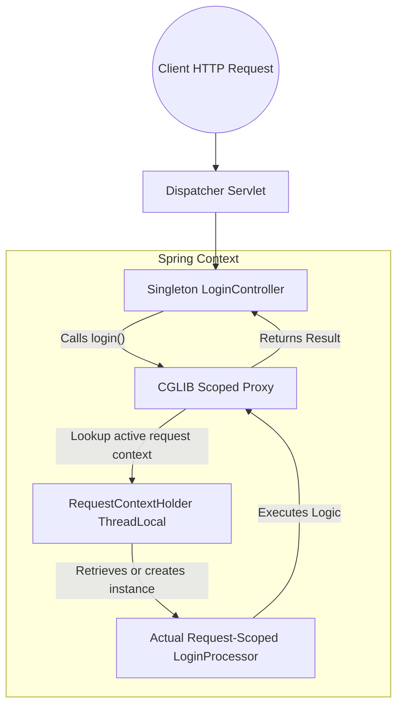
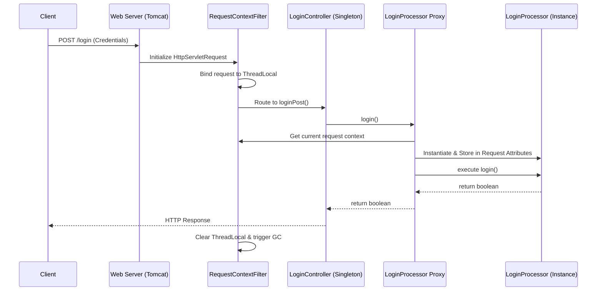
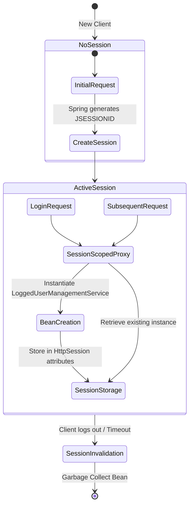

# Chapter 9 - Using the Spring web scopes

## Overview of Web Scopes

In any Spring app, the default bean scope is Singleton, where the framework uniquely identifies each instance.  Spring manages a bean’s life cycle differently depending on how you declare the bean in the Spring context.  For web apps, Spring provides custom ways to manage instances using the HTTP request as a point of reference. 

These web-specific scopes are:
* **Request Scope**: Spring creates an instance of the bean class for every HTTP request. 
* **Session Scope**: Spring creates an instance and keeps the instance in the server’s memory for the full HTTP session. 
* **Application Scope**: The instance is unique in the app’s context, and it’s available while the app is running. 

---

## ⚙️ The Missing Link: Scoped Proxies

The book explains that a Singleton controller (`LoginController`) can depend on a Request-scoped bean (`LoginProcessor`).  However, it omits *how* a singleton bean, which is created once at application startup, can hold a reference to a request-scoped bean that is created and destroyed millions of times.

**Spring Internals:** Spring solves this using **Scoped Proxies**. When you annotate a class with `@RequestScope` or `@SessionScope`, Spring does not inject the actual bean instance into the Singleton controller. Instead, it injects a CGLIB proxy.

### Proxy Resolution Architecture



When the `LoginController` calls `loginProcessor.login()`, the Proxy intercepts the call, retrieves the current `HttpServletRequest` via `RequestContextHolder`, extracts or creates the actual `LoginProcessor` instance bound to that specific request, delegates the method call to it, and returns the result.

---

## 1. Request Scope (`@RequestScope`)

A request-scoped bean is an object managed by Spring, for which the framework creates a new instance for every HTTP request.  The app can use the instance only for the request that created it.  Any new HTTP request (from the same or other clients) creates and uses a different instance of the same class. 

### Request Scope Lifecycle & Storage

**Spring Internals:** Spring stores request-scoped beans directly as attributes within the standard `HttpServletRequest` object under the hood (e.g., `request.setAttribute("loginProcessor", instance)`).



### Design Considerations
* **Concurrency:** Instances of request-scoped beans are not prone to multithread-related issues as only one thread (the one of the request) can access them.  Don’t use synchronization techniques for the attributes of these beans. 
* **Performance:** Make sure you don’t implement a time-consuming logic Spring needs to execute to create the instance.  Avoid writing logic in the constructor or a `@PostConstruct` method for request-scoped beans. 

---

## 2. Session Scope (`@SessionScope`)

A session-scoped bean is an object managed by Spring, for which Spring creates an instance and links it to the HTTP session.  That instance can be reused for the same client while it still has the HTTP session active.  The data you store in the session-scoped bean attribute is available for all the client’s requests throughout an HTTP session. 

### Session Scope Lifecycle & Storage

**Spring Internals:** Similar to request scope, the scoped proxy relies on `RequestContextHolder` to fetch the underlying `HttpSession`. Spring then retrieves or creates the bean and stores it using `session.setAttribute()`.



### Design Considerations
* **Multithreading:** If the same client issues multiple concurrent requests that change the data on the instance, you may encounter multithreading-related issues like race conditions.  When you know such a scenario is possible, you might need to use synchronization techniques to avoid concurrency. 
* **Statefulness:** When keeping details stateful in one app’s memory, you make clients dependent on that specific app instance.  Consider alternatives, such as storing the data you want to share in a database instead of the session.  This way, you can leave the HTTP requests independent one from another. 
* **Security:** Never store sensitive details (like passwords, private keys, or any other secret detail) in session-bean attributes. 

---

## 3. Application Scope (`@ApplicationScope`)

The instance of an application-scoped bean is shared by all the HTTP requests from all clients.  The Spring context provides only one instance of the bean’s type, used by anyone who needs it. 

### Application Scope vs. Singleton

While the application scope is close to how a singleton works, there is a fundamental internal difference. 

**Spring Internals:**
* A **Singleton** is tied to the `ApplicationContext` (the Spring IoC container).
* An **Application Scoped Bean** is tied directly to the `ServletContext` of the web container (like Tomcat). It is stored as a `ServletContext` attribute. This is specifically useful when you need to share state with components outside of Spring, like standard Java EE Servlets or Filters that only have access to the `ServletContext`.

### The Concurrency Flaw & Correction

The book introduces an application-scoped `LoginCountService` with a standard `int` attribute. 

```java
// Book's Implementation (Flawed for concurrent environments)
@Service
@ApplicationScope
public class LoginCountService {
  private int count;
  public void increment() { count++; } // Race condition vulnerability
}
```

With application-scoped bean instances being shared by all the web app requests, any write operation usually needs synchronization, creating bottlenecks and dramatically affecting the app’s performance. 

**Spring Internals Correction:** To fix the race condition inherent in the book's implementation without relying on heavy synchronized blocks, we must use thread-safe data structures like `AtomicInteger`.

```java
// Production-Ready Implementation
import java.util.concurrent.atomic.AtomicInteger;

@Service
@ApplicationScope
public class LoginCountService {
  private final AtomicInteger count = new AtomicInteger(0);
  
  public void increment() { 
      count.incrementAndGet(); // Thread-safe atomic operation
  }
  
  public int getCount() { 
      return count.get(); 
  }
}
```

Generally, developers should avoid using application-scoped beans.  A better approach is to directly store the data in a database. 

---

## Web Scopes Technical Summary

| Scope Type      | Annotation          | Scope Boundary                                | Internal Storage Mechanism          | Thread Safety                                                    |
|:----------------|:--------------------|:----------------------------------------------|:------------------------------------|:-----------------------------------------------------------------|
| **Request**     | `@RequestScope`     | Single HTTP Request.                          | `HttpServletRequest.setAttribute()` | Naturally Thread-Safe. One thread per request.                   |
| **Session**     | `@SessionScope`     | User HTTP Session (across multiple requests). | `HttpSession.setAttribute()`        | Vulnerable to race conditions if user sends concurrent requests. |
| **Application** | `@ApplicationScope` | Entire Web Application Lifecycle.             | `ServletContext.setAttribute()`     | Highly Vulnerable. Requires strict synchronization or Atomics.   |